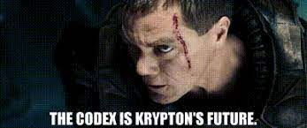

Encoding and Decoding Genetic Information

--- 

<figure markdown="span">
  { width="300" }
</figure>

---

Because Radiate has such a specific domain language, there needs to be a way to convert between the domain language or 'problem space' and the 'solution space'. For example, if you are trying to evolve a list of floating-point numbers, the `GeneticEngine` needs to know how to interact with that list of numbers, but from our perspective, we are only interested in the real-world problem that the list of numbers represents. This is where the `Codex` comes in.

 When the `GeneticEngine` is evolving a population of individuals, it uses the `Codex` to encode the genetic information of the individuals into a `Genotype`, and then decode the `Genotype` back into the domain language when evaluating the fitness of the individuals. This process of encoding and decoding genetic information is what allows the `GeneticEngine` to operate on the genetic information of the individuals while still allowing us to work with the real-world problem that the genetic information represents. This allows the `fitness_fn` to accept the real-world representation of the individual we defined in the `Codex`.

In other words, the `Codex` is the bridge between the domain language of Radiate and the real-world problem that you are trying to solve. 

Core library `Codex` implementations:

| Codex | Chromosome | Gene | Real-World Representation |
|-------|------------|------|---------------------------|
| `BitCodex` | `BitChromosome` | `BitGene` | `Vec<Vec<bool>>` |
| `CharCodex` | `CharChromosome` | `CharGene` | `Vec<Vec<char>>` |
| `FloatCodex` | `FloatChromosome` | `FloatGene` | `Vec<Vec<f32>>` |
| `IntCodex<I>` | `IntChromosome<I>` | `IntGene<I>` | `Vec<Vec<I>>` |
| `PermutationCodex<A>` | `PermutationChromosome<A>` | `PermutationGene<A>` | `Vec<A>` |
| `SubsetCodex<'a, T>` | `BitChromosome` | `BitGene` | `Vec<&'a T>` |
| `FnCodex<C: Chromosome, T>` | `C` | `C::GeneType` | `T` |

___
## BitCodex
```rust
pub struct BitCodex {
    pub num_chromosomes: usize,
    pub num_genes: usize,
}
``` 

* **Encodes**: `Genotype` of `BitChromosomes` with `BitGenes`
* **Decodes**: `Vec<Vec<bool>>`

When people traditionally think of genetic algorithms, they often think of binary strings. The `BitCodex` is a simple way to encode and decode a `Genotype` of binary strings so in essence, it is the most basic `Codex` implementation.

___
## CharCodex
```rust
pub struct CharCodex {
    pub num_chromosomes: usize,
    pub num_genes: usize,
}
```

* **Encodes**: `Genotype` of `CharChromosomes` with `CharGenes`
* **Decodes**: `Vec<Vec<char>>`

___
## FloatCodex
```rust
pub struct FloatCodex {
    pub num_chromosomes: usize,
    pub num_genes: usize,
    pub min: f32,
    pub max: f32,
    pub lower_bound: f32,
    pub upper_bound: f32,
}
```

* **Encodes**: `Genotype` of `FloatChromosomes` with `FloatGenes`
* **Decodes**: `Vec<Vec<f32>>`

___
## IntCodex
```rust
pub struct IntCodex<T: Integer<T>>
where
    Standard: rand::distributions::Distribution<T>,
{
    pub num_chromosomes: usize,
    pub num_genes: usize,
    pub min: T,
    pub max: T,
    pub lower_bound: T,
    pub upper_bound: T,
}
```

* **Encodes**: `Genotype` of `IntChromosome<T>` with `IntGene<T>`
* **Decodes**: `Vec<Vec<T>>`
  
**Note**: `T` must implement the `Integer` trait. Integer is a trait in Radiate and is implemented for `i8`, `i16`, `i32`, `i64`, `i128`.

___
## PermutationCodex
```rust
pub struct PermutationCodex<A: PartialEq + Clone> {
    pub alleles: Arc<Vec<A>>,
}
```

* **Encodes**: `Genotype` of `PermutationChromosomes<A>` with `PermutationGene<A>`
* **Decodes**: `Vec<A>`
  
Permutation problems are problems where the order of the elements in the solution is important. The Travelling Salesman Problem is a classic example of a permutation problem.

___
## SubsetCodex
```rust
pub struct SubSetCodex<'a, T> {
    pub items: &'a Vec<T>,
}
```

* **Encodes**: `Genotype` of `BitChromosome` with `BitGene`
* **Decodes**: `Vec<&'a T>`

The `SubsetCodex` is a specialized `Codex` that is used for subset selection problems. In subset selection problems, the goal is to select a subset of items from a larger set of items that maximizes some objective function. The Knapsack Problem is a classic example of a subset selection problem.

___
## FnCodex
```rust
pub struct FnCodex<C: Chromosome, T> {
    pub encoder: Option<Box<dyn Fn() -> Genotype<C>>>,
    pub decoder: Option<Box<dyn Fn(&Genotype<C>) -> T>>,
}
```

* **Encodes**: `Genotype` of `C` with `C::GeneType`
* **Decodes**: `T`

The `FnCodex` is a generic `Codex` that allows you to define your own encoding and decoding functions. This is useful if you have a custom problem that doesn't fit into the other `Codex` implementations and don't want to create a new `Codex` implementation.

___
## Defining a Codex
The `Codex` trait is defined as follows where `C` is the `Chromosome` type and `T` is the real-world representaion. The `encode` method is a supplier function that simply returns a new `Genotype`, while the `decode` method takes a `Genotype` and converts it back into our real-world representation.

```rust
pub trait Codex<C: Chromosome, T> {
    fn encode(&self) -> Genotype<C>;
    fn decode(&self, genotype: &Genotype<C>) -> T;
}
```

___
## Example
Let's take a look at a simplified version of Raditate's built-in `FloatCodex` which encodes and decodes floating-point numbers. The `FloatCodex` takes in the number of chromosomes, number of genes per chromosome, the max allele value, and the min allele value. The `encode` method creates a new `Genotype` of `FloatChromosomes` with `FloatGenes` that have random alleles between the max and min. The `decode` method takes a `Genotype` and returns a `Vec<Vec<f32>>` of the gene values.

```rust
use radiate::*;

pub struct FloatCodex {
    pub num_chromosomes: usize,
    pub num_genes: usize,
    pub min: f32,
    pub max: f32,
    pub lower_bound: f32,
    pub upper_bound: f32,
}

impl FloatCodex {
    /// Create a new `FloatCodex` with the given number of chromosomes, genes, min, and max values.
    /// The f_32 values for each `FloatGene` will be randomly generated between the min and max values.
    pub fn new(num_chromosomes: usize, num_genes: usize, min: f32, max: f32) -> Self {
        FloatCodex {
            num_chromosomes,
            num_genes,
            min,
            max,
            lower_bound: min,
            upper_bound: max,
        }
    }
}

impl Codex<FloatChromosome, Vec<Vec<f32>>> for FloatCodex {
    fn encode(&self) -> Genotype<FloatChromosome> {
        Genotype {
            chromosomes: (0..self.num_chromosomes)
                .map(|_| {
                    FloatChromosome::from_genes(
                        (0..self.num_genes)
                            .map(|_| {
                                FloatGene::new(self.min, self.max)
                                    .with_bounds(self.lower_bound, self.upper_bound)
                            })
                            .collect::<Vec<FloatGene>>(),
                    )
                })
                .collect::<Vec<FloatChromosome>>(),
        }
    }

    fn decode(&self, genotype: &Genotype<FloatChromosome>) -> Vec<Vec<f32>> {
        genotype
            .iter()
            .map(|chromosome| {
                chromosome
                    .iter()
                    .map(|gene| *gene.allele())
                    .collect::<Vec<f32>>()
            })
            .collect::<Vec<Vec<f32>>>()
    }
}
```

Lets take a look at how we can use the `FloatCodex` to encode and decode a `Genotype` of `FloatChromosomes`
with 2 chromosomes and 3 genes per chromosome:

```rust
fn main() {
    let codex = FloatCodex::new(2, 3, 0.0, 1.0);

    let genotype: Genotype<FloatChromosome> = codex.encode();
    let decoded: Vec<Vec<f32>> = codex.decode(&genotype);
}
```

The `genotype` in this case will look something like this:

``` rust
Genotype {
    chromosomes: [
        FloatChromosome {
            genes: [
                FloatGene { allele: 0.123, min: 0.0, max: 1.0, lower_bound: f32::MIN, upper_bound: f32::MAX },
                FloatGene { allele: 0.456, min: 0.0, max: 1.0, lower_bound: f32::MIN, upper_bound: f32::MAX }, 
                FloatGene { allele: 0.789, min: 0.0, max: 1.0, lower_bound: f32::MIN, upper_bound: f32::MAX },
            ],
        },
        FloatChromosome {
            genes: [
                FloatGene { allele: 0.321, min: 0.0, max: 1.0, lower_bound: f32::MIN, upper_bound: f32::MAX },
                FloatGene { allele: 0.654, min: 0.0, max: 1.0, lower_bound: f32::MIN, upper_bound: f32::MAX },
                FloatGene { allele: 0.987, min: 0.0, max: 1.0, lower_bound: f32::MIN, upper_bound: f32::MAX },
            ],
        },
    ],
}
```

And the `decoded` is a `Vec<Vec<f32>>` of the gene values and is what will be passed to the `fitness_fn`:

``` rust
[
    [0.123, 0.456, 0.789],
    [0.321, 0.654, 0.987],
]
```

<!-- The `Codex` is a powerful tool that allows you to define how individuals are represented in the genetic algorithm. By defining a `Codex` for your specific problem, you can easily encode and decode the genetic information of the individuals, allowing you to focus on the real-world problem that you are trying to solve. -->