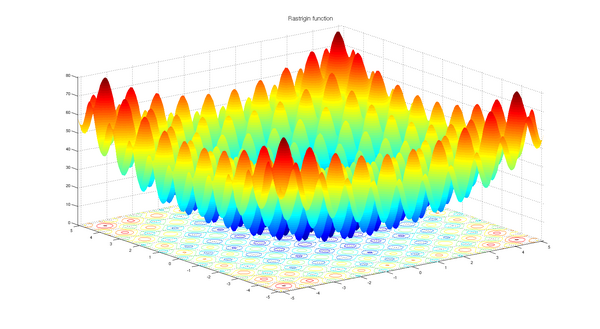

Check the git repo [examples](https://github.com/pkalivas/radiate/tree/master/examples) for a more 
comprehensive list of examples.

## MinSum

> Objective - Find a set of numbers that sum to the minimum value (0).

??? example MinSum

    This example demonstrates how to use the `radiate` library to solve a very simple optimization problem. This will create 
    a `Population` with 150 `Phenotype<IntChrosome<i32>>` with 1 `IntChromosome<i32>` 10 `IntGene<i32>` genes each, where each gene is a random number between 0 and 100. We set the bounds of the chromosomes to be between 0 and 100, this ensures that any chromosome whith a 
    gene outside of these bounds is classified as 'invalid' and is discarded from the population.
    
    The goal is to find a set of numbers that sum to the minimum value (0) - meaning all the genes' allele's should be 0. The `fitness_fn` calculates the sum of all the genes in the genotype, and the `minimizing()` method is used to indicate that we want to minimize this value. The `alter` method is used to specify the mutation and crossover strategies to be used during the evolution process. The `run` method is used to execute the evolution process, and the `ctx` parameter provides information about the current state of the engine. The `best` solution is printed at the end. We execute the engine until the score is `MIN_SCORE` (0).

    ```rust
    use radiate::*;

    const MIN_SCORE: i32 = 0;
    const NUM_CHROMOSOMES: usize = 1;
    const NUM_GENES: usize = 10;
    const MIN_GENE_VALUE: i32 = 0;
    const MAX_GENE_VALUE: i32 = 100;

    fn main() {
        let codex = IntCodex::new(NUM_CHROMOSOMES, NUM_GENES, MIN_GENE_VALUE, MAX_GENE_VALUE)
            .with_bounds(MIN_GENE_VALUE, MAX_GENE_VALUE);

        let engine = GeneticEngine::from_codex(codex)
            .population_size(150)
            .minimizing()
            .offspring_selector(EliteSelector::new())
            .alter(alters!(SwapMutator::new(0.05), UniformCrossover::new(0.5)))
            .fitness_fn(|geno: Vec<Vec<i32>>| geno.iter().flatten().sum::<i32>())
            .build();

        let result = engine.run(|ctx| {
            println!("[ {:?} ]: {:?}", ctx.index, ctx.best.first().unwrap());
            ctx.score().as_i32() == MIN_SCORE
        });

        println!("{:?}", result);
    }
    ```

## NQueens

> Objective - Place `n` queens on an `n x n` board such that no two queens threaten each other.

??? example

    This example demonstrates how to use the `radiate` library to solve the classic N-Queens problem, where the goal is to place `n` queens on an `n x n` board such that no two queens threaten each other. By threatening each other, we mean that they are in the same row, column, or diagonal. The solution is represented as a single chromosome with `n` genes, where each gene represents the row position of a queen in its respective column. The fitness function calculates the number of pairs of queens that threaten each other, and the goal is to minimize this value to zero.

    ```rust
    use radiate::*;

    const N_QUEENS: usize = 32;

    fn main() {
        random_provider::set_seed(42);

        let codex = IntCodex::<i8>::new(1, N_QUEENS, 0, N_QUEENS as i8);

        let engine = GeneticEngine::from_codex(codex)
            .minimizing()
            .num_threads(5)
            .offspring_selector(BoltzmannSelector::new(4.0))
            .alter(alters!(
                MultiPointCrossover::new(0.75, 2),
                UniformMutator::new(0.05)
            ))
            .fitness_fn(|genotype: Vec<Vec<i8>>| {
                let queens = &genotype[0];
                let mut score = 0;

                for i in 0..N_QUEENS {
                    for j in (i + 1)..N_QUEENS {
                        if queens[i] == queens[j] {
                            score += 1;
                        }
                        if (i as i8 - j as i8).abs() == (queens[i] - queens[j]).abs() {
                            score += 1;
                        }
                    }
                }

                score
            })
            .build();

        let result = engine.run(|ctx| {
            println!("[ {:?} ]: {:?}", ctx.index, ctx.score().as_usize());
            ctx.score().as_usize() == 0
        });

        println!("\nResult Queens Board ({:.3?}):", result.timer.duration());

        let board = &result.best[0];
        for i in 0..N_QUEENS {
            for j in 0..N_QUEENS {
                if board[j] == i as i8 {
                    print!("Q ");
                } else {
                    print!(". ");
                }
            }
            println!();
        }
    }
    ```


## Knapsack

> Objective - Find the optimal combination of items to maximize the total value without exceeding the weight limit.

??? example

    ```rust
    use std::sync::LazyLock;

    use radiate::*;

    const KNAPSACK_SIZE: usize = 15;
    const MAX_EPOCHS: i32 = 50;

    static KNAPSACK: LazyLock<Knapsack> = LazyLock::new(|| Knapsack::new(KNAPSACK_SIZE));

    fn main() {
        random_provider::set_seed(12345);
        let codex = SubSetCodex::new(&KNAPSACK.items);

        let engine = GeneticEngine::from_codex(codex)
            .max_age(MAX_EPOCHS)
            .fitness_fn(move |genotype: Vec<&Item>| Knapsack::fitness(&KNAPSACK.capacity, &genotype))
            .build();

        let result = engine.run(|ctx| {
            let value_total = Knapsack::value_total(&ctx.best);
            let weight_total = Knapsack::weight_total(&ctx.best);

            println!(
                "[ {:?} ]: Value={:?} Weight={:?}",
                ctx.index, value_total, weight_total
            );

            ctx.index == MAX_EPOCHS
        });

        println!(
            "Result Value Total=[ {:?} ]",
            Knapsack::value_total(&result.best)
        );
        println!(
            "Result Weigh Total=[ {:?} ]",
            Knapsack::weight_total(&result.best)
        );
        println!("Max Weight=[{:?}]", KNAPSACK.capacity);
    }

    pub struct Knapsack {
        pub capacity: f32,
        pub size: usize,
        pub items: Vec<Item>,
    }

    impl Knapsack {
        pub fn new(size: usize) -> Self {
            let items = Item::random_collection(size);
            Knapsack {
                capacity: size as f32 * 100_f32 / 3_f32,
                size,
                items,
            }
        }

        pub fn fitness(capacity: &f32, genotype: &Vec<&Item>) -> f32 {
            let mut sum = 0_f32;
            let mut weight = 0_f32;
            for item in genotype {
                sum += item.value;
                weight += item.weight;
            }

            if weight > *capacity {
                0_f32
            } else {
                sum
            }
        }

        pub fn value_total(items: &Vec<&Item>) -> f32 {
            items.iter().fold(0_f32, |acc, item| acc + item.value)
        }

        pub fn weight_total(items: &Vec<&Item>) -> f32 {
            items.iter().fold(0_f32, |acc, item| acc + item.weight)
        }
    }

    impl std::fmt::Debug for Knapsack {
        fn fmt(&self, f: &mut std::fmt::Formatter<'_>) -> std::fmt::Result {
            let mut sum = 0_f32;
            for item in &self.items {
                sum += item.value;
            }

            write!(
                f,
                "Knapsack[capacity={:.2}, size={:.2}, sum={:.2}]",
                self.capacity, self.size, sum
            )
        }
    }

    #[derive(Debug, Clone)]
    pub struct Item {
        pub weight: f32,
        pub value: f32,
    }

    impl Item {
        pub fn new(weight: f32, value: f32) -> Self {
            Item { weight, value }
        }

        pub fn random_collection(size: usize) -> Vec<Item> {
            (0..size)
                .map(|_| {
                    Item::new(
                        random_provider::random::<f32>() * 100.0,
                        random_provider::random::<f32>() * 100.0,
                    )
                })
                .collect()
        }
    }
    ```

## Rastrigin

> Objective - Find the global minimum of the [Rastrigin](https://en.wikipedia.org/wiki/Rastrigin_function) function.

??? example

    The Rastrigin function is a non-convex function used as a benchmark test problem for optimization algorithms. The function is highly multimodal, with many local minima, making it challenging for optimization algorithms to find the global minimum. 
    It is defined as:
    $$
    f(x) = A \cdot n + \sum_{i=1}^{n} \left[ x_i^2 - A \cdot \cos(2 \pi x_i) \right]
    $$
    where:

    - \( A \) is a constant (typically set to 10)
    - \( n \) is the number of dimensions (in this case 2)
    - \( x_i \) are the input variables.
    - The global minimum occurs at \( x = 0 \) for all dimensions, where the function value is \( 0 \).

    <figure>
        { width="400" }
    </figure>

    ```rust
    use radiate::*;

    const MIN_SCORE: f32 = 0.00;
    const MAX_SECONDS: f64 = 1.0;
    const A: f32 = 10.0;
    const RANGE: f32 = 5.12;
    const N_GENES: usize = 2;

    fn main() {
        let codex = FloatCodex::new(1, N_GENES, -RANGE, RANGE).with_bounds(-RANGE, RANGE);

        let engine = GeneticEngine::from_codex(codex)
            .minimizing()
            .population_size(500)
            .alter(alters!(
                UniformCrossover::new(0.5),
                ArithmeticMutator::new(0.01)
            ))
            .fitness_fn(move |genotype: Vec<Vec<f32>>| {
                let mut value = A * N_GENES as f32;
                for i in 0..N_GENES {
                    value += genotype[0][i].powi(2)
                        - A * (2.0 * std::f32::consts::PI * genotype[0][i]).cos();
                }

                value
            })
            .build();

        let result = engine.run(|ctx| {
            println!("[ {:?} ]: {:?}", ctx.index, ctx.score().as_f32());
            ctx.score().as_f32() <= MIN_SCORE || ctx.seconds() > MAX_SECONDS
        });

        println!("{:?}", result);
    }
    ```

## XOR Problem (Neural Network)

> Objective - Evolve a traditional neural network to solve the XOR problem.

??? example

    ```rust
    use radiate::*;

    const MIN_SCORE: f32 = 0.0001;
    const MAX_INDEX: i32 = 500;
    const MAX_SECONDS: u64 = 1;

    fn main() {
        let inputs = vec![
            vec![0.0, 0.0],
            vec![1.0, 1.0],
            vec![1.0, 0.0],
            vec![0.0, 1.0],
        ];

        let target = vec![0.0, 0.0, 1.0, 1.0];

        let codex = NeuralNetCodex {
            shapes: vec![(2, 8), (8, 8), (8, 1)],
            inputs: inputs.clone(),
            target: target.clone(),
        };

        let engine = GeneticEngine::from_codex(codex.clone())
            .minimizing()
            .num_threads(5)
            .offspring_selector(BoltzmannSelector::new(4_f32))
            .alter(alters!(
                IntermediateCrossover::new(0.75, 0.1),
                ArithmeticMutator::new(0.03),
            ))
            .fitness_fn(move |net: NeuralNet| net.error(&inputs, &target))
            .build();

        let result = engine.run(|ctx| {
            println!("[ {:?} ]: {:?}", ctx.index, ctx.score().as_f32());
            ctx.score().as_f32() < MIN_SCORE
                || ctx.index == MAX_INDEX
                || ctx.timer.duration().as_secs() > MAX_SECONDS
        });

        println!("Seconds: {:?}", result.seconds());
        println!("{:?}", result.metrics);
        let best = result.best;
        for (input, target) in codex.inputs.iter().zip(codex.target.iter()) {
            let output = best.feed_forward(input.clone());
            println!(
                "{:?} -> expected: {:?}, actual: {:.3?}",
                input, target, output
            );
        }
    }

    #[derive(Clone)]
    pub struct NeuralNet {
        pub layers: Vec<Vec<Vec<f32>>>,
    }

    impl NeuralNet {
        pub fn feed_forward(&self, input: Vec<f32>) -> Vec<f32> {
            let mut output = input;

            for layer in &self.layers {
                let layer_height = layer.len();
                let layer_width = layer[0].len();

                if output.len() != layer_height {
                    panic!(
                        "Input size does not match layer size: {} != {}",
                        output.len(),
                        layer_width
                    );
                }

                let mut new_output = Vec::new();
                for i in 0..layer_width {
                    let mut sum = 0_f32;
                    for j in 0..layer_height {
                        sum += layer[j][i] * output[j];
                    }

                    if i == layer_width - 1 {
                        new_output.push(if sum > 0.0 { sum } else { 0.0 });
                    } else {
                        new_output.push(1.0 / (1.0 + (-sum).exp()));
                    }
                }

                output = new_output;
            }

            output
        }

        pub fn error(&self, data: &[Vec<f32>], target: &[f32]) -> f32 {
            let mut score = 0_f32;
            for (input, target) in data.iter().zip(target.iter()) {
                let output = self.feed_forward(input.clone());
                score += (target - output[0]).powi(2);
            }

            score / data.len() as f32
        }
    }

    #[derive(Clone)]
    pub struct NeuralNetCodex {
        pub shapes: Vec<(usize, usize)>,
        pub inputs: Vec<Vec<f32>>,
        pub target: Vec<f32>,
    }

    impl Codex<FloatChromosome, NeuralNet> for NeuralNetCodex {
        fn encode(&self) -> Genotype<FloatChromosome> {
            let mut chromosomes = Vec::<FloatChromosome>::new();
            for shape in &self.shapes {
                chromosomes.push(FloatChromosome {
                    genes: (0..shape.0 * shape.1)
                        .map(|_| FloatGene::new(-1.0, 1.0))
                        .collect::<Vec<FloatGene>>(),
                });
            }

            Genotype::new(chromosomes)
        }

        fn decode(&self, genotype: &Genotype<FloatChromosome>) -> NeuralNet {
            let mut layers = Vec::new();
            for (i, chromosome) in genotype.iter().enumerate() {
                layers.push(
                    chromosome
                        .iter()
                        .as_slice()
                        .chunks(self.shapes[i].1 as usize)
                        .map(|chunk| chunk.iter().map(|gene| gene.allele).collect::<Vec<f32>>())
                        .collect::<Vec<Vec<f32>>>(),
                );
            }

            NeuralNet { layers }
        }
    }
    ```

## XOR Problem (NeuroEvolution)

> Objective - Evolve a `Graph<Op<f32>>` to solve the XOR problem (NeuroEvolution).
>
>  Warning - only available with the `radiate-gp` crate

??? example

    ```rust
    use radiate::*;
    use radiate_gp::*;

    const MAX_INDEX: i32 = 500;
    const MIN_SCORE: f32 = 0.01;

    fn main() {
        random_provider::set_seed(501);

        let values = vec![
            (NodeType::Input, vec![Op::var(0), Op::var(1)]),
            (NodeType::Edge, vec![Op::weight(), Op::identity()]),
            (NodeType::Vertex, ops::get_all_operations()),
            (NodeType::Output, vec![Op::sigmoid()]),
        ];

        let graph_codex = GraphCodex::asyclic(2, 1, values);
        let regression = Regression::new(get_dataset(), Loss::MSE);

        let engine = GeneticEngine::from_codex(graph_codex)
            .minimizing()
            .alter(alters!(
                GraphCrossover::new(0.5, 0.5),
                OperationMutator::new(0.05, 0.05),
                GraphMutator::new(0.06, 0.01, false)
            ))
            .fitness_fn(move |genotype: Graph<Op<f32>>| regression.eval(&genotype))
            .build();

        let result = engine.run(|ctx| {
            println!("[ {:?} ]: {:?}", ctx.index, ctx.score().as_f32(),);
            ctx.index == MAX_INDEX || ctx.score().as_f32() < MIN_SCORE
        });

        display(&result);
    }

    fn display(result: &EngineContext<GraphChromosome<Op<f32>>, Graph<Op<f32>>>) {
        let mut reducer = GraphEvaluator::new(&result.best);
        for sample in get_dataset().iter() {
            let output = &reducer.eval_mut(sample.input())[0];
            println!(
                "{:?} -> epected: {:?}, actual: {:.3?}",
                sample.input(),
                sample.output(),
                output
            );
        }

        println!("{:?}", result)
    }

    fn get_dataset() -> DataSet {
        let inputs = vec![
            vec![0.0, 0.0],
            vec![1.0, 1.0],
            vec![1.0, 0.0],
            vec![0.0, 1.0],
        ];

        let answers = vec![vec![0.0], vec![0.0], vec![1.0], vec![1.0]];

        DataSet::new(inputs, answers)
    }
    ```