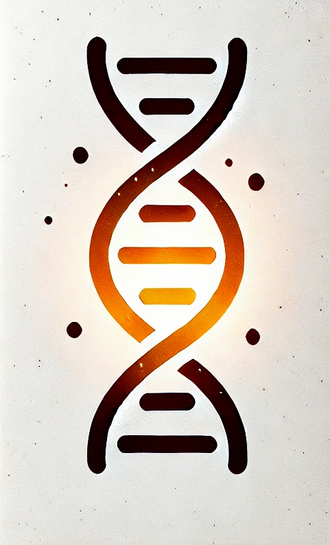

#  

<center>
    <h1>Radiate</h1>
</center>
<figure markdown="span">
  { width="100" }
</figure>

<center>
![master branch checks][master_branch_checks] ![Crates.io][crates_link] ![Crates.io License][license] ![Static badge][static_evolution_badge]
</center>

[crates_link]: https://img.shields.io/crates/v/radiate
[master_branch_checks]: https://img.shields.io/github/check-runs/pkalivas/radiate/master
[license]: https://img.shields.io/crates/l/radiate
[static_evolution_badge]: https://img.shields.io/badge/evolution-genetics-default

Radiate is a powerful Rust library designed for implementing genetic algorithms and artificial evolution techniques. It
provides a fast and flexible framework for creating, evolving, and optimizing solutions to complex problems using principles
inspired by natural selection and genetics. With an intuitive, 'plug and play' style API, Radiate allows you to quickly test a multitude of evolutionary strategies and configurations, making it an ideal tool for both beginners and experienced practitioners in the field of evolutionary computation.

___
```toml
[dependencies]
radiate = "1.2.3"
```
___

<div class="grid cards" markdown>
    
-   **Ease of use** :material-thumb-up:{ .right }

    ---

    Intuitive API design allows users to easily configure and run genetic algorithms without needed to know the nuts and bolts of the complex operations underlying them.

-   **Modular Design** :material-draw:{ .right }

    ---

    The library architecture enables users to mix and match different components such as selection strategies, crossover methods, and mutation techniques to suit their specific needs.

-   **Performance** :material-rocket-launch:{ .right }

    ---

    Leveraging Rust's performance capabilities, Radiate ensures efficient execution of genetic operations, even for large populations and complex problem spaces. 

-   **Flexibility** :material-domain:{ .right }

    ---

    Out of the box support for a customizable genotypes and fitness functions, Radiate can be adapted to a wide range of problem domains, from single and multi optimization tasks to machine learning applications.

</div>
