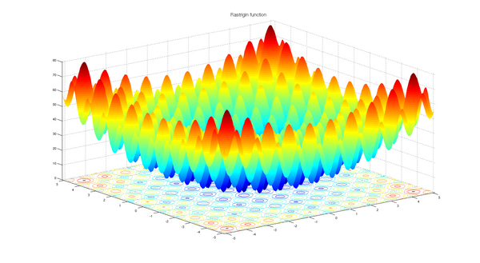
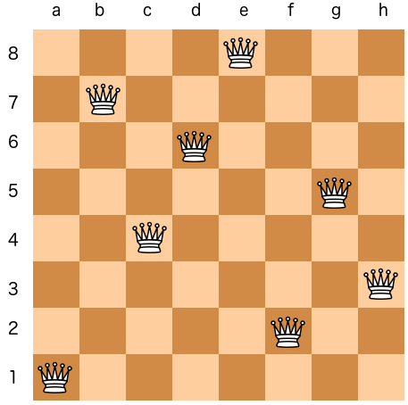
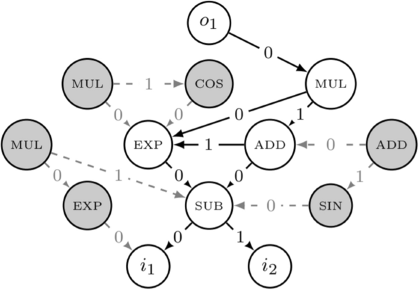
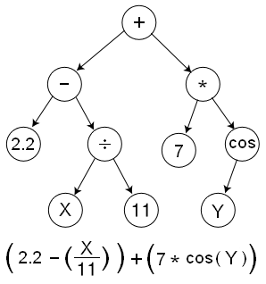
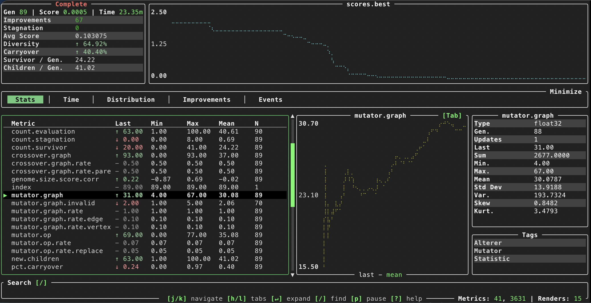

<div class="rd-section" markdown>

<p class="rd-eyebrow">Why Radiate</p>

## Evolution Made Easy

<p class="rd-section__lead">Radiate is a powerful library for implementing genetic algorithms and artificial evolution techniques. It provides a fast and flexible framework for creating, evolving, and optimizing solutions to complex problems using principles
inspired by natural selection and genetics. The core is written in Rust with complete parity in Python.</p>

<div class="grid cards" markdown>
    
-   **Ease of use** :material-thumb-up:{ .right .rd-icon }

    ---

    Intuitive API design allows users to easily configure and run genetic algorithms without needed to know the nuts and bolts of the complex operations underlying them.

-   **Modular Design** :material-draw:{ .right .rd-icon }

    ---

    The library architecture enables users to mix and match different components such as selection strategies, crossover methods, and mutation techniques to suit their specific needs.

-   **Performance** :material-rocket-launch:{ .right .rd-icon }

    ---

    Between Rust's performance capabilities, a multi-threaded architecture, and hours spent optimizing code, Radiate ensures efficient execution of genetic operations, even for large populations and complex problem spaces. 

-   **Genome** :material-dna:{ .right .rd-icon }

    ---

    Bits, characters, integers, floats, permutations, graphs and trees all evolve through the same core engine.

</div>

</div>

<div class="rd-section" markdown>

<p class="rd-eyebrow">Flexibility</p>

## Customizable Genotypes and Fitness Functions

<p class="rd-section__lead">Out of the box support for a customizable genotypes and fitness functions, Radiate can be adapted to a wide range of problem domains, from single and multi optimization tasks to neuroevolution and machine learning applications.</p>

<div class="rd-showcase">
  <a class="rd-tile" href="source/examples/">
    
    <span class="rd-tile__caption"><strong>Continuous</strong>Float genomes for Rastrigin, Rosenbrock, Ackley and your own objectives.</span>
  </a>
  <a class="rd-tile" href="source/examples/">
    
    <span class="rd-tile__caption"><strong>Combinatorial</strong>Permutations and integers for N-Queens, TSP and knapsack.</span>
  </a>
  <a class="rd-tile" href="source/gp/graph/">
    
    <span class="rd-tile__caption"><strong>Neuroevolution</strong>Evolve graph topologies, from feed-forward to recurrent and LSTM-style cells.</span>
  </a>
  <a class="rd-tile" href="source/gp/trees/">
    
    <span class="rd-tile__caption"><strong>Genetic programming</strong>Tree-based programs for symbolic regression and classification.</span>
  </a>
</div>

<div class="rd-chips">
  <span class="rd-chip">Bits</span>
  <span class="rd-chip">Characters</span>
  <span class="rd-chip">Integers</span>
  <span class="rd-chip">Floats</span>
  <span class="rd-chip">Permutations</span>
  <span class="rd-chip">Subsets</span>
  <span class="rd-chip">Graphs</span>
  <span class="rd-chip">Trees</span>
  <span class="rd-chip">Multi-objective</span>
  <span class="rd-chip">Speciation</span>
  <span class="rd-chip">Novelty search</span>
</div>

</div>

<div class="rd-section" markdown>

</div>

<div class="rd-section" markdown>

<div class="rd-split" markdown>

<div markdown>

<p class="rd-eyebrow">Observability</p>

## Deep insight into the engine in real-time

<p class="rd-section__lead">A first-class metric system is inter-woven into every aspect of radiate. Read them in your own code, subscribe to events, or open the opt-in terminal dashboard.</p>

[Explore the dashboard](source/misc/ui.md){ .md-button }

</div>



</div>

</div>

<div class="rd-section" markdown>

<div class="rd-example" markdown>

<div class="rd-example__intro" markdown>

<p class="rd-eyebrow">Example</p>

## Hello, Radiate!

<p class="rd-section__lead">Evolve a string of characters until it matches a target. The same run in Python and Rust.</p>

<ol class="rd-steps">
  <li><span class="rd-step">1</span><span><strong>Pick a genome.</strong> A codec turns the problem into something the engine can evolve: here, a vector of characters as long as the target.</span></li>
  <li><span class="rd-step">2</span><span><strong>Score it.</strong> The fitness function counts the characters that already match.</span></li>
  <li><span class="rd-step">3</span><span><strong>Run it.</strong> The engine evolves the population until a limit is reached: here, a perfect score.</span></li>
</ol>

<div class="rd-links rd-links--start" markdown>

[:material-dna: Codecs](source/genome/codec.md){ .rd-link }
[:material-scale-balance: Fitness](source/fitness.md){ .rd-link }
[:material-flag-checkered: Limits](source/engine/limits.md){ .rd-link }

</div>

</div>

<div class="rd-example__code" markdown>

=== ":fontawesome-brands-python: Python"

    ```python title="hello_radiate.py"
    import radiate as rd

    target = "Hello, Radiate!"

    engine = (
        rd.Engine.char(len(target))
        .fitness(
            lambda member: sum(1 for i in range(len(target)) if member[i] == target[i])
        )
        .limit(rd.Limit.score(len(target)))
    )

    result = engine.run(log=True)

    print("Best solution:", "".join(result.value()))
    ```

=== ":fontawesome-brands-rust: Rust"

    ```rust title="src/main.rs"
    use radiate::prelude::*;

    let target = "Hello, Radiate!";

    let engine = GeneticEngine::builder()
        .codec(CharCodec::vector(target.len()))
        .fitness_fn(|geno: Vec<char>| {
            geno.into_iter()
                .zip(target.chars())
                .filter(|(allele, targ)| allele == targ)
                .count()
        })
        .build();

    let result = engine
        .iter()
        .until_score(target.len())
        .last()?;

    println!("{}", result.value().iter().collect::<String>());
    ```

</div>

</div>

</div>

<div class="rd-section" markdown>

<p class="rd-eyebrow">Next steps</p>

## Start evolving

<div class="grid cards" markdown>

-   :material-book-open-variant:{ .lg .rd-icon } **User guide**

    ---

    Explore the library one concept at a time.

    [:octicons-arrow-right-24: Read the guide](source/overview.md)

-   :material-flask-outline:{ .lg .rd-icon } **Examples**

    ---

    Complete problems in both languages.

    [:octicons-arrow-right-24: Browse examples](source/examples.md)

-   :material-language-rust:{ .lg .rd-icon } **Rust API**

    ---

    docs.rs.

    [:octicons-arrow-right-24: docs.rs/radiate](https://docs.rs/radiate/latest/radiate/)

-   :material-github:{ .lg .rd-icon } **Source**

    ---

    Issues, code, and the changelog.

    [:octicons-arrow-right-24: pkalivas/radiate](https://github.com/pkalivas/radiate)

</div>

</div>
