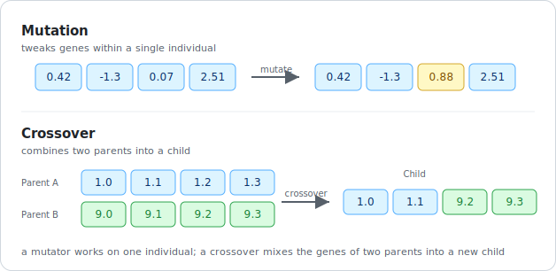

# Alterers

Alterers are genetic operators that modify the genetic material of individuals in a `population`. In Radiate, there are two main types of alterers:

1. **Mutators**: Operators that modify individual genes or chromosomes
2. **Crossovers**: Operators that combine genetic material from two parents to create offspring

<figure markdown="span">
    { width="560" }
</figure>

Alterers run during the engine's **recombine** step and are applied only to the **offspring** — the individuals chosen by the [offspring selector](../selectors/index.md). Survivors pass through to the next generation untouched. Each alterer is paired with a [rate](rate.md) that controls how often it fires, so you tune not just *which* operators run but *how aggressively*.

These operators modify the `population` and are essential for the genetic algorithm to explore the search space effectively. As such, the choice of `alterer` can have a significant impact on the performance of the genetic algorithm, so it is important to choose an `alterer` that is well-suited to the problem being solved.

This section is organized as:

| Page | Covers |
|---|---|
| [Rate](rate.md) | how often an alterer fires — a fixed value or a schedule that changes over the run |
| [Mutators](mutators.md) | operators that tweak genes within a single individual |
| [Crossovers](crossovers.md) | operators that combine two parents into offspring |
| [Example](example.md) | wiring alterers into an engine |

---

## Best Practices

1. **Rate Selection**:
    - Start with conservative rates (0.01 for mutation, 0.5-0.8 for crossover)
    - Adjust based on problem characteristics
    - Higher rates increase exploration but may disrupt good solutions

2. **Choosing the Right Alterer**:
    - For continuous problems: Use Gaussian or Arithmetic [mutators](mutators.md) with Blend/Intermediate [crossover](crossovers.md)
    - For permutation problems: Use Swap/Scramble [mutators](mutators.md) with PMX or Shuffle [crossover](crossovers.md)
    - For binary problems: Use Uniform [mutator](mutators.md) with Multi-point or Uniform [crossover](crossovers.md)

3. **Combining Alterers**:
    - It's often beneficial to use multiple alterers
    - Example: Combine a local search mutator (Gaussian) with a global search crossover (Multi-point)
    - Monitor population diversity to ensure proper balance

4. **Parameter Tuning**:
    - Start with default parameters
    - Adjust based on problem size and complexity
    - Use smaller rates for larger problems

## Common Pitfalls

1. **Too High Mutation Rates**:
    - Can lead to random search behavior
    - May destroy good solutions before they can be exploited
    - Solution: Start with low rates (0.01-0.1) and adjust based on results

2. **Inappropriate Crossover Selection**:
    - Using permutation crossovers for continuous problems
    - Using continuous crossovers for permutation problems
    - Solution: Match the crossover type to your problem domain

3. **Ignoring Problem Constraints**:
    - Some alterers may produce invalid solutions
    - Solution: Use appropriate alterers or implement repair mechanisms

4. **Poor Parameter Tuning**:
    - Using the same parameters for all problems
    - Solution: Experiment with different parameters and monitor performance
