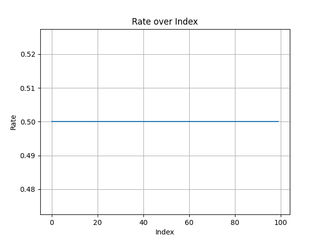
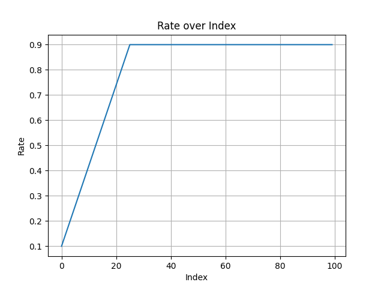
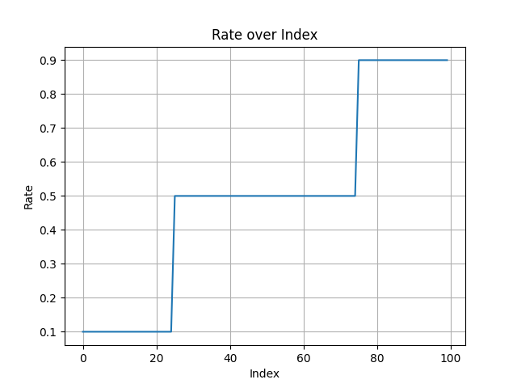

# Rates

Rates are used to control the application frequency of alters. They can be static (fixed) or dynamic (changing over time). Radiate provides several built-in rate strategies to help you fine-tune the behavior of the alterers. Each mutator and crossover in Radiate accepts a `rate` parameter. In Python, the `rate` parameter can be either a float (for fixed rates) or an instance of the `Rate` class (for dynamic rates). In Rust, the `rate` parameter is anything that implements `Into<Rate>`. Below we can see the available rate strategies generated by the code snippet:

```python
import radiate as rd

rate = rd.Rate...

rates = []
for i in range(100):
	rates.append(rate.value(i))
```

## Fixed

- **Purpose**: Applies a constant rate throughout the evolution process - this is the default behavior and can be thought of as the "standard" rate.

=== ":fontawesome-brands-python: Python"

    ```python
    import radiate as rd

    rate = rd.Rate.fixed(0.1)
    ```

=== ":fontawesome-brands-rust: Rust"

    ```rust
    use radiate::*;

    let rate = Rate::fixed(0.1);
    ```

<figure markdown="span">
    { width="500" }
</figure>


## Linear

- **Purpose**: Gradually changes the rate from a starting value to an ending value over a specified duration, allowing for a smooth transition in the application frequency of the alterer.

=== ":fontawesome-brands-python: Python"

    ```python
    import radiate as rd

    rate = rd.Rate.linear(start=0.1, end=0.9, duration=25)
    ```

=== ":fontawesome-brands-rust: Rust"

    ```rust
    use radiate::*;

    let rate = Rate::linear(0.1, 0.9, 25);
    ```

<figure markdown="span">
    { width="500" }
</figure>


## Stepwise

- **Purpose**: Changes the rate at specified intervals, allowing for abrupt changes in the application frequency of the alterer.

=== ":fontawesome-brands-python: Python"

    ```python
    import radiate as rd

    steps = [(0, 0.1), (25, 0.5), (75, 0.9)]
    rate = rd.Rate.stepwise(steps)
    ```

=== ":fontawesome-brands-rust: Rust"

    ```rust
    use radiate::*;

    let steps = vec![(0, 0.1), (25, 0.5), (75, 0.9)];
    let rate = Rate::stepwise(steps);
    let rate = Rate::from(steps);
    ```

<figure markdown="span">
    { width="500" }
</figure>


## Sine Cyclical

- **Purpose**: Oscillates the rate between a minimum and maximum value over a specified period, allowing for periodic changes in the application frequency of the alterer.

=== ":fontawesome-brands-python: Python"

    ```python
    import radiate as rd

    rate = rd.Rate.sine(min=0.1, max=0.9, periods=10)
    ```

=== ":fontawesome-brands-rust: Rust"

    ```rust
    use radiate::*;

    let rate = Rate::cyclical(0.1, 0.9, 10, "sine");
    ```

<figure markdown="span">
    { width="500" }
</figure>


## Triangular Cyclical

- **Purpose**: Oscillates the rate between a minimum and maximum value over a specified period using a triangular wave, allowing for periodic changes in the application frequency of the alterer.

=== ":fontawesome-brands-python: Python"

    ```python
    import radiate as rd

    rate = rd.Rate.triangular(min=0.1, max=0.9, periods=10)
    ```

=== ":fontawesome-brands-rust: Rust"

    ```rust
    use radiate::*;

    let rate = Rate::cyclical(0.1, 0.9, 10, "triangular");
    ```

<figure markdown="span">
    { width="500" }
</figure>


## Exponential

- **Purpose**: Changes the rate exponentially from a starting value to an ending value over a specified duration, allowing for rapid changes in the application frequency of the alterer.

=== ":fontawesome-brands-python: Python"

    ```python
    import radiate as rd

    rate = rd.Rate.exp(start=0.5, end=0.1, half_life=25)
    ```

=== ":fontawesome-brands-rust: Rust"

    ```rust
    use radiate::*;

    let rate = Rate::exponential(0.5, 0.1, 25);
    ```

<figure markdown="span">
    { width="500" }
</figure>
