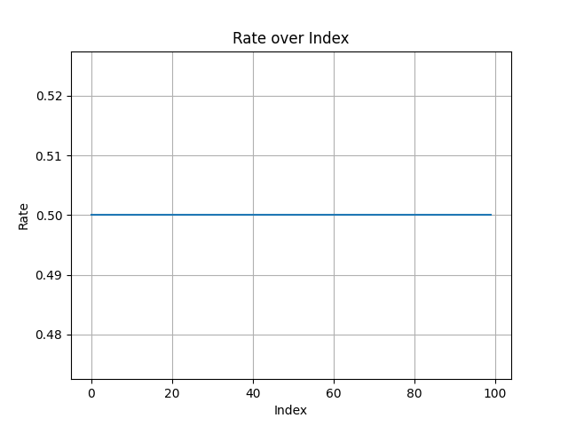
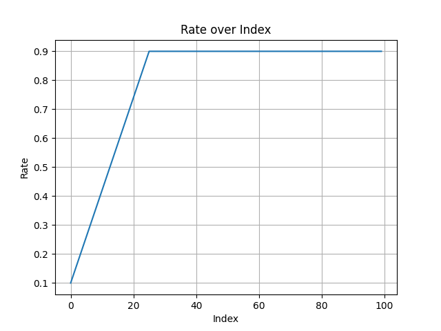
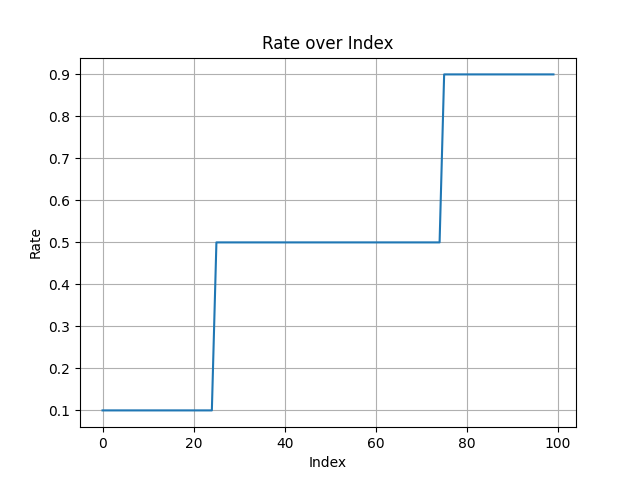
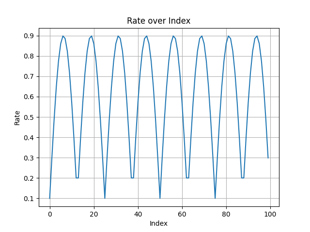
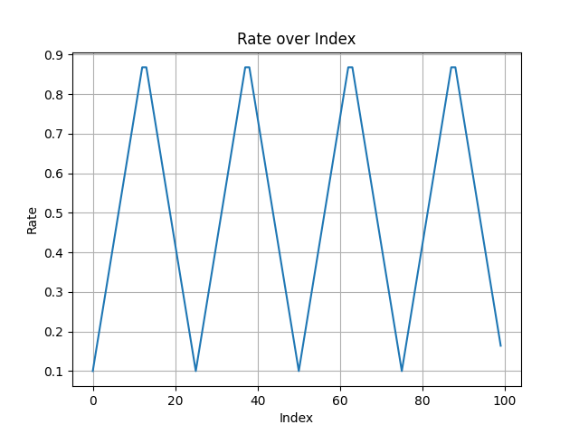
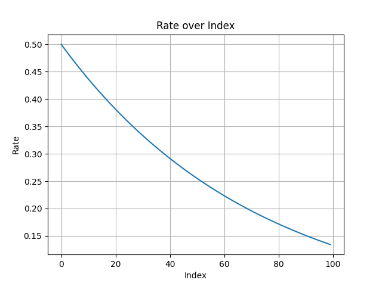

# Rates

Rates are used to control the application frequency of alters. They can be static (fixed) or dynamic (changing over time). Radiate provides several built-in rate strategies to help you fine-tune the behavior of the alterers. Each mutator and crossover in Radiate accepts a `rate` parameter. In Python, the `rate` parameter can be either a float (for fixed rates) or an instance of the `Rate` class (for dynamic rates). In Rust, the `rate` parameter is anything that implements `Into<Rate>`. Beyond the fixed and scheduled rates below, a rate can also be driven by live metrics via an [expression](../engine/expressions.md).

Every schedule exposes its value at a given generation through `.value(i)` — this is how the engine reads the current rate each generation, and how the curves below were plotted. For example, sampling a fixed rate across 100 generations:

```python
--8<-- "python/alters/rate.py:intro"
```

Use the table below to pick a schedule, then see its section for the parameters and curve.

| Strategy | Behavior | Reach for it when… |
|---|---|---|
| [Fixed](#fixed) | constant rate | you want one steady rate (the default) |
| [Linear](#linear) | smooth ramp from start → end | you want to shift exploration ↔ exploitation gradually |
| [Stepwise](#stepwise) | jumps to a new rate at set generations | your run has distinct phases |
| [Sine Cyclical](#sine-cyclical) | smooth oscillation between min/max | you want to periodically re-inject exploration (escape local optima) |
| [Triangular Cyclical](#triangular-cyclical) | oscillation with linear ramps | same as sine, but with sharper turns |
| [Exponential](#exponential) | fast change that levels off | you want a high starting rate to decay quickly |

## Fixed

- **Purpose**: Applies a constant rate throughout the evolution process - this is the default behavior and can be thought of as the "standard" rate.

=== ":fontawesome-brands-python: Python"

    ```python
    --8<-- "python/alters/rate.py:fixed_rate"
    ```

=== ":fontawesome-brands-rust: Rust"

    ```rust
    use radiate::*;

    let rate = Rate::fixed(0.1);
    ```

<figure markdown="span">
    { width="500" }
</figure>


## Linear

- **Purpose**: Gradually changes the rate from a starting value to an ending value over a specified duration, allowing for a smooth transition in the application frequency of the alterer.

=== ":fontawesome-brands-python: Python"

    ```python
    --8<-- "python/alters/rate.py:linear_rate"
    ```

=== ":fontawesome-brands-rust: Rust"

    ```rust
    use radiate::*;

    let rate = Rate::linear(0.1, 0.9, 25);
    ```

<figure markdown="span">
    { width="500" }
</figure>


## Stepwise

- **Purpose**: Changes the rate at specified intervals, allowing for abrupt changes in the application frequency of the alterer.

=== ":fontawesome-brands-python: Python"

    ```python
    --8<-- "python/alters/rate.py:stepwise_rate"
    ```

=== ":fontawesome-brands-rust: Rust"

    ```rust
    use radiate::*;

    let steps = vec![(0, 0.1), (25, 0.5), (75, 0.9)];
    let rate = Rate::stepwise(steps);
    let rate = Rate::from(steps);
    ```

<figure markdown="span">
    { width="500" }
</figure>


## Sine Cyclical

- **Purpose**: Oscillates the rate between a minimum and maximum value over a specified period, allowing for periodic changes in the application frequency of the alterer.

=== ":fontawesome-brands-python: Python"

    ```python
    --8<-- "python/alters/rate.py:sine_rate"
    ```

=== ":fontawesome-brands-rust: Rust"

    ```rust
    use radiate::*;

    let rate = Rate::cyclical(0.1, 0.9, 10, "sine");
    ```

<figure markdown="span">
    { width="500" }
</figure>


## Triangular Cyclical

- **Purpose**: Oscillates the rate between a minimum and maximum value over a specified period using a triangular wave, allowing for periodic changes in the application frequency of the alterer.

=== ":fontawesome-brands-python: Python"

    ```python
    --8<-- "python/alters/rate.py:triangular_rate"
    ```

=== ":fontawesome-brands-rust: Rust"

    ```rust
    use radiate::*;

    let rate = Rate::cyclical(0.1, 0.9, 10, "triangular");
    ```

<figure markdown="span">
    { width="500" }
</figure>


## Exponential

- **Purpose**: Changes the rate exponentially from a starting value to an ending value with a specified half-life, allowing for rapid changes in the application frequency of the alterer.

=== ":fontawesome-brands-python: Python"

    ```python
    --8<-- "python/alters/rate.py:exp_rate"
    ```

=== ":fontawesome-brands-rust: Rust"

    ```rust
    use radiate::*;

    let rate = Rate::exponential(0.5, 0.1, 25);
    ```

<figure markdown="span">
    { width="500" }
</figure>
