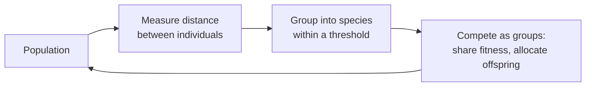

# Diversity

By default the `GeneticEngine` evolves one flat population where every individual competes against every other. That works in a majority of problems, but it can fail into what is known as **premature convergence** - where the `population` piles into the first decent solution it finds and stops exploring. A novel individual that needs a few generations to really evolve and pay off gets out-competed and lost before it ever matures.

**Diversity** is `radiate`'s opt-in defense against premature convergence. Instead of one undifferentiated pool, the engine groups genetically-similar individuals into **species** and lets them compete *as groups*. A promising-but-immature lineage then competes mainly against its own kind, giving it room to refine before it has to stand against the rest of the population.

## How it fits together

Diversity is really two halves of a single loop that runs each generation:

- A **distance measure** answers *"how genetically similar are these two individuals?"* given the structure of their `genotypes`. This effectively turns a pair of `genotypes` into a single number.
- **Species** are what the engine builds *from* those numbers, or distances: it clusters the population, shares fitness within each cluster, and allocates offspring between clusters.

Here we can see the whole cycle before diving into either piece:



The **distance measure** is the input to everything while the **species** machinery is what consumes it. 

| Page | What it covers |
|---|---|
| **[Distance](distance.md)** | The built-in measures (Hamming, Euclidean, Cosine, NEAT), what each one captures, and the value range it produces. |
| **[Species](species.md)** | How the engine forms species from those measurements, shares fitness, and allocates offspring + the knobs that tune it. |
| **[Example](example.md)** | Wiring it all into a working engine. |

!!! tip "Opt-in, and not free"

	Speciation only runs when you attach a distance measure. It also adds computational cost because every generation the engine must measure distances and re-cluster the population — so reach for it when a problem is converging too early or not reaching its global optimum, not by default.

## The whole feature, in one call

Turning diversity on comes down to two settings: the **measure** (which distance) and the **threshold** (how close counts as "the same species"). Everything in this sections builds on these two, so here is a brief look at how they work together:

=== ":fontawesome-brands-python: Python"

	```python
	--8<-- "python/diversity/index.py:diversity_basic"
	```

=== ":fontawesome-brands-rust: Rust"

	```rust
	use radiate::*;

	let engine = GeneticEngine::builder()
	    // ... other parameters ...
	    .diversity(EuclideanDistance::new())
	    .species_threshold(0.5)
	    // ... other parameters ...
	    .build();
	```
