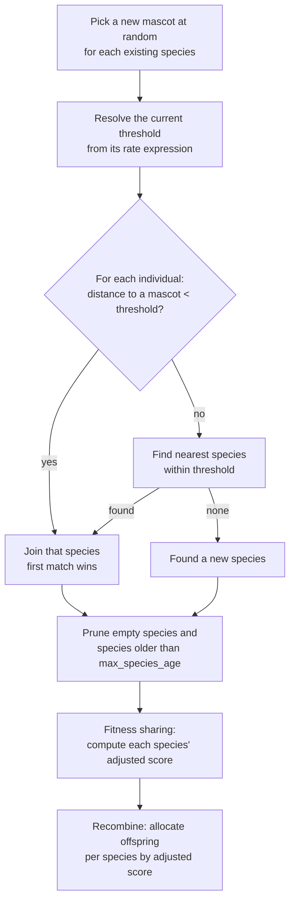

# Species

A **species** is a cluster of genetically-similar individuals. When a [distance measure](distance.md) is attached to the engine, `radiate` groups the `population` into species each generation and lets them compete *as groups* rather than as a single pool. By doing this, we protect a promising-but-immature lineage from being wiped out before it has a chance to refine. This is the core idea behind [NEAT](https://nn.cs.utexas.edu/downloads/papers/stanley.ec02.pdf)-style speciation, and `radiate` applies this to all of speciation.

This page covers *what a species is* and *how the engine forms and uses them*. For the distance measures that decide who is "similar," see the last section, [Distance](distance.md).

!!! tip "Speciation is opt-in"

	Speciation only runs if you provide a diversity measure (see [Diversity](index.md)). Without one, the engine evolves a single flat population and none of the machinery below is active.

---

## What a species holds

Each species tracks a small amount of state across generations:

| Field | Meaning |
|---|---|
| **mascot** | A representative individual, re-chosen *at random* from the species' members every generation. Membership for the next generation is decided by distance to this mascot. |
| **members** | The individuals currently assigned to the species. For what it's worth, this is the individual's `PhenotypeId`, not the entire individual. |
| **generation** | The generation the species was founded which is used to compute its age. |
| **best / stagnation** | The species' best score so far and how many generations it has gone without improving it. |
| **adjusted score** | The species' *fitness-shared* score, used to decide how many offspring it earns (see [below](#fitness-sharing-and-offspring-allocation)). |

The randomly-chosen mascot is deliberate: it keeps a species from being anchored to one fixed individual and lets the cluster drift as the population evolves.

---

## The speciation lifecycle

Every generation the engine runs a speciation step that re-forms species from scratch against the previous generation's mascots, then prunes and scores them:



1. **Mascots are refreshed.** Each existing species picks a new mascot uniformly at random from its current members.
2. **The threshold is resolved.** `species_threshold` is a [rate](../alters/rate.md) — a constant or an `Expr` — so it may be fixed or change over generations (see [Adaptive thresholds](#adaptive-thresholds)).
3. **Individuals are assigned.** Each individual is compared to the mascots; the *first* species whose mascot is within `species_threshold` claims it. This can run in parallel depending on the configured [executor](../executors.md).
4. **Leftovers settle.** An unassigned individual joins its single nearest species if one sits within the threshold; otherwise it **founds a new species** and becomes its mascot.
5. **Dead and stale species are removed.** Species with no members disappear, and the [filter step](../genome/index.md) culls any species whose age exceeds `max_species_age`.
6. **Fitness is shared and offspring are allocated** — the next two sections.

---

## Fitness sharing and offspring allocation

Rather than letting the globally-fittest individuals dominate reproduction, the engine shares fitness *within* a species and hands out offspring *between* species in proportion to how each species is doing on average.

**Fitness sharing.** A species' raw fitness is divided across its members, so being in a crowded species dilutes each member's contribution. Concretely, the species' **adjusted score** is the average of its members' scores, then normalized across all species so the adjusted scores form a distribution:

$$
\text{adjusted}_i = \frac{1}{S} \sum_{m \in \text{species}_i} \text{score}(m)
\qquad
\widehat{\text{adjusted}}_i = \frac{\text{adjusted}_i}{\sum_j \text{adjusted}_j}
$$

where $S$ is the species size. The effect: a large species must be *better on average* to keep its share, which discourages any one cluster from swamping the population.

**Offspring allocation.** During recombination the total offspring budget is split into **per-species quotas** proportional to each species' normalized adjusted score (largest fractional remainders get the leftover slots if needed). Selection and alteration then happen *within* each species' sub-population:

- A higher-scoring species earns a larger quota of offspring.
- Survivors are still selected globally, but offspring are bred per-species, so young or unusual species get protected breeding room instead of competing head-to-head with established ones.

This is really the core algorithm that allows novel structures to survive long enough to mature.

---

## Tuning knobs

### Species threshold

The threshold sets how close two individuals must be — *under the chosen distance measure* — to share a species. It is the single most impactful speciation knob.

=== ":fontawesome-brands-python: Python"

	```python
	--8<-- "python/diversity/species.py:threshold"
	```

=== ":fontawesome-brands-rust: Rust"

	```rust
	--8<-- "rust/diversity/species.rs:threshold"
	```

As a general rule, the `species_threshold` follows the below pattern:

A **lower** threshold → individuals must be very similar to group → **more, smaller species** → more diversity, slower convergence.

A **higher** threshold → loose grouping → **fewer, larger species** → less diversity, faster convergence.

Because the right value is measure-dependent, the practical approach is to set it, watch how many species form, and adjust until you get a handful of meaningful clusters rather than one giant species or hundreds of singletons.

### Adaptive thresholds

Since `species_threshold` accepts a [rate](../alters/rate.md) — anything that converts to an `Expr` — it can change over the run — for example starting tight to explore many niches, then widening to let the population consolidate:

=== ":fontawesome-brands-python: Python"

	```python
	--8<-- "python/diversity/species.py:dynamic_threshold"
	```

=== ":fontawesome-brands-rust: Rust"

	```rust
	--8<-- "rust/diversity/species.rs:dynamic_threshold"
	```

The threshold can also be driven by live metrics via an expression — see [Expressions](../engine/expressions.md).

### Target Species Count

The engine's `target_species_count` acts as a soft target for the number of species to maintain. Internally, it replaces the `species_threshold` with an `Expr` that nudges the threshold up or down based on how many species are currently active — if there are too many species, the threshold rises to encourage consolidation; if there are too few, it drops to encourage diversification. The engine builds this internal expression for you — all you have to do is specify the `target` species count. The full expression is included below too, for visibility into what's actually running.

=== ":fontawesome-brands-python: Python"

	```python
	--8<-- "python/diversity/species.py:target_species_count"
	```

=== ":fontawesome-brands-rust: Rust"

	```rust
	--8<-- "rust/diversity/species.rs:target_species_count"
	```

### Maximum species age

A species that goes `max_species_age` generations without improving its best score is considered stagnant and removed; its members sit out crossover and mutation for that generation. This frees the offspring budget for species that are still making progress.

=== ":fontawesome-brands-python: Python"

	```python
	--8<-- "python/diversity/species.py:age"
	```

=== ":fontawesome-brands-rust: Rust"

	```rust
	--8<-- "rust/diversity/species.rs:age"
	```

The default is **`25`** generations in Rust and **`20`** in Python. Increase it for hard problems that need more time to refine a niche; decrease it to clear out stagnant clusters faster.

---

## Common pitfalls

1. **Threshold scaled wrong for the measure.**
	- *Symptom*: one species containing everyone, or a new species for nearly every individual.
	- *Fix*: re-scale `species_threshold` to your distance measure's range — a value that works for Hamming (`[0, 1]`) is meaningless for an unbounded Euclidean distance.

2. **Premature convergence.**
	- *Symptom*: the population locks onto a suboptimal solution early.
	- *Fix*: lower the threshold (more species), raise `max_species_age`, or increase the mutation rate.

3. **Failure to converge.**
	- *Symptom*: the population stays scattered and never settles.
	- *Fix*: raise the threshold (fewer species), lower `max_species_age`, or increase selection pressure.

4. **Stagnation.**
	- *Symptom*: improvement flatlines.
	- *Fix*: lower `max_species_age` to recycle stale species, raise the mutation rate, or try an [adaptive threshold](#adaptive-thresholds).
