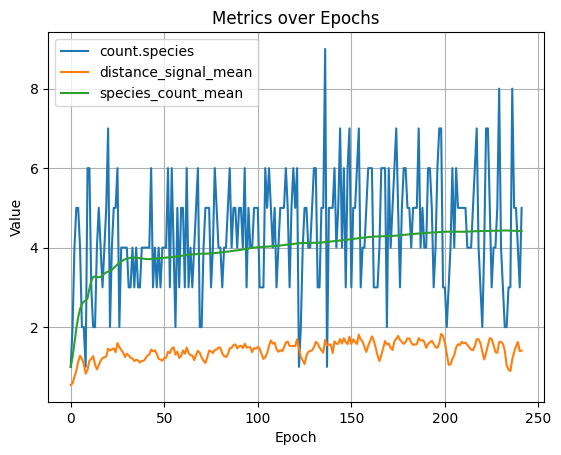

# Expressions

!!! warning ":construction: Under Construction :construction:"

    As of `05/18/2026`: These docs are a work in progress and may not be complete or fully accurate. Please check back later for updates. This feature is currently in active development and subject to change.

Radiate includes a composable expression system that lets you query and transform the engine's metric state at runtime. Expressions are stateful, lazily-evaluated trees — each call to `.apply()` or an internal engine dispatch consumes one "tick" of any stateful nodes (rolling windows, schedules, etc.). This system was designed to be extremely similar to [polars' expression API](https://pola-rs.github.io/polars/py-polars/html/reference/expressions/index.html) to leverage the same mental model of lazy evaluation and chaining, but adapted to radiate's needs.

Expressions are used in three places within the engine:

1. **Termination conditions** — stop evolution when an expression evaluates to `true`
2. **Derived metrics** — register expressions that run every generation and write their output back into the `MetricSet`
3. **Dynamic rates** — drive alterer rates from metric values rather than a fixed schedule

---

## Building Expressions

=== ":fontawesome-brands-python: Python"

    The expression DSL is available directly from the `radiate` package:

    ```python
    --8<-- "python/engine/expressions.py:building"
    ```

=== ":fontawesome-brands-rust: Rust"

    The `expr` module provides the building-block constructors:

    ```rust
    use radiate::expr;

    // Select a metric by name (reads last_value by default)
    let score = expr::select("scores.best");

    // A literal constant  
    let threshold = expr::lit(0.01_f32);

    // Select the nth element of a vector input
    let first = expr::nth(0);
    ```

---

## Aggregations

Expressions can aggregate over accumulated history using a rolling window or directly over a collection.

=== ":fontawesome-brands-python: Python"

    ```python
    --8<-- "python/engine/expressions.py:aggregations"
    ```

=== ":fontawesome-brands-rust: Rust"

    ```rust
    use radiate::expr;

    let score = expr::select("scores.best");

    score.clone().last()         // last recorded value (default)
    score.clone().mean()         // running mean
    score.clone().stddev()       // standard deviation
    score.clone().min()          // running minimum
    score.clone().max()          // running maximum
    score.clone().sum()          // running sum
    score.clone().var()          // variance
    score.clone().skew()         // skewness
    score.clone().count()        // number of values seen
    score.clone().slope()        // linear slope over all accumulated values
    score.clone().unique()       // deduplicated collection

    // Rolling window: aggregate over the last N values only
    score.clone().rolling(50).mean()
    score.clone().rolling(100).slope()
    ```

---

## Comparisons and Logic

Expressions support standard comparison and boolean operators. These always produce a `Bool` result.

=== ":fontawesome-brands-python: Python"

    Python operator overloads are supported, so you can write expressions naturally:

    ```python
    --8<-- "python/engine/expressions.py:comparisons"
    ```

=== ":fontawesome-brands-rust: Rust"

    ```rust
    use radiate::expr;

    let score = expr::select("scores.best");
    let index = expr::select("index");

    score.clone().lt(0.01_f32)
    score.clone().lte(0.01_f32)
    score.clone().gt(0.99_f32)
    score.clone().gte(0.99_f32)
    score.clone().eq(0.5_f32)
    score.clone().ne(0.5_f32)

    // Boolean logic
    score.clone().lt(0.01_f32).and(index.gt(50.0_f32))   // and
    score.clone().lt(0.01_f32).or(index.gt(500.0_f32))   // or
    score.clone().lt(0.01_f32).not()                      // not

    // Convenience: between (inclusive)
    score.clone().between(0.0_f32, 1.0_f32)
    ```

---

## Arithmetic

=== ":fontawesome-brands-python: Python"

    Python arithmetic operators are supported:

    ```python
    --8<-- "python/engine/expressions.py:arithmetic"
    ```

=== ":fontawesome-brands-rust: Rust"

    ```rust
    use radiate::expr;

    let a = expr::select("scores.best");
    let b = expr::select("score.volatility");

    a.clone().add(b.clone())
    a.clone().sub(b.clone())
    a.clone().mul(expr::lit(2.0_f32))
    a.clone().div(b.clone())
    a.clone().pow(expr::lit(2.0_f32))
    a.clone().neg()
    a.clone().abs()
    a.clone().clamp(expr::lit(0.0_f32), expr::lit(1.0_f32))
    ```

---

## Conditional Expressions

`when / then / otherwise` composes a ternary branch. Both branches must be `Expr` values.

=== ":fontawesome-brands-python: Python"

    ```python
    --8<-- "python/engine/expressions.py:conditional"
    ```

=== ":fontawesome-brands-rust: Rust"

    ```rust
    use radiate::expr;

    let expr = expr::when(expr::select("scores.best").lt(0.01_f32))
        .then(expr::select("scores.best").mean())
        .otherwise(expr::lit(1.0_f32));
    ```

---

## Schedule: `every`

`every(n)` fires `true` once every `n` calls and `false` otherwise. It is purely stateful — it ignores its input entirely. Combined with `when / then / otherwise`, it produces an expression that returns different values at different cadences.

=== ":fontawesome-brands-python: Python"

    ```python
    --8<-- "python/engine/expressions.py:schedule"
    ```

=== ":fontawesome-brands-rust: Rust"

    ```rust
    use radiate::expr;

    let expr = expr::every(10)
        .then(expr::select("scores.best").rolling(10).stddev())
        .otherwise(expr::select("scores.best"));
    ```

---

## Querying Metrics

Expressions are evaluated against the engine's `MetricSet`. Meaning any metric inside the metric set can be selected and transformed with expressions. The most commonly used metrics are documented in the [Metrics reference](../engine/metrics.md), but you can also select any custom metric you've registered via `register_metrics` or that the engine produces internally.

Additional metrics are available when the engine is configured for [species-based diversity](../diversity/index.md) (`count.species`, `age.species`, etc.) or [multi-objective optimization](../objectives.md) (`size.front`, `front.entropy`, etc.).

By default `expr::select("metric_name")` reads `last_value`. To interpret the value as a duration, chain `.time()` before the aggregation:

=== ":fontawesome-brands-python: Python"

    ```python
    --8<-- "python/engine/expressions.py:querying"
    ```

=== ":fontawesome-brands-rust: Rust"

    ```rust
    use radiate::expr;

    // Interpret the time metric as Duration
    expr::select("time").time().mean()

    // Read count.evaluation as a numeric value
    expr::select("count.evaluation").count()
    ```

---

## Integration:

### 1: Expression Limits

An `Expr` that returns a `bool` can be used as a termination condition. The engine stops as soon as the expression evaluates to `true`.

=== ":fontawesome-brands-python: Python"

    ```python
    --8<-- "python/engine/expressions.py:limit_expr"
    ```

    You can also combine an expression limit with other limits:

    ```python
    --8<-- "python/engine/expressions.py:limit_combined"
    ```

=== ":fontawesome-brands-rust: Rust"

    ```rust
    use radiate::*;

    let engine = GeneticEngine::builder()
        .codec(FloatCodec::vector(10, -5.0..5.0))
        .minimizing()
        .fitness_fn(my_fitness_fn)
        .build();

    // Stop when the rolling mean of the best score drops below 0.01
    let stop_expr = expr::select("scores.best").rolling(50).mean().lt(0.01_f32);

    let result = engine
        .iter()
        .limit((
            Limit::Expr(stop_expr),
            Limit::Generation(5000), // hard ceiling
        ))
        .last()
        .unwrap();
    ```

---

### 2: Derived Metrics

You can register named expressions that are evaluated against the `MetricSet` at the end of every generation. Their output is written back as new metrics (tagged `Expr`), making them available to downstream expressions, limits, events, and the dashboard. This means you can create your own metrics!

=== ":fontawesome-brands-python: Python"

    Pass kwargs to `.metrics()` on the engine builder:

    ```python
    --8<-- "python/engine/expressions.py:derived_metrics"
    ```

    Derived metrics can also reference each other, as long as the referenced metric was registered first. They can also be used directly in a `Limit.expr`:

    ```python
    --8<-- "python/engine/expressions.py:derived_metrics_limit"
    ```

=== ":fontawesome-brands-rust: Rust"

    Pass a `Vec<impl Into<NamedExpr>>` to `.register_metrics()` on the builder:

    ```rust
    use radiate::*;

    let score_trend = expr::select("scores.best").rolling(20).slope();
    let score_cv = expr::select("scores.best")
        .rolling(20)
        .stddev()
        .div(expr::select("scores.best").rolling(20).mean());

    let engine = GeneticEngine::builder()
        .codec(FloatCodec::vector(10, -5.0..5.0))
        .minimizing()
        .fitness_fn(my_fitness_fn)
        .register_metrics(vec![
            ("score_trend", score_trend),
            ("score_cv", score_cv),
        ])
        .build();

    let result = engine.iter().limit(5000).last().unwrap();
    let metrics = result.metrics();

    // Access the derived metric values
    if let Some(m) = metrics.get("score_trend") {
        println!("score_trend: {}", m.last_value());
    }
    ```

    Derived metrics can also feed expression limits:

    ```rust
    let engine = GeneticEngine::builder()
        .codec(FloatCodec::vector(10, -5.0..5.0))
        .minimizing()
        .fitness_fn(my_fitness_fn)
        .register_metrics(vec![
            ("score_trend", expr::select("scores.best").rolling(50).slope()),
        ])
        .build();

    let result = engine
        .iter()
        .limit((
            Limit::Expr(expr::select("score_trend").abs().lt(0.0001_f32)),
            Limit::Generation(5000),
        ))
        .last()
        .unwrap();
    ```

---

### 3: Dynamic Rates

An expression can also drive an alterer's rate, a species threshold, or any other parameter that accepts a `Rate`. The expression is evaluated against the `MetricSet` each generation, and the result is used as the rate for that step.

=== ":fontawesome-brands-python: Python"

    Pass `Rate::Expr(expr)` or just a plain `expr` wherever a `Rate` is accepted:

    ```python
    --8<-- "python/engine/expressions.py:dynamic_rates"
    ```

=== ":fontawesome-brands-rust: Rust"

    Pass `Rate::Expr(expr)` or just a plain `expr` wherever a `Rate` is accepted:

    ```rust
    use radiate::*;

    let dynamic_rate = expr::select("score.volatility")
            .rolling(20)
            .mean()
            .clamp(expr::lit(0.01_f32), expr::lit(0.5_f32));

    let engine = GeneticEngine::builder()
        .codec(FloatCodec::vector(10, -5.0..5.0))
        .minimizing()
        .fitness_fn(my_fitness_fn)
        .alterers(alters![
            GaussianMutator::new(dynamic_rate),
            BlendCrossover::new(0.5, 0.5),
        ])
        .build();
    ```

---

## Example

So, what does all this do in practice? Well, lets say you opt-in to using speciation and as you test, you discover that ideally, your problem gets solved best with ~4 species. Well, radiate doesn't offer a 'target species' option out of the box, but using expressions you can build a dynamic rate (threshold in this case) that encourages the engine to maintain that number of species. Below we build a distance metric that acts as a feedback loop which combines several species-level metrics, then use it as the distance function for speciation. We also register two derived metrics to track the average distance and species count over time. 

=== ":fontawesome-brands-python: Python"

    Then, using radiate's built-in `MetricCollector` subscriber, we plot those metrics over time to see how our registered distance signal correlates with species count and overall diversity.

    ```python
    --8<-- "python/engine/expressions_showcase.py:example"
    ```

=== ":fontawesome-brands-rust: Rust"

    ```rust
    use radiate::prelude::*;

    random_provider::set_seed(90);

    let store = vec![
        (NodeType::Input, vec![Op::var(0)]),
        (NodeType::Edge, vec![Op::weight()]),
        (NodeType::Vertex, vec![Op::sub(), Op::mul(), Op::linear()]),
        (NodeType::Output, vec![Op::linear()]),
    ];

    let target_species = 4.0;
    let rolling = target_species as usize;

    let spec_count_signal = expr::select("count.species")
        .rolling(rolling)
        .mean()
        .div(target_species);

    let spec_dist_signal = expr::select("species.distance")
        .mean()
        .rolling(rolling)
        .mean()
        .div(target_species);

    let spec_thresh_signal = expr::select("species.threshold").rolling(rolling).mean();
    let spec_evenness_signal = expr::select("species.evenness").rolling(rolling).mean();

    let distance_signal = spec_count_signal
        .mul(0.9)
        .add(spec_dist_signal.mul(0.4))
        .add(spec_thresh_signal.mul(0.2))
        .add(spec_evenness_signal.mul(0.1))
        .clamp(0.01, 10.0);

    let engine = GeneticEngine::builder()
        .codec(GraphCodec::directed(1, 1, store))
        .raw_batch_fitness_fn(Regression::new(dataset(), Loss::MSE))
        .minimizing()
        .diversity(NeatDistance::new(1.0, 1.0, 3.0))
        .species_threshold(Rate::Expr(distance_signal))
        .alter(alters!(
            GraphCrossover::new(0.5, 0.5),
            OperationMutator::new(0.07, 0.05),
            GraphMutator::new(0.1, 0.1).allow_recurrent(false)
        ))
        .build();
    ```

The above engine's will produce something (this was produced in python) like the following. We can see that the rolling 10 generation species threshold (orange) is adjusting dynamically according to the species count, resulting in an average of around 4 species (green) and a corresponding species count (blue).

<figure markdown="span">
    { width="600" }
</figure>

This same sort of logic (combining multiple signals into a single metric/rate/signal) can be applied to other aspects of the engine as well, like alterer rates. For example, you might want to start with a high mutation rate to encourage exploration, but then dial it back as the population converges. By building a dynamic rate that combines several metrics of convergence (e.g., score volatility, species count, etc.) you can get a more robust signal for when to dial back mutation than just using generation count or best score alone.

---

## Tips

- **Expressions are stateful.** Rolling windows and `every` counters accumulate state across generations. If you reuse the same `Expr` object in two places (e.g., both a derived metric and a limit), they share state — construct separate instances instead.
- **Derived metrics update before limits are checked.** This means a `Limit::Expr` can reference a metric registered via `register_metrics` and see that generation's fresh value.
- **Expressions that select unknown metric names return `Null`.** Arithmetic on `Null` propagates `Null`; comparisons against `Null` return `false`.
- **`every(n)` counts calls, not generations.** If the same expression is called multiple times per generation, the counter advances faster than you might expect. Registered derived metrics are called exactly once per generation.
