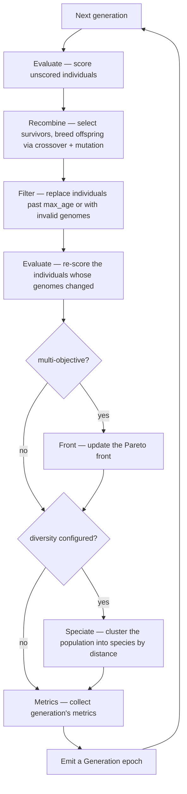

# Genetic Engine

The `GeneticEngine` is the core component. Once built, it manages the entire evolutionary process, including population management, fitness evaluation, and genetic operations. The engine itself is essentially a large iterator that produces `Generation` objects representing each generation.

---

## Engine Defaults

Every engine is created through a fluent builder. Only two things are **required** — an encoding (the [codec](../genome/codec.md)) and a [fitness function](../fitness.md); everything else has a sensible default you override only when you need to.

| Setting | Default |
|---|---|
| Encoding / genome | — *(required)* |
| [Fitness function](../fitness.md) | — *(required)* |
| [Objective](../objectives.md) | maximize, single |
| Population size | 100 |
| [Offspring selector](../selectors/index.md) | Roulette |
| [Survivor selector](../selectors/index.md) | Tournament (k=3) |
| Offspring fraction | 0.8 |
| [Alterers](../alters/index.md) | UniformCrossover(0.5) + UniformMutator(0.1) |
| [Diversity](../diversity/index.md) | off |
| [Executor](../executors.md) | Serial |
| Stopping [limits](limits.md) | none — runs until you stop it |
| [Events](../events.md) | none |

So a minimal engine with just a codec and a fitness function will do the following: maximizes a single objective over a population of 100, breeding 80% offspring each generation with uniform crossover and mutation, selecting offspring by roulette and survivors by tournament, running single-threaded. From there you change only what your problem needs.

=== ":fontawesome-brands-python: Python"

    ```python
    --8<-- "python/engine/index.py:minimal_engine"
    ```

=== ":fontawesome-brands-rust: Rust"

    ```rust
    --8<-- "rust/engine/index.rs:minimal_engine"
    ```

---

## Life of a Generation

Each time the engine advances one generation, it runs a fixed pipeline of steps. Two of them are conditional — `Front` only runs for multi-objective problems, and `Speciate` only when you've configured a [diversity measure](../diversity/index.md):



The engine evaluates twice per generation. The first pass ranks the current population so selection has scores to work with. The second pass re-scores every individual whose genome changed in between — the offspring produced by crossover and mutation (modifying a genome invalidates its old score) and any replacements introduced by `Filter` — so each emitted epoch is fully scored.

---

## This section is organized as

| Page | Covers |
|---|---|
| [Runtime](runtime.md) | how the engine actually advances — the `Engine` trait, `EngineRuntime`, `run()` vs the iterator, the control interface |
| [Generations](generations.md) | the `Generation` and `GenerationView` types — what you get back each epoch, and what it costs to get it |
| [Limits](limits.md) | every built-in stopping condition, and how to combine them |
| [Metrics](metrics.md) | the statistics collected every generation |
| [Exprs](expressions.md) | the expression DSL behind dynamic rates and expression-based limits |
| [Example](example.md) | a few small, focused examples — including when you actually need the iterator instead of `run()` |

---

## Best Practices

1. **Population size**: 100-500 covers most problems; go larger only if you have the fitness-evaluation budget for it.
2. **Executor**: enable [parallel execution](../executors.md) for expensive fitness functions before tuning anything else — it's usually the biggest lever.
3. **Diversity**: reach for [species-based diversity](../diversity/index.md) only once you've seen premature convergence — it's opt-in and not free.
4. **Rates**: experiment with mutation/crossover rates, and prefer an [`Expr`-driven rate](../alters/rate.md) over a fixed one if the right rate changes as the run progresses.
5. **Observability**: use [logging](runtime.md#combinators-actions), [checkpointing](../misc/checkpoint.md), and the [control interface](runtime.md#control-interface) for long or interactive runs.

## Common Pitfalls

1. **No stopping limit**: an engine with no [limit](limits.md) attached runs forever in Rust (you must `break`/`return` or attach one) and raises immediately in Python (at least one `Limit` is mandatory there).
2. **Reusing a consumed Rust engine**: `.iter()` consumes the `GeneticEngine` — once you've built an `EngineRuntime` from it, that engine value is gone. `run(closure)` doesn't consume it, so it's safe to call more than once.
3. **Assuming Python's `.run()` resumes**: Python's `Engine` is a reusable *builder*, not a live engine — every `.run()` call constructs a fresh engine from scratch. See [Runtime](runtime.md) for the Rust/Python distinction.
4. **Materializing a `Generation` you don't need**: a stop condition that has to inspect the actual per-generation result (a custom callback, or an actual loop over each generation) forces a fresh clone every generation. If you only want the final result, drive the stop condition with [`Limit`s](limits.md) instead and skip the per-generation cost entirely — see [Runtime](runtime.md) for exactly which calls stay on the cheap path in each language.

---
