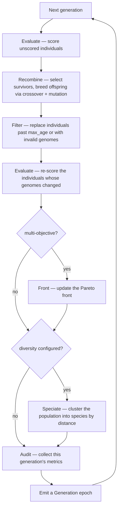

# Genetic Engine

The `GeneticEngine` is the core component. Once built, it manages the entire evolutionary process, including population management, fitness evaluation, and genetic operations. The engine itself is essentially a large iterator that produces `Generation` objects representing each generation.

---

## Building an Engine

We've already taken a pretty comprehensive look at how to build engine's in the prior sections, but lets just go ahead and take a direct look at the builder below. Every engine is created through a fluent builder. Only two things are **required** — an encoding (the [codec](../genome/codec.md)) and a [fitness function](../fitness.md); everything else has a sensible default you override only when you need to.

| Setting | Default |
|---|---|
| Encoding / genome | — *(required)* |
| [Fitness function](../fitness.md) | — *(required)* |
| [Objective](../objectives.md) | maximize, single |
| Population size | 100 |
| [Offspring selector](../selectors/index.md) | Roulette |
| [Survivor selector](../selectors/index.md) | Tournament (k=3) |
| Offspring fraction | 0.8 |
| [Alterers](../alters/index.md) | UniformCrossover(0.5) + UniformMutator(0.1) |
| [Diversity](../diversity/index.md) | off |
| [Executor](../executors.md) | Serial |
| Stopping [limits](#running) | none — runs until you stop it |
| [Events](../events.md) | none |

So a minimal engine with just a codec and a fitness function will do the following: maximizes a single objective over a population of 100, breeding 80% offspring each generation with uniform crossover and mutation, selecting offspring by roulette and survivors by tournament, running single-threaded. From there you change only what your problem needs.

---

## Life of a Generation

Each time the engine advances one generation, it runs a fixed pipeline of steps. Two of them are conditional — `Front` only runs for multi-objective problems, and `Speciate` only when you've configured a [diversity measure](../diversity/index.md):



The engine evaluates twice per generation. The first pass ranks the current population so selection has scores to work with. The second pass re-scores every individual whose genome changed in between — the offspring produced by crossover and mutation (modifying a genome invalidates its old score) and any replacements introduced by `Filter` — so each emitted epoch is fully scored.

---

## Epochs

Each epoch represents a single generation in the evolutionary process. An epoch contains information related not only to the current generation, but also the engine's state at that point in time. This is the primary output of the engine, and it can be used to track progress, visualize results, or make decisions based on the evolutionary process. 

### Single-Objective Epoch

This is the default epoch for the engine - `Generation`. It contains:

- The generation number
- `Ecosystem` information (population, species, etc.)
- Score, which is the fitness of the best individual in the generation
- Value, which is the decoded value of the best individual
- Performance metrics (e.g., time taken)
- The Objective (max or min). The fitness objective being optimized, used for comparison and decision making during the evolutionary process.

=== ":fontawesome-brands-python: Python"

    ```python
    --8<-- "python/engine/index.py:single_objective"
    ```

=== ":fontawesome-brands-rust: Rust"

    ```rust
    --8<-- "rust/engine/index.rs:single_objective"
    ```

### Multi-Objective Epoch

When the engine is configured for multi-objective optimization, the engine `Generation` will have a `ParetoFront` attached to it. The only difference between the single-objective and multi-objective is the availability of the `ParetoFront` and the `fitness` value. The `fitness` value will be a list of scores, one for each objective being optimized.

=== ":fontawesome-brands-python: Python"

    ```python
    --8<-- "python/engine/index.py:multi_objective"
    ```

=== ":fontawesome-brands-rust: Rust"

    ```rust
    --8<-- "rust/engine/index.rs:multi_objective"
    ```

---

## Running 

Radiate provides multiple ways to run the `GeneticEngine`. 

1. **Run Method**

    The `run` method provides a more traditional way to run the engine. In rust it accepts a closure that takes the current epoch as an argument and returns a boolean indicating whether to stop the engine. In python, it accepts either a single limit or a list of limits that define the stopping conditions for the engine. The `run` method also accepts a `log`, `ui`, & `checkpoint` parameter to enable logging, a terminal UI, or checkpointing respectively.

2. **Iterator API** 

    The `GeneticEngine` is an inherently iterable concept, as such we can treat the engine as an iterator. Because of this we can use it in a `for` loop or with iterator methods like `map`, `filter`, etc. We can also extend the iterator with custom methods to provide additional functionality, such as running until a certain fitness (score) is reached, time limit, or convergence. These custom methods are essentially syntactic sugar for 'take_until' or 'skip_while' style iterators.

    During any sort of optimization task it's useful to visually see the progress of the engine. Using the iterator API, we do this by calling `logging()` on the engine's iterator. This will give us nice console output of the progress provided by the [tracing](https://github.com/tokio-rs/tracing) project.

    !!! warning "Stopping Condition"

        The engine's iterator is a 'streaming' or 'infinite iterator', meaning it will continue to produce epochs until a stopping condition, a `break` or a `return` is met. So, unless you want to run the engine indefinitely, you should always use a method like `take`, `until`, or `last` to limit the number of epochs produced.
        

=== ":fontawesome-brands-python: Python"

    ```python
    --8<-- "python/engine/index_showcase.py:running"
    ```

=== ":fontawesome-brands-rust: Rust"

    ```rust
    --8<-- "rust/engine/index.rs:running"
    ```
---

## Control Interface

The engine provides a control interface that allows for pausing, resuming, and stopping the evolutionary process from external contexts. For instance, you might want to pause or step through generations from another thread or based on user input.

=== ":fontawesome-brands-python: Python"

    Not currently implemented.


=== ":fontawesome-brands-rust: Rust"

    ```rust
    --8<-- "rust/engine/index.rs:control"
    ```

---

## Tips

* Use appropriate population sizes (100-500 for most problems)
* Enable parallel execution for expensive fitness functions
* Consider species-based diversity for complex landscapes
* Experiment with different mutation and crossover rates
* Monitor convergence and adjust parameters dynamically
* Utilize logging and checkpointing for long runs
* Leverage the control interface for interactive runs


<!-- ```python
import radiate as rd
import threading
import time

# Create an engine
engine = rd.Engine(
    codec=rd.FloatCodec.scalar(0.0, 1.0), 
    fitness_fn=my_fitness_fn,  # Some fitness function
    # ... other parameters ...
)

# Get the control interface
control = engine.get_control()

# Run the engine in a separate thread
def run_engine():
    engine.run(rd.GenerationsLimit(1000))

engine_thread = threading.Thread(target=run_engine)
engine_thread.start()

# Pause the engine after 5 seconds
time.sleep(5)
control.pause()
print("Engine paused.")

# Resume the engine after another 5 seconds
time.sleep(5)
control.resume()
print("Engine resumed.")

# Stop the engine after another 5 seconds
time.sleep(5)
control.stop()
print("Engine stopped.")

engine_thread.join()
``` -->
