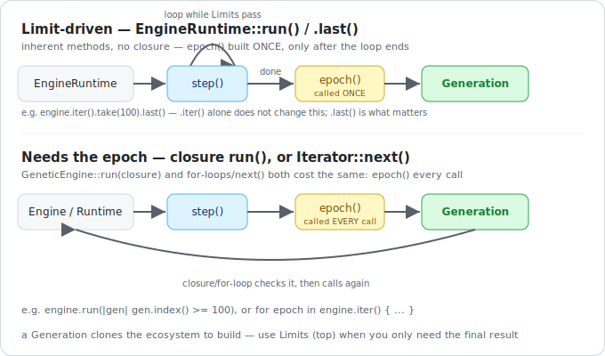

# Engine Runtime

___

Advancing the engine happens in two conceptually separate steps: stepping its internal state forward one generation, and separately snapshotting that state as a `Generation`. Radiate keeps these apart on purpose — building a `Generation` clones the ecosystem, and depending on your population size and genome, that isn't free. How you drive the engine decides whether that snapshot gets built once, at the very end, or on every single generation.

---

## Two paths, one runtime

The distinction comes down to **whether your stopping condition needs to inspect the snapshot itself**:

- **Declared up front** — a target score, a generation count, a time budget, or any combination — never needs to see a `Generation` to decide whether to keep going, so it's checked directly against the engine's live state. No `Generation` is built until the very end, once, to hand back the result.
- **Inspecting the result as you go** — a custom stop condition that reads the decoded value or score directly, or code that observes/acts on every generation as it happens — forces a fresh `Generation` on every single generation, because that's the only way to give you something to look at.

<figure markdown="span">
    { width="640" }
</figure>

Prefer the first kind whenever you only care about the final result. Reach for the second only when you actually need to observe (or act on) the real per-generation state along the way — see the [Example](example.md) page for a case where that's genuinely necessary.

=== ":fontawesome-brands-python: Python"

    The engine is directly iterable (`for epoch in engine`), and `next(engine)` works too — both build a fresh `Generation` on every call.

    ```python
    --8<-- "python/engine/runtime.py:iterator_basic"
    ```

    Or drive it one epoch at a time:

    ```python
    --8<-- "python/engine/runtime.py:iterator_next"
    ```

    [`engine.run()`](#convenience-run) takes the cheap, condition-driven path instead. Python requires at least one [`Limit`](limits.md) to be attached either way — there's no closure-based stop condition here.

=== ":fontawesome-brands-rust: Rust"

    `.iter()` hands back a runtime that implements the standard `Iterator` trait, so a `for` loop or an explicit `.next()` works directly:

    ```rust
    --8<-- "rust/engine/runtime.rs:iterator_basic"
    ```

    That same runtime also has its own `run()`/`.last()`, driven by attached [`Limit`s](limits.md) instead of by iterating — and it stays on the cheap path no matter how you got there. A closure passed straight to the engine's own `run(closure)`, without going through `.iter()` first, takes the expensive path instead, since the closure needs a real `Generation` to decide whether to stop:

    ```rust
    --8<-- "rust/engine/runtime.rs:iterator_run"
    ```

    A closure over a borrowed [`GenerationView`](generations.md#generationview) via `.until(closure)` is the cheap middle ground — condition-driven, so it never forces a `Generation` to be built either.

!!! warning "Always attach a stopping condition"

    The engine's iterator is a streaming, effectively infinite iterator — it produces epochs until a [limit](limits.md) trips, a `break`, or a `return`. Always attach one (or a method like `take`/`until`/`last` in Rust) unless you genuinely want to run indefinitely.

!!! note "Re-running the engine"

    **Rust**: a closure-based `run(closure)` call borrows the engine rather than consuming it, so calling it again on the same engine continues from wherever it left off. `.iter()`, by contrast, consumes the engine — once you've built a runtime from it, that engine value is gone.

    **Python**: `Engine` is a reusable *builder*, not a live engine. Every `for` loop, every `next()` call after `StopIteration`, and every `.run()` call constructs a brand-new engine from the builder's queued inputs. Calling `.run()` twice runs two independent evolutionary processes from a fresh population — it does not resume the first one.

---

## Combinators & Actions

Beyond the built-in stopping conditions, Radiate lets you compose several of them together and attach side effects like progress logging or periodic checkpointing.

=== ":fontawesome-brands-python: Python"

    Limits and side effects are both configured on the engine builder rather than chained onto an iterator — see [Limits](limits.md) for combining stop conditions, and [Convenience `run()`](#convenience-run) below for `log`/`checkpoint` options.

=== ":fontawesome-brands-rust: Rust"

    The runtime adds chainable methods for composing stop conditions and side effects: `until_score`, `until_generation`, `until_seconds`/`until_duration`, `until_convergence`, `until_expr`, `until(closure)`, and the generic `limit(...)` — see [Limits](limits.md) for what each one checks. `logging()`/`log_every(n)` print per-generation progress; `checkpoint(interval, path)`/`checkpoint_with(...)` persist engine state periodically.

    ```rust
    --8<-- "rust/engine/runtime.rs:iterator_actions"
    ```

    !!! note "`take()` isn't `std::iter::Iterator::take`"

        `take(n)` is an alias for `until_generation(n)` — it appends a generation-count stop condition and hands back the same runtime, rather than wrapping it in a `std::iter::Take<Self>`. It reads the same in a `for` loop, but don't expect standard-library semantics if you go looking for them.

---

### Convenience `run()`

For the common case — build an engine, run it to completion, get the final epoch — `run()` wraps the condition-driven loop without needing an explicit `for`/`while`:

=== ":fontawesome-brands-python: Python"

    ```python
    --8<-- "python/engine/runtime.py:iterator_convenience"
    ```

    `run()` also accepts `log`, `ui`, and `checkpoint` options:

    ```python
    --8<-- "python/engine/runtime_showcase.py:iterator_run_options"
    ```

=== ":fontawesome-brands-rust: Rust"

    ```rust
    --8<-- "rust/engine/runtime.rs:run_convenience"
    ```

---

## Control Interface

The engine provides a control interface for pausing, resuming, and stopping the evolutionary process from outside the run loop — for example, pausing or stepping through generations from another thread or in response to user input.

=== ":fontawesome-brands-python: Python"

    Not currently implemented.

=== ":fontawesome-brands-rust: Rust"

    ```rust
    --8<-- "rust/engine/runtime.rs:control"
    ```

---
