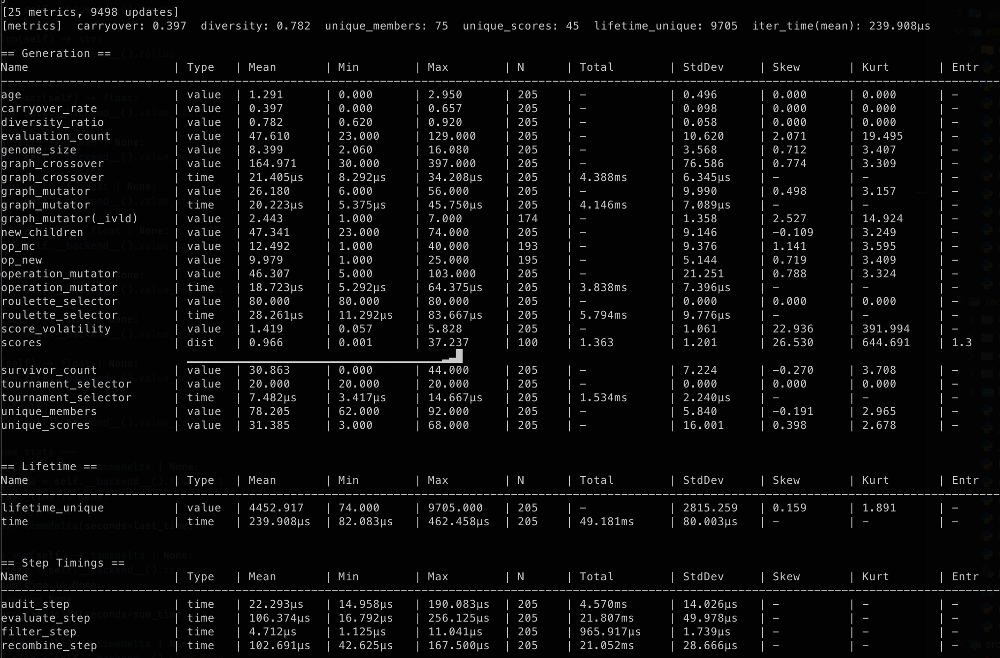

The `GeneticEngine` is the core component. Once built, it manages the entire evolutionary process, including population management, fitness evaluation, and genetic operations. The engine itself is essentially a large iterator that produces `Epoch` objects representing each generation.

---

## Epochs

Each epoch represents a single generation in the evolutionary process. An epoch contains information related not only the current generation, but also the engine's state at that point in time. This is the primary output of the engine, and it can be used to track progress, visualize results, or make decisions based on the evolutionary process. 

### Single-Objective Epoch

This is the default epoch for the engine - `Generation`. It contains:

- The generation number
- `Ecosystem` information (population, species, etc.)
- Score, which is the fitness of the best individual in the generation
- Value, which is the decoded value of the best individual
- Performance metrics (e.g., time taken)
- The Objective (max or min). The fitness objective being optimized, used for comparison and disicion making during the evolutionary process.

=== ":fontawesome-brands-python: Python"

    ```python
    import radiate as rd

    # Create an engine
    engine = rd.GeneticEngine(
        codec=rd.FloatCodec.scalar(0.0, 1.0), 
        fitness_fn=my_fitness_fn,  # Single objective fitness function
        # ... other parameters ...
    )

    # Run the engine for 100 generations
    result = engine.run(rd.GenerationsLimit(100))

    # Get the best individual's decoded value 
    value = result.value() # float 

    # Get the score (fitness) of the best individual or epoch score
    score = result.score()  # List[float] - note that this is a list. 
    # In this scenario, the engine is configured for single-objective optimization,
    # so the list will contain a single value.

    # Get the population of the engine's ecosystem
    population = result.population()  # Population object

    # Get the index of the epoch (number of generations)
    index = result.index()  # int

    # Get the metrics of the engine
    metrics = result.metrics()  # MetricSet object

    # Get the objective of the engine
    objective = result.objective()  # list[str] | str (list[str] if multi-objective) - "min" or "max"
    ```

=== ":fontawesome-brands-rust: Rust"

    ```rust
    use radiate::*;

    // Create an engine of type:
    // `GeneticEngine<FloatChromosome, f32>`
    //
    // Where the `epoch` is `Generation<FloatChromosome, f32>`
    let mut engine = GeneticEngine::builder()
        .codec(FloatCodec::scalar(0.0..1.0)) 
        .fitness_fn(|genotype: f32| my_fitness_fn(genotype)) // Return a single fitness score
        // ... other parameters ...
        .build();

    // Run the engine for 100 generations - the result will be a `Generation<FloatChromosome, f32>`
    let result = engine.run(|generation: Generation<FloatChromosome, f32>| {
        generation.index() >= 100
    });

    // -- or using the engine's iterator --
    let result = engine.iter().take(100).last().unwrap();

    // Get the best individual's decoded value and fitness score:
    let best_value: f32 = result.value();

    // Get the score (fitness) of the best individual (or epoch score):
    let best_score: Score = result.score();

    // Get the index of the epoch (number of generations):
    let index: usize = result.index();

    // Get the ecosystem level information:
    let ecosystem: Ecosystem<FloatChromosome> = result.ecosystem();
    let population: Population<FloatChromosome> = ecosystem.population();
    let species: Option<&[Species<FloatChromosome>]> = ecosystem.species();

    // Get performance metrics:
    let metrics: MetricSet = result.metrics();

    // Get evolution duration (also available in metrics):
    let time: Duration = result.time();

    // Get the objective of the engine
    let objective: &Objective = result.objective(); 
    ```

### Multi-Objective Epoch

When the engine is configured for multi-objective optimization, the engine `Generation` will have a `ParetoFront` attached to it. The only difference between the single-objective and multi-objective is the availablity of the `ParetoFront` and the `fitness` value. The `fitness` value will be a list of scores, one for each objective being optimized.

=== ":fontawesome-brands-python: Python"

    ```python
    import radiate as rd

    # Create an engine
    engine = rd.GeneticEngine(
        codec=rd.FloatCodec.scalar(0.0, 1.0), 
        fitness_fn=my_fitness_fn,  # Multi-objective fitness function
        objective=['min', 'max', ...],  # Specify multi-objective optimization
        # ... other parameters ...
    )

    # Run the engine for 100 generations
    result = engine.run(rd.GenerationsLimit(100))

    # Everything in the multi-objective epoch is the same as the single-objective epoch, except for the value:
    # This will be a list of objects representing your pareto front as such:
    # [
    #     {'genotype': [Float], 'fitness': [obj1_fit, obj2_fit, ...]},
    #     {'genotype': [Float], 'fitness': [obj1_fit, obj2_fit, ...]},
    #     ...
    # ]
    value = result.value()  
    ```

=== ":fontawesome-brands-rust: Rust"

    ```rust
    use radiate::*;

    // Create an engine of type:
    // `GeneticEngine<FloatChromosome, f32>`
    //
    // Where the `epoch` is `Generation<FloatChromosome, f32>`
    let mut engine = GeneticEngine::builder()
        .codec(FloatCodec::scalar(0.0..1.0)) 
        .multi_objective(vec![Objective::Min, Objective::Max]) // Specify multi-objective optimization
        .fitness_fn(|genotype: f32| my_fitness_fn(genotype)) // Return a multi-objective fitness score
        // ... other parameters ...
        .build();

    // Run the engine for 100 generations - the result will be a `MultiObjectiveGeneration<FloatChromosome>`
    let result = engine.run(|generation: Generation<FloatChromosome, 32>| {
        generation.index() >= 100
    });

    // -- or using the engine's iterator --
    let result = engine.iter().take(100).last().unwrap();

    // Everything in this generation is the same as the single-objective epoch, except that 
    // the function call to `front()` will return a `ParetoFront` object.:
    // This will be of type `Front<Phenotype<FloatChromosome>>`
    let front: Option<&Front<Phenotype<FloatChromosome>>> = result.front();

    // Get the members of the Pareto front:
    let individuals: &[Arc<Phenotype<FloatChromosome>>] = front.values();
    ```

---

## Iterator API

The `GeneticEngine` is an inherently iterable concept, as such we can treat the engine as an iterato. Because of this we can use it in a `for` loop or with iterator methods like `map`, `filter`, etc. We can also extend the iterator with custom methods to provide additional functionality, such as running until a certain fitness (score) is reached, time limit, or convergence. These custom methods are essentially sytactic sugar for 'take_until' or 'skip_while' style iterators.

During any sort of optimization task its useful to visually see the progress of the engine. Using the iterator API, we do this by calling `logging()` on the engine's iterator. This will give us nice console output of the progress provided by the [tracing](https://github.com/tokio-rs/tracing) project.

!!! warning "Stopping Condition"

    The engine's iterator is an 'infinite iterator', meaning it will continue to produce epochs until a stopping condition, a `break` or a `return` is met. So, unless you want to run the engine indefinitely, you should always use a method like `take`, `until`, or `last` to limit the number of epochs produced.
    

=== ":fontawesome-brands-python: Python"

    ```python
    import radiate as rd

    # Create an engine
    engine = rd.GeneticEngine(
        codec=rd.FloatCodec.scalar(0.0, 1.0), 
        fitness_funn=my_fitness_fn,  # Some fitness function
        # ... other parameters ...
    )

    # use a simple for loop to iterate through 100 generations
    for epoch in engine:
        if epoch.index() >= 100:
            break
        print(f"Generation {epoch.index()}: Score = {epoch.score()}")

    # Log the progress of the engine to the console
    result = engine.run(rd.ScoreLimit(0.01), log=True)
    ```

=== ":fontawesome-brands-rust: Rust"

    ```rust
    use radiate::*;
    use std::time::Duration;

    // Create an engine
    let mut engine = GeneticEngine::builder()
        .codec(FloatCodec::scalar(0.0..1.0)) 
        .fitness_fn(|genotype: f32| my_fitness_fn(genotype))
        // ... other parameters ...
        .build();

    // 1.) use a simple for loop to iterate through 100 generations
    for epoch in engine.iter().take(100) {
        println!("Generation {}: Score = {}", epoch.index(), epoch.score().as_f32());
    }

    // 2.) use the iterator's custom methods to run until a score target is reached
    let target_score = 0.01;
    let result = engine.iter().until_score(target_score).take(1).last().unwrap();

    // 3.) run until a time limit is reached
    let time_limit = Duration::from_secs(60);
    let result = engine.iter().until_duration(time_limit).take(1).last().unwrap();

    // 4.) run until convergence
    let window = 50;
    let epsilon = 0.01; // how close the scores must be over the window to consider convergence
    let result = engine.iter().until_convergence(window, epsilon).take(1).last().unwrap();

    // 5.) log the progress of the engine to the console using the `logging()` method
    let result = engine.iter().logging().until_seconds(10).last().unwrap();
    ```
---

## Problem API

For certain optimization problems, it is useful to have a more structured way to define a `problem`. For instance, it may be useful to hold stateful information within a fitness function, store data in a more unified way, or evaluate a `Genotype<C>` directly without decoding. The `problem` interface provides a way to do just that. Under the hood of the `GeneticEngine`, the builder constructs a `problem` object that holds the `codec` and fitness function. Because of this, when using the `problem` API, we don't need a `codec` or a fitness function - the `problem` will take care of that for us. 

=== ":fontawesome-brands-python: Python"

    The `Problem` interface is not available in python because it isn't needed.

=== ":fontawesome-brands-rust: Rust"

    ```rust
    use radiate::*;

    // Define a problem struct that holds stateful information
    struct MyFloatProblem {
        num_genes: usize,
        value_range: Range<f32>,
    }

    impl Problem<FloatChromosome, Vec<f32>> for MyFloatProblem {
        fn encode(&self) -> Genotype<FloatChromosome> {
            Genotype::from(FloatChromosome::from((self.num_genes, self.value_range.clone())))
        }
        
        fn decode(&self, genotype: &Genotype<FloatChromosome>) -> Vec<f32> {
            genotype.genes().iter().map(|gene| gene.value()).collect()
        }

        fn eval(&self, genotype: &Genotype<FloatChromosome>) -> Score {
            // Evaluate the genotype directly without decoding
            my_fitness_fn(&genotype)
        }
    }

    // The `Problem<C, T>` trait requires `Send` and `Sync` implementations
    unsafe impl Send for MyFloatProblem {}
    unsafe impl Sync for MyFloatProblem {}

    // Create an engine with the problem
    let mut engine = GeneticEngine::builder()
        .problem(MyProblem { num_genes: 10, value_range: 0.0..1.0 })
        .build();

    // Run the engine
    let result = engine.run(|epoch| epoch.index() >= 100);
    ```

---

## Metrics

Metric collection in radiate is interwoven into every aspect of the evolutionary process. It uses the [Kahan summation algorithm](https://en.wikipedia.org/wiki/Kahan_summation_algorithm) paired with [Welford's one-pass online algorithm](https://en.wikipedia.org/wiki/Algorithms_for_calculating_variance#Welford's_online_algorithm) for fast, accurate, and numerically stable computation of statistics. All of this combined provides robust and reliable metric tracking throughout the evolutionary process. Using the `MetricSet` (a collection of independent `Metric`s) we can collect a whole host statistics that span the entire evolutionary process allowing us to gain deep insights into the evolutionary dynamics.

The `MetricSet` is an object (struct) given to the user in two main forms:

1. On the engine's `Generation` - given to the user after each epoch or each pass of the evolution process.
2. Through the engine's eventing system. Various events emit metric data allowing the user to track metrics or derive their own in real-time.

Each `metric` can include any combination of the following types:

1. `Value` - Represents a single value metric. Ie: a count, or running sum throughout either the generation or the entire process.
2. `Time` - Represents a time metric with a name and a collection of time samples. This can also be represented through a single generation pass or a cumulative time.
3. `Distribution` - Represents a distribution metric. The distribution is stored as a `Vec<f32>` and stores the same statistical measures as a `Value`, but also includes the shape of the distribution allowing for calculation of distribution-specific statistics (like entropy for exampe).

### Statistic 

The `Statistic` exposes a number of different statistical measures that can be used to summarize the data, such as, `last_value`, `count`, `min`, `max`, `mean`, `sum`, `variance`, `std_dev`, `skewness`, and `kurtosis`. 

### TimeStatistic

Similarly, the `TimeStatistic` exposes the same measures, however the data is assumed to be time-based. As such, the results are expressed as a `Duration::from_secs_f32(value)`.

### Distribution

The `Distribution` metric is used to represent a distribution of values. The distribution is stored as a `Vec<f32>` and produces the same statistical measures as the `Statistic` and `TimeStatistic` with the exception of `last_value` which is changed to `last_sequence`.

??? info "Default metrics"

    | Name                | Description                                                                 |
    |---------------------|-----------------------------------------------------------------------------|
    | `time`              | The time taken for the evolution process.                                   |
    | `scores`            | The scores (fitness) of all the individuals evolved throughout the evolution process. |
    | `age`               | The age of all the individuals in the `Ecosystem`. |
    | `replace_age`      | The number of individuals replaced based on age. |
    | `replace_invalid`  | The number of individuals replaced based on invalid structure (e.g. Bounds) |
    | `genome_size`      | The size of each genome over the evolution process. This is usually static and doesn't change. |
    | `front`            | The number of members added to the Pareto front throughout the evolution process. |
    | `unique_members`   | The number of unique members in the `Ecosystem`. |
    | `unique_scores`    | The number of unique scores in the `Ecosystem`. |
    | `diversity_ratio`  | The ratio of unique scores to the size of the `Ecosystem`. |
    | `score_volatility` | The volatility of the scores in the `Ecosystem`. This is calculated as the standard deviation of the scores / mean. |
    | `carryover_rate`   | The rate at which unique individuals are carried over to the next generation. |
    | `survivor_count`   | The number of individuals that survived to the next generation. |
    | `evaluation_count` | The total number of evaluations performed per generation. |
    | `lifetime_unique`  | The number of unique individuals that have existed throughout the entire evolution process. |
    | `new_children`     | The number of new children each generation through either mutation or crossover (or both). |
    | `species_count`    | The number of `species` in the 'Ecosystem`. |
    | `species_removed`  | The number of `species` removed based on stagnation. |
    | `species_distance` | The distance between `species` in the `Ecosystem`. |
    | `species_created`  | The number of `species` created in the `Ecosystem`. |
    | `species_died`     | The number of `species` that have died in the `Ecosystem`. |
    | `species_age`      | The age of all the `species` in the `Ecosystem`. |

    Along with the default metrics, each component will also collect metrics for the operations it performs. For example, each `Alterer` and `Selector` will collect metrics and be identified by their name. Its also important to note that `species` level metrics will only be collected if the engine is configured to use species-based diversity.

These can be accessed through the `metrics()` method of the epoch, which returns a `MetricSet`. 

=== ":fontawesome-brands-python: Python"

    ```python
    import radiate as rd

    # Create an engine
    engine = rd.GeneticEngine(
        codec=rd.FloatCodec.scalar(0.0, 1.0), 
        fitness_fn=my_fitness_fn,  # Single objective fitness function
        # ... other parameters ...
    )

    # Run the engine for 100 generations
    result = engine.run(rd.GenerationsLimit(100))

    # Get the metrics of the engine
    metrics = result.metrics()  # MetricSet object
    df = metrics.to_polars()  # Convert metrics to a Polars DataFrame for analysis (if installed)
    df = metrics.to_pandas()  # Convert metrics to a Pandas DataFrame for analysis (if installed)

    # Access specific metrics
    time_taken = metrics["time"].time_sum() # Total time taken for the evolution process
    carry_over = metrics['carryover_rate'].max() # Maximum carryover rate throughout evolution
    scores = metrics["scores"] # Get the score metric

    mean_score = scores.seq_mean()  # Mean score of all individuals
    all_last_generation_scores = scores.seq_last()  # Last generation scores (list[float])

    # pretty-print the metrics dashboard
    print(metrics.dashboard())
    ```

=== ":fontawesome-brands-rust: Rust"

    ```rust
    // --- set up the engine ---

    let result = engine.run(|ctx| {
        // get the scroe metric from the generation context
        let temp = ctx.metrics().get("scores").unwrap();
        // get the standard deviation of the score distribution
        let std = temp.value_std_dev();
        
        std < 0.01 // Example condition to stop the engine
    });

    // Access the metrics from the result
    let metrics: MetricSet = result.metrics();

    // pretty-print the metrics dashboard
    println!("{}", metrics.dashboard())
    ```

The `MetricSet` provides a nice little pretty-printed dashboard for visualizing metrics during evolution or at the end of a run. Below we can see an example output from a graph engine:

<figure markdown="span">
    { width="700" }
</figure>

---

## Tips

* Use appropriate population sizes (100-500 for most problems)
* Enable parallel execution for expensive fitness functions
* Use efficient selection strategies for large populations
* Consider species-based diversity for complex landscapes

