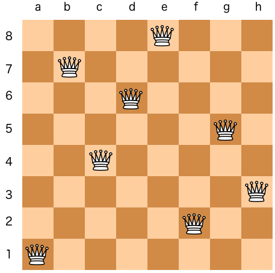
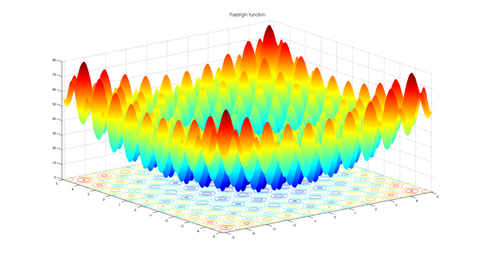

Check the git repo [examples](https://github.com/pkalivas/radiate/tree/master/examples) for a more 
comprehensive list of examples.

---

## MinSum

Find a set of numbers that sum to the minimum value (0). The solution is represented as a vector of integers, and the fitness function calculates the sum of the integers. The goal is to minimize this sum to 0.

For example, a solution could be:

```text
[0, 0, 0, 0, 0, 0, 0, 0, 0, 0]
```

=== ":fontawesome-brands-python: Python"

    ```python
    --8<-- "python/examples_showcase.py:minsum"
    ```

=== ":fontawesome-brands-rust: Rust"

    ```rust
    --8<-- "rust/examples.rs:minsum"
    ```

---

## NQueens

Solve the classic N-Queens problem, where the goal is to place `n` queens on an `n x n` board such that no two queens threaten each other. By threatening each other, we mean that they are in the same row, column, or diagonal. The solution is represented as a single chromosome with `n` genes, where each gene represents the row position of a queen in its respective column. The fitness function calculates the number of pairs of queens that threaten each other, and the goal is to minimize this value to zero. 

For example, a solution for `n=8` would be:

<figure markdown="span">
    { width="300" }
</figure>

=== ":fontawesome-brands-python: Python"

    Use the `use_numpy` flag to get a `numpy.array` back when decoding the chromosome for the fitness function. If we use the numba package to compile the fitness function we can actually match the rust example in terms of speed (+/- a few milliseconds).

    ```python
    --8<-- "python/examples_showcase.py:nqueens"
    ```

=== ":fontawesome-brands-rust: Rust"

    ```rust
    --8<-- "rust/examples.rs:nqueens"
    ```

---

## Rastrigin

The [Rastrigin](https://en.wikipedia.org/wiki/Rastrigin_function) function is a non-convex function used as a benchmark test problem for optimization algorithms. The function is highly multimodal, with many local minima, making it challenging for optimization algorithms to find the global minimum. 
It is defined as:
$$
f(x) = A \cdot n + \sum_{i=1}^{n} \left[ x_i^2 - A \cdot \cos(2 \pi x_i) \right]
$$
where:

- \( A \) is a constant (typically set to 10)
- \( n \) is the number of dimensions (in this case 2)
- \( x_i \) are the input variables.
- The global minimum occurs at \( x = 0 \) for all dimensions, where the function value is \( 0 \).

<figure markdown="span">
    { width="300" }
</figure>

=== ":fontawesome-brands-python: Python"

    ```python
    --8<-- "python/examples_showcase.py:rastrigin"
    ```

=== ":fontawesome-brands-rust: Rust"

    ```rust
    --8<-- "rust/examples.rs:rastrigin"
    ```

---

## DTLZ1


The [DTLZ1](https://pymoo.org/problems/many/dtlz.html) problem is a well-known multiobjective optimization problem that is used to test the performance of multiobjective optimization algorithms. It is a 3-objective problem with 4 variables and is defined as:

$$
\begin{align*}
\text{minimize} \quad & f_1(x) = (1 + g) \cdot x_1 \cdot x_2 \\
\text{minimize} \quad & f_2(x) = (1 + g) \cdot x_1 \cdot (1 - x_2) \\
\text{minimize} \quad & f_3(x) = (1 + g) \cdot (1 - x_1) \\
\text{subject to} \quad & 0 \leq x_i \leq 1 \quad \text{for} \quad i = 1, 2, 3, 4 \\
\text{where} \quad & g = \sum_{i=3}^{4} (x_i - 0.5)^2
\end{align*}
$$

=== ":fontawesome-brands-python: Python"

    Again here we are using the numba crate to compile the fitness function down to native C - once again, this allows us to match the same speed as rust.

    ```python
    --8<-- "python/examples_showcase.py:dtlz1"
    ```

=== ":fontawesome-brands-rust: Rust"

    ```rust
    --8<-- "rust/examples.rs:dtlz1"
    ```

The resulting Pareto front can be visualized using Plotly or matplotlib, as shown below:

<div id="dtlz_1"></div>

---

## Graph - XOR Problem

Evolve a `Graph<Op<f32>>` to solve the XOR problem (NeuroEvolution).

=== ":fontawesome-brands-python: Python"

    ```python
    --8<-- "python/examples_showcase.py:graph_xor"
    ```

=== ":fontawesome-brands-rust: Rust"

    !!! note "Requires `gp` feature flag"

    ```rust
    --8<-- "rust/examples.rs:graph_xor"
    ```

---

## Tree - Regression

Evolve a `Tree<Op<f32>>` to solve the a regression problem (Genetic Programming).

=== ":fontawesome-brands-python: Python"

    ```python
    --8<-- "python/examples_showcase.py:tree"
    ```

=== ":fontawesome-brands-rust: Rust"

    !!! note "Requires `gp` feature flag"


    ```rust
    --8<-- "rust/examples.rs:tree"
    ```


<script src="https://cdn.plot.ly/plotly-latest.min.js"></script>
<script>
Promise.all([
    fetch("../../assets/dtlz_1.json").then(response => response.json()),
    fetch("../../assets/dtlz_2.json").then(response => response.json())
])
.then(([dtlz1, dtlz2]) => {
    let x1 = [], y1 = [], z1 = [];
    let x2 = [], y2 = [], z2 = [];

    dtlz1.pareto_front.forEach(point => {
        x1.push(point[0]);
        y1.push(point[1]);
        z1.push(point[2]);
    });

    dtlz2.pareto_front.forEach(point => {
        x2.push(point[0]);
        y2.push(point[1]);
        z2.push(point[2]);
    });

    let trace1 = {
        x: x1,
        y: y1,
        z: z1,
        mode: "markers",
        type: "scatter3d",
        name: "DTLZ1",
        marker: { size: 5, color: "blue" }
    };

    let trace2 = {
        x: x2,
        y: y2,
        z: z2,
        mode: "markers",
        type: "scatter3d",
        name: "DTLZ2",
        marker: { size: 5, color: "red" }
    };

    Plotly.newPlot("dtlz_1", [trace1]);
    Plotly.newPlot("dtlz_2", [trace2]);
})
.catch(error => console.error(error));
</script>
