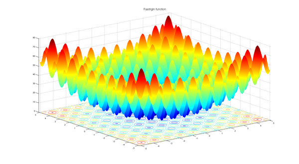

!!! warning ":construction: Under Construction :construction:"

    These docs are a work in progress and may not be complete or accurate. Please check back later for updates.
    Check the [GitHub repository](https://github.com/pkalivas/radiate/trees/master/examples) for the latest examples

Check the git repo [examples](https://github.com/pkalivas/radiate/tree/master/examples) for a more 
comprehensive list of examples.

---

## MinSum

Find a set of numbers that sum to the minimum value (0). The solution is represented as a vector of integers, and the fitness function calculates the sum of the integers. The goal is to minimize this sum to 0.

For example, a solution could be:

```text
[0, 0, 0, 0, 0, 0, 0, 0, 0, 0]
```

=== ":fontawesome-brands-python: Python"

    ```python
    import radiate as rd

    engine = rd.GeneticEngine(
        codec=rd.IntCodec.vector(10, (0, 100)),
        fitness_func=lambda x: sum(x),
        offspring_selector=rd.EliteSelector(),
        objectives="min",
        alters=[
            rd.SwapMutator(0.05),
            rd.UniformCrossover(0.5),
        ],
    )

    result = engine.run(rd.ScoreLimit(0))

    print(result)
    ```

=== ":fontawesome-brands-rust: Rust"

    ```rust
    use radiate::*;

    const MIN_SCORE: i32 = 0;

    let mut engine = GeneticEngine::builder()
        .codec(IntCodec::vector(10, 0..100))
        .minimizing()
        .offspring_selector(EliteSelector::new())
        .mutator(SwapMutator::new(0.05))
        .crossover(UniformCrossover::new(0.5))
        .fitness_fn(|geno: Vec<i32>| geno.iter().sum::<i32>())
        .build();

    let result = engine.run(|epoch| {
        println!("[ {:?} ]: {:?}", epoch.index(), epoch.value());
        epoch.score().as_i32() == MIN_SCORE
    });

    println!("{:?}", result);
    ```

---

## NQueens

Solve the classic N-Queens problem, where the goal is to place `n` queens on an `n x n` board such that no two queens threaten each other. By threatening each other, we mean that they are in the same row, column, or diagonal. The solution is represented as a single chromosome with `n` genes, where each gene represents the row position of a queen in its respective column. The fitness function calculates the number of pairs of queens that threaten each other, and the goal is to minimize this value to zero. 

For example, a solution for `n=8` would be:

<figure markdown="span">
    { width="300" }
</figure>

=== ":fontawesome-brands-python: Python"

    ```python
    import radiate as rd

    N_QUEENS = 32

    def fitness_fn(queens):
        score = 0
        for i in range(N_QUEENS):
            for j in range(i + 1, N_QUEENS):
                if queens[i] == queens[j]:
                    score += 1
                if abs(i - j) == abs(queens[i] - queens[j]):
                    score += 1
        return score

    engine = rd.GeneticEngine(
        codec=rd.IntCodec.vector(N_QUEENS, (0, N_QUEENS)),
        fitness_func=fitness_fn,
        num_threads=1,
        offspring_selector=rd.BoltzmannSelector(4.0),
        alters=[
            rd.MultiPointCrossover(0.75, 2),
            rd.UniformMutator(0.05)
        ]
    )

    result = engine.run(rd.ScoreLimit(0), log=False)
    print(result)

    board = result.value()
    for i in range(N_QUEENS):
        for j in range(N_QUEENS):
            if board[j] == i:
                print("Q ", end="")
            else:
                print(". ", end="")
        print()
    ```

=== ":fontawesome-brands-rust: Rust"

    ```rust
    use radiate::*;

    const N_QUEENS: usize = 32;

    fn main() {
        random_provider::set_seed(500);

        let codec = IntCodec::vector(N_QUEENS, 0..N_QUEENS as i8);

        let engine = GeneticEngine::builder()
            .codec(codec)
            .minimizing()
            .offspring_selector(BoltzmannSelector::new(4.0))
            .crossover(MultiPointCrossover::new(0.75, 2))
            .mutator(UniformMutator::new(0.05))
            .fitness_fn(|queens: Vec<i8>| {
                let mut score = 0;

                for i in 0..N_QUEENS {
                    for j in (i + 1)..N_QUEENS {
                        if queens[i] == queens[j] {
                            score += 1;
                        }
                        if (i as i8 - j as i8).abs() == (queens[i] - queens[j]).abs() {
                            score += 1;
                        }
                    }
                }

                score
            })
            .build();

        let result = engine
            .iter()
            .inspect(|ctx| {
                println!("[ {:?} ]: {:?}", ctx.index(), ctx.score().as_usize());
            })
            .until_score_equal(0)
            .unwrap();

        println!("Result: {:?}", result);
        println!("\nResult Queens Board ({:.3?}):", result.time());

        let board = &result.value();
        for i in 0..N_QUEENS {
            for j in 0..N_QUEENS {
                if board[j] == i as i8 {
                    print!("Q ");
                } else {
                    print!(". ");
                }
            }
            println!();
        }
    }
    ```

---

## Rastrigin

The [Rastrigin](https://en.wikipedia.org/wiki/Rastrigin_function) function is a non-convex function used as a benchmark test problem for optimization algorithms. The function is highly multimodal, with many local minima, making it challenging for optimization algorithms to find the global minimum. 
It is defined as:
$$
f(x) = A \cdot n + \sum_{i=1}^{n} \left[ x_i^2 - A \cdot \cos(2 \pi x_i) \right]
$$
where:

- \( A \) is a constant (typically set to 10)
- \( n \) is the number of dimensions (in this case 2)
- \( x_i \) are the input variables.
- The global minimum occurs at \( x = 0 \) for all dimensions, where the function value is \( 0 \).

<figure markdown="span">
    { width="300" }
</figure>

=== ":fontawesome-brands-python: Python"

    ```python
    import math
    import radiate as rd

    A = 10.0
    RANGE = 5.12
    N_GENES = 2

    def fitness_fn(x):
        value = A * N_GENES
        for i in range(N_GENES):
            value += x[i]**2 - A * math.cos((2.0 * 3.141592653589793 * x[i]))
        return value

    codec = rd.FloatCodec.vector(2, (-5.12, 5.12))
    engine = rd.GeneticEngine(codec, fitness_fn)

    engine.alters([
        rd.UniformCrossover(0.5),
        rd.ArithmeticMutator(0.01)
    ])

    print(engine.run(rd.ScoreLimit(0.0001)))
    ```

=== ":fontawesome-brands-rust: Rust"

    ```rust
    use radiate::*;

    const MIN_SCORE: f32 = 0.00;
    const MAX_SECONDS: f64 = 1.0;
    const A: f32 = 10.0;
    const RANGE: f32 = 5.12;
    const N_GENES: usize = 2;

    let mut engine = GeneticEngine::builder()
        .codec(FloatCodec::vector(N_GENES, -RANGE..RANGE))
        .minimizing()
        .population_size(500)
        .alter(alters!(
            UniformCrossover::new(0.5),
            ArithmeticMutator::new(0.01)
        ))
        .fitness_fn(move |genotype: Vec<f32>| {
            let mut value = A * N_GENES as f32;
            for i in 0..N_GENES {
                value += genotype[i].powi(2) - A * (2.0 * std::f32::consts::PI * genotype[i]).cos();
            }

            value
        })
        .build();

    let result = engine.run(|ctx| {
        println!("[ {:?} ]: {:?}", ctx.index, ctx.score().as_f32());
        ctx.score().as_f32() <= MIN_SCORE || ctx.seconds() > MAX_SECONDS
    });

    println!("{:?}", result);
    ```

---

## DTLZ1


The [DTLZ1](https://pymoo.org/problems/many/dtlz.html) problem is a well-known multiobjective optimization problem that is used to test the performance of multiobjective optimization algorithms. It is a 3-objective problem with 4 variables and is defined as:

$$
\begin{align*}
\text{minimize} \quad & f_1(x) = (1 + g) \cdot x_1 \cdot x_2 \\
\text{minimize} \quad & f_2(x) = (1 + g) \cdot x_1 \cdot (1 - x_2) \\
\text{minimize} \quad & f_3(x) = (1 + g) \cdot (1 - x_1) \\
\text{subject to} \quad & 0 \leq x_i \leq 1 \quad \text{for} \quad i = 1, 2, 3, 4 \\
\text{where} \quad & g = \sum_{i=3}^{4} (x_i - 0.5)^2
\end{align*}
$$

=== ":fontawesome-brands-python: Python"

    ```python
    import radiate as rd

    variables = 4
    objectives = 3
    k = variables - objectives + 1

    def dtlz_1(val):
        g = 0.0
        for i in range(variables - k, variables):
            g += (val[i] - 0.5) ** 2 - math.cos(20.0 * math.pi * (val[i] - 0.5))
        g = 100.0 * (k + g)
        f = [0.0] * objectives
        for i in range(objectives):
            f[i] = 0.5 * (1.0 + g)
            for j in range(objectives - 1 - i):
                f[i] *= val[j]
            if i != 0:
                f[i] *= 1.0 - val[objectives - 1 - i]
        return f


    engine = rd.GeneticEngine(
        codec=rd.FloatCodec.vector(variables, (0.0, 1.0), (-100.0, 100.0)),
        fitness_func=dtlz_1,
        offspring_selector=rd.TournamentSelector(k=5),
        survivor_selector=rd.NSGA2Selector(),
        objectives=["min" for _ in range(objectives)],
        alters=[
            rd.SimulatedBinaryCrossover(1.0, 1.0),
            rd.UniformMutator(0.1)
        ],
    )

    result = engine.run(rd.GenerationsLimit(1000))

    # When running an MO problem, we can get the resulting pareto from from the 
    # engine's epoch result. This is stored in the 'value()' field of the result here:
    front = result.value()

    # The front is a list of individuals, each with a 'fitness' attribute
    # which is a list of fitness values for each objective.
    x = [member["fitness"][0] for member in front]
    y = [member["fitness"][1] for member in front]
    z = [member["fitness"][2] for member in front]
    ```

=== ":fontawesome-brands-rust: Rust"

    ``` rust 
    use radiate::*;

    pub fn dtlz_1(values: &[f32]) -> Vec<f32> {
        let mut g = 0.0;
        for i in VARIABLES - K..VARIABLES {
            g += (values[i] - 0.5).powi(2) - (20.0 * std::f32::consts::PI * (values[i] - 0.5)).cos();
        }

        g = 100.0 * (K as f32 + g);

        let mut f = vec![0.0; OBJECTIVES];
        for i in 0..OBJECTIVES {
            f[i] = 0.5 * (1.0 + g);
            for j in 0..OBJECTIVES - 1 - i {
                f[i] *= values[j];
            }

            if i != 0 {
                f[i] *= 1.0 - values[OBJECTIVES - 1 - i];
            }
        }

        f
    }

    const VARIABLES: usize = 4;
    const OBJECTIVES: usize = 3;
    const K: usize = VARIABLES - OBJECTIVES + 1;

    let codec = FloatCodec::vector(VARIABLES, 0_f32..1_f32).with_bounds(-100.0, 100.0);

    let mut engine = GeneticEngine::builder()
        .codec(codec)
        .multi_objective(vec![Optimize::Minimize; OBJECTIVES])
        .offspring_selector(TournamentSelector::new(5))
        .survivor_selector(NSGA2Selector::new())
        .alter(alters!(
            SimulatedBinaryCrossover::new(1_f32, 1.0),
            UniformMutator::new(0.1),
        ))
        .fitness_fn(|geno: Vec<f32>| dtlz_1(&geno))
        .build();
    
    let result = engine.run(|ctx| {
        println!("[ {:?} ]", ctx.index);
        ctx.index > 1000
    });

    // When running an MO problem, we can get the resulting pareto from from the 
    // engine's epoch result. This is stored in the 'value()' field of the result here:
    let front = result.value();
    ```

The resulting Pareto front can be visualized using Plotly or matplotlib, as shown below:

<div id="dtlz_1"></div>

---

## Graph - XOR Problem

Evolve a `Graph<Op<f32>>` to solve the XOR problem (NeuroEvolution).

!!! warning "Requires `gp` feature flag"

=== ":fontawesome-brands-python: Python"

    !!! warning ":construction: Under Construction :construction:"

        Python's gp feature is still under development and not yet available.

=== ":fontawesome-brands-rust: Rust"

    ```rust
    use radiate::*;

    const MAX_INDEX: i32 = 500;
    const MIN_SCORE: f32 = 0.01;

    fn main() {
        random_provider::set_seed(501);

        let values = vec![
            (NodeType::Input, vec![Op::var(0), Op::var(1)]),
            (NodeType::Edge, vec![Op::weight(), Op::identity()]),
            (NodeType::Vertex, ops::all_ops()),
            (NodeType::Output, vec![Op::sigmoid()]),
        ];

        let graph_codec = GraphCodec::directed(2, 1, values);
        let regression = Regression::new(get_dataset(), Loss::MSE, graph_codec);

        let mut engine = GeneticEngine::builder()
            .problem(regression)
            .minimizing()
            .alter(alters!(
                GraphCrossover::new(0.5, 0.5),
                OperationMutator::new(0.05, 0.05),
                GraphMutator::new(0.06, 0.01).allow_recurrent(false),
            ))
            .build();

        let result = engine.run(|ctx| {
            println!("[ {:?} ]: {:?}", ctx.index, ctx.score().as_f32(),);
            ctx.index == MAX_INDEX || ctx.score().as_f32() < MIN_SCORE
        });

        display(&result);
    }

    fn display(result: &EngineContext<GraphChromosome<Op<f32>>, Graph<Op<f32>>>) {
        let mut reducer = GraphEvaluator::new(&result.best);
        for sample in get_dataset().iter() {
            let output = &reducer.eval_mut(sample.input())[0];
            println!(
                "{:?} -> epected: {:?}, actual: {:.3?}",
                sample.input(),
                sample.output(),
                output
            );
        }

        println!("{:?}", result)
    }

    fn get_dataset() -> DataSet {
        let inputs = vec![
            vec![0.0, 0.0],
            vec![1.0, 1.0],
            vec![1.0, 0.0],
            vec![0.0, 1.0],
        ];

        let answers = vec![vec![0.0], vec![0.0], vec![1.0], vec![1.0]];

        DataSet::new(inputs, answers)
    }
    ```

---

## Tree - Regression

Evolve a `Tree<Op<f32>>` to solve the a regression problem (Genetic Programming).

!!! warning "Requires `gp` feature flag"

=== ":fontawesome-brands-python: Python"

    !!! warning ":construction: Under Construction :construction:"

        Python's gp feature is still under development and not yet available.

=== ":fontawesome-brands-rust: Rust"

    ```rust
    use radiate::*;

    const MIN_SCORE: f32 = 0.01;
    const MAX_SECONDS: f64 = 1.0;

    fn main() {
        random_provider::set_seed(518);

        let store = vec![
            (NodeType::Vertex, vec![Op::add(), Op::sub(), Op::mul()]),
            (NodeType::Leaf, vec![Op::var(0)]),
        ];

        let tree_codec = TreeCodec::single(3, store).constraint(|root| root.size() < 30);
        let problem = Regression::new(get_dataset(), Loss::MSE, tree_codec);

        let mut engine = GeneticEngine::builder()
            .problem(problem)
            .minimizing()
            .mutator(HoistMutator::new(0.01))
            .crossover(TreeCrossover::new(0.7))
            .build();

        let result = engine.run(|ctx| {
            println!("[ {:?} ]: {:?}", ctx.index, ctx.score().as_f32());
            ctx.score().as_f32() < MIN_SCORE || ctx.seconds() > MAX_SECONDS
        });

        display(&result);
    }

    fn display(result: &EngineContext<TreeChromosome<Op<f32>>, Tree<Op<f32>>>) {
        let data_set = get_dataset();
        let accuracy = Accuracy::new("reg", &data_set, Loss::MSE);
        let accuracy_result = accuracy.calc(|input| vec![result.best.eval(input)]);

        println!("{:?}", result);
        println!("Best Tree: {}", result.best.format());
        println!("{:?}", accuracy_result);
    }

    fn get_dataset() -> DataSet {
        let mut inputs = Vec::new();
        let mut answers = Vec::new();

        let mut input = -1.0;
        for _ in -10..10 {
            input += 0.1;
            inputs.push(vec![input]);
            answers.push(vec![compute(input)]);
        }

        DataSet::new(inputs, answers)
    }

    fn compute(x: f32) -> f32 {
        4.0 * x.powf(3.0) - 3.0 * x.powf(2.0) + x
    }

    ```


<script src="https://cdn.plot.ly/plotly-latest.min.js"></script>
<script>
Promise.all([
    fetch("../../assets/dtlz_1.json").then(response => response.json()),
    fetch("../../assets/dtlz_2.json").then(response => response.json())
])
.then(([dtlz1, dtlz2]) => {
    let x1 = [], y1 = [], z1 = [];
    let x2 = [], y2 = [], z2 = [];

    dtlz1.pareto_front.forEach(point => {
        x1.push(point[0]);
        y1.push(point[1]);
        z1.push(point[2]);
    });

    dtlz2.pareto_front.forEach(point => {
        x2.push(point[0]);
        y2.push(point[1]);
        z2.push(point[2]);
    });

    let trace1 = {
        x: x1,
        y: y1,
        z: z1,
        mode: "markers",
        type: "scatter3d",
        name: "DTLZ1",
        marker: { size: 5, color: "blue" }
    };

    let trace2 = {
        x: x2,
        y: y2,
        z: z2,
        mode: "markers",
        type: "scatter3d",
        name: "DTLZ2",
        marker: { size: 5, color: "red" }
    };

    Plotly.newPlot("dtlz_1", [trace1]);
    Plotly.newPlot("dtlz_2", [trace2]);
})
.catch(error => console.error(error));
</script>


<!--
     ```python
    import radiate as rd

    MAX_INDEX = 500
    MIN_SCORE = 0.01

    def get_dataset():
        inputs = [[0.0, 0.0], [1.0, 1.0], [1.0, 0.0], [0.0, 1.0]]
        answers = [[0.0], [0.0], [1.0], [1.0]]
        return rd.DataSet(inputs, answers)

    engine = rd.GeneticEngine(
        problem=rd.Regression(
            dataset=get_dataset(),
            loss=rd.Loss.MSE,
            codec=rd.GraphCodec.directed(
                input_size=2,
                output_size=1,
                values=[
                    (rd.NodeType.Input, [rd.Op.var(0), rd.Op.var(1)]),
                    (rd.NodeType.Edge, [rd.Op.weight(), rd.Op.identity()]),
                    (rd.NodeType.Vertex, rd.ops.all_ops()),
                    (rd.NodeType.Output, [rd.Op.sigmoid()]),
                ]
            )
        ),
        minimizing=True,
        alters=[
            rd.GraphCrossover(0.5, 0.5),
            rd.OperationMutator(0.05, 0.05),
            rd.GraphMutator(0.06, 0.01).allow_recurrent(False)
        ]
    )

    result = engine.run(lambda ctx: (
        print(f"[ {ctx.index} ]: {ctx.score.as_f32()}"),
        ctx.index == MAX_INDEX or ctx.score.as_f32() < MIN_SCORE
    ))

    def display(result):
        reducer = rd.GraphEvaluator(result.best)
        for sample in get_dataset().iter():
            output = reducer.eval_mut(sample.input())[0]
            print(f"{sample.input()} -> expected: {sample.output()}, actual: {output:.3f}")

        print(result)

    display(result)
    ``` 
-->