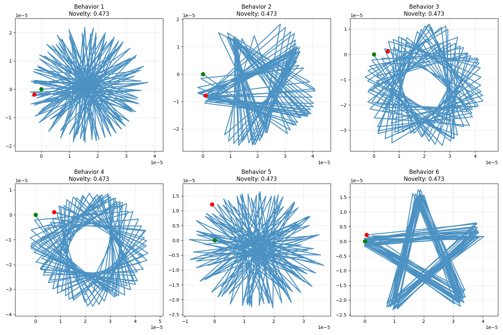

# Fitness Functions

___
Fitness functions are the core of any genetic algorithm - they define how well an individual performs and guide the evolution process. Radiate supports several different types of fitness functions, from your run of the mill functions to advanced techniques like novelty search and composite fitness functions.

The fitness function takes a decoded phenotype (the actual data structure) and returns a `Score` that represents how well that individual performs. The score can be a single value for single-objective optimization or multiple values for multi-objective problems. The result of your fitness function should reflect the quality of the individual in relation to the problem being solved. 

!!! note "**Fitness functions must return valid scores**"
    
    All fitness functions must return a `Score` object. Radiate automatically converts common types like `f32`, `f64`, `i32`, `ì64`, `Vec<f32>`, etc. into `Score` objects. NaN values are not allowed and will cause a panic. The number of values returned by the fitness function must match your objectives. For example, if you have two objectives, your fitness function must return a `Score` with two values.

## Overview

| Fitness Function Type | Purpose | Use Case | Complexity |
|----------------------|---------|----------|------------|
| [Simple Functions](#simple-fitness) | Basic optimization | Problems, benchmarks, cutstom logic | Low |
| [Batch Fitness](#batch-fitness) | Batch optimization | Problems, benchmarks, custom logic | Low |
| [Composite Functions](#composite-fitness) | Fitness combination | Balancing multiple goals | Medium |
| [Novelty Search](#novelty-search) | Behavioral diversity | Exploration, avoiding local optima | High |

___

## Simple Fitness

Simple fitness functions are the most common type - they take a phenotype and return a single score value. These can be any function that evaluates how well an individual performs. Things like mathematical functions, benchmarks, or even custom evaluation logic can be used as simple fitness functions. Your run of the mill mathematical functions like Rastrigin, Sphere, or Ackley functions are great examples of simple fitness functions. They take a vector of floats and return a single float score.

!!! note ":fontawesome-brands-python: Python `numba`"

    For python, In come cases (primarily if you are decoding to a `np.array`) it is possible to compile your fitness function down to native C using [numba](https://numba.pydata.org). 
    In most cases with this, this will result in your engine running as fast or almost as fast as rust. Check the examples page for an example using this method.

=== ":fontawesome-brands-python: Python"

    ```python
    import radiate as rd
    import math

    A = 10.0
    RANGE = 5.12
    N_GENES = 2

    def fitness_fn(x: list[float]) -> float:
        value = A * N_GENES
        for i in range(N_GENES):
            value += x[i]**2 - A * math.cos((2.0 * 3.141592653589793 * x[i]))
        return value

    codec = rd.FloatCodec.vector(N_GENES, init_range=(-RANGE, RANGE))
    engine = rd.GeneticEngine(codec, fitness_fn, objective="min")
    ```

=== ":fontawesome-brands-rust: Rust"

    ```rust
    use radiate::*;

    fn rastrigin_function(genotype: Vec<f32>) -> f32 {
        let mut value = 10.0 * 2 as f32;
        for i in 0..N_GENES {
            value += genotype[i].powi(2) - 10.0 * (2.0 * std::f32::consts::PI * genotype[i]).cos();
        }

        value
    }

    let engine = GeneticEngine::builder()
        .codec(FloatCodec::vector(2, -5.12..5.12))
        .minimizing()
        .fitness_fn(rastrigin_function)
        .build();
    ```

---

## Batch Fitness

The batch fitness function groups members of the `Population` which need to be evaluated into buckets to be evaluated together. 
If you need access to parts or the whole of a `Population` in order to compute fitness, this is your best bet. Depending on the 
implementation of your actual fitness logic, this can also be a speed up to your `Engine`. The logic behind the grouping depends on the `Executor` being used. Meaning, if your `Executor` is using 4 workers (threads) the individuals which need to be evaluated will be split into 4 batches. On the flip side, if your `Executor` is using a single thread (Serial), your fitness function will recieve a single batch containing all individuals which need evaluation.

Its important to note that other types of fitness functions like `NoveltySearch` & `CompositeFitnessFn` both support batch processing too by simply placing those objects within the call to `.batch_fitness_fn` - just like `.fitness_fn`.

=== ":fontawesome-brands-python: Python"

    ```python
    import radiate as rd
    import math

    A = 10.0
    RANGE = 5.12
    N_GENES = 2

    # NOTE this function expects a batch of inputs and returns a batch of outputs
    # the order in which the inputs are given is the order in which the outputs are returned
    def fitness_fn(x: list[list[float]]) -> list[float]:
        assert len(x) > 1

        results = []
        for member in x:
            value = A * N_GENES
            for i in range(N_GENES):
                value += member[i]**2 - A * math.cos((2.0 * 3.141592653589793 * member[i]))
            results.append(value)
        return results

    codec = rd.FloatCodec.vector(N_GENES, init_range=(-RANGE, RANGE))

    # Create the genetic engine with batch fitness function.
    # Just wrap your fitness function in 'rd.BatchFitness'
    engine = rd.GeneticEngine(codec, rd.BatchFitness(fitness_fn), objective="min")
    ```

=== ":fontawesome-brands-rust: Rust"

    ```rust
    use radiate::*;

    let engine = GeneticEngine::builder()
        .codec(IntChromosome::from((5, 0..100)))
        // Replace the original 'fitness_fn' call with 'batch_fitness_fn' to enable batch fitness.
        // This fitness function will receive a single batch containing all individuals which need evaluation
        .batch_fitness_fn(|phenotypes: &[Vec<i32>]| {
            phenotypes
                .iter()
                .map(|geno| geno.iter().sum::<i32>())
                .collect()
        })
        .build();

    // When using an parallel executor, the batches will be grouped together to evaluate on separate threads
    let engine = GeneticEngine::builder()
        .codec(IntChromosome::from((5, 0..100)))
        // 'batch_fitness_fn' will receive 7 batches of individuals during each generation's evaluation
        .executor(Executor::FixedSizedWorkerPool(7))
        .batch_fitness_fn(|phenotypes: &[Vec<i32>]| {
            phenotypes
                .iter()
                .map(|geno| geno.iter().sum::<i32>())
                .collect()
        })
        .build();
    ```

---

## Composite Fitness

Composite fitness functions allow you to combine multiple objectives into a single weighted fitness score. This is useful when you have multiple goals that need to be balanced. There are two main options when using a `CompositeFitnessFn`:

1. Weighted 
    * Combine multiple fitness functions with weights to create a single weighted average objective.
  
2. Equal
    * Combine multiple fitness functions with equal weights (1.0) to produce a single objective.

<!-- 
    ```python
    import radiate as rd

    def accuracy_objective(model: Model) -> float:
        return calculate_accuracy(model, test_data)

    def complexity_objective(model: Model) -> float:
        return model.complexity()  # Lower is better

    def efficiency_objective(model: Model) -> float:
        return model.inference_time()  # Lower is better

    # Create composite fitness function
    composite_fitness = rd.CompositeFitnessFn.new()
        .add_weighted_fn(accuracy_objective, 0.6)      # 60% weight on accuracy
        .add_weighted_fn(complexity_objective, 0.25)   # 25% weight on complexity
        .add_weighted_fn(efficiency_objective, 0.15)   # 15% weight on efficiency

    engine = rd.GeneticEngine(
        codec=rd.ModelCodec(),
        fitness_func=composite_fitness,
        objective="max"  # We want to maximize the composite score
    )
    ```
-->

=== ":fontawesome-brands-python: Python"

    !!! warning ":construction: Under Construction :construction:"
        The composite fitness function is currently under construction and not yet available in the Python API.


=== ":fontawesome-brands-rust: Rust"

    ```rust
    use radiate::*;

    fn accuracy_objective(model: &MyDecodedModel) -> f32 {
        // ... calculate accuracy ...
    }

    fn complexity_objective(model: &MyDecodedModel) -> f32 {
        // ... calculate complexity ...
    }

    fn efficiency_objective(model: &MyDecodedModel) -> f32 {
        // ... calculate efficiency ...
    }

    // Create weighted composite fitness function - this version computes a
    // weighted average of each function given to it
    let composite_fitness = CompositeFitnessFn::new()
        .add_weighted_fn(accuracy_objective, 0.6)      // 60% weight on accuracy
        .add_weighted_fn(complexity_objective, 0.25)   // 25% weight on complexity
        .add_weighted_fn(efficiency_objective, 0.15);  // 15% weight on efficiency

    // Create an equal weight composite fitness function with equal weights.
    // Meaning these are all essentially just added together to create a single objective.
    let composite_fitness = CompositeFitnessFn::new()
        .add_fitness_fn(accuracy_objective)
        .add_fitness_fn(complexity_objective)
        .add_fitness_fn(efficiency_objective);

    // Add it to the engine like any other fitness function
    let engine = GeneticEngine::builder()
        .codec(my_model_codec)
        .fitness_fn(composite_fitness)
        .build();
    ```

**Key Features:**

- **Weighted combination**: If using weighted, each objective has a weight that determines its importance
- **Normalized scoring**: If using weighted, scores are weighted and averaged
- **Flexible objectives**: Can combine any number of fitness functions
- **Single objective**: Results in a single score for selection

---

## Novelty Search

Novelty search is an advanced technique that rewards individuals for being behaviorally different from previously seen solutions, rather than just being "better" in terms of fitness. This helps avoid local optima and promotes exploration of the solution space. Below we can see a few members of the population generated by the python [script here](https://github.com/pkalivas/radiate/blob/master/py-radiate/examples/novelty_search.py). You can see that each of these has an equal fitness score or 'novelty', but they produce vastly different outcomes. Each phenotype was graded on how novel their walk was between points A and B noted by the green and red dots repsectively.

<figure markdown="span">
    { width="600" }
</figure>

Novelty search works by:

1. **Behavioral Descriptors**: Each individual is described by a behavioral descriptor (e.g., output patterns, feature values)
2. **Archive**: Novel solutions are stored in an archive
3. **Distance Calculation**: Novelty is measured as the average distance to the k-nearest neighbors in the archive
4. **Threshold**: Solutions with novelty above a threshold are added to the archive

You can implement your own behavioral descriptors by implementing the `Novelty` trait. 

=== ":fontawesome-brands-python: Python"

    ```python
    import radiate as rd

    class MyModelBehaviorDescriptor:
        def __init__(self, individual: List[float]):
            self.individual = individual

        def get_behavior_vector(self) -> List[float]:
            # some code that describes the behavior of a vector
            ... 

    # Define a behavioral descriptor
    def description(self, individual: List[float]) -> List[float]:
        # Return behavioral characteristics 
        descriptor = MyModelBehaviorDesciptor(individual)
        return descriptor.get_behavior_vector()
        
    # Create novelty search fitness function
    novelty_fitness = rd.NoveltySearch(
        behavior=description,
        # can use any of the distance inputs. The engine will use this to 
        # determine how 'novel' an individual is compared to the other's in the 
        # archinve or population, ultimently resulting in the individuals fitness score.
        distance=rd.CosineDistance() 
        k=10,           # Number of nearest neighbors to consider
        threshold=0.1,   # Novelty threshold for archive addition
        archive_size=1000, # defaults to 1000
        batch=False # Whether to use batch evaluation - the default is false
    )

    engine = rd.GeneticEngine(
        # whatever codec you specify - the decoded value of your codec will be fed 
        # into the `behavior` function of your NoveltySearch fitness_func
        codec=rd.FloatCodec.vector(10, (0, 10)), 
        fitness_func=novelty_fitness,
        # we always want to maximize novelty - however this is the default 
        # so its not necessary to define
        objective='max' 
    )
    ```

=== ":fontawesome-brands-rust: Rust"

    ```rust
    use radiate::*;

    // Define a behavioral descriptor
    struct MyModelBehaviorDescriptor;

    // ... rest of impl ...

    impl Novelty<MyModel> for MyModelBehaviorDescriptor {
        fn description(&self, individual: &MyModel) -> Self::Descriptor {
            // Return behavioral characteristics (e.g., outputs on test cases)
            individual.get_behavior_vector()
        }
    }

    // Create novelty search fitness function
    let novelty_fitness = NoveltySearch::new(
        MyModelBehaviorDescriptor,
        10,  // k: number of nearest neighbors
        0.1  // threshold: novelty threshold for archive addition
    )
    .with_archive_size(1000) // Optional: set archive size - default is 1000
    .cosine_distance(); // Optional set the distance parameter used
    // .euclidean_distance() // euclidean_distance is the default
    // .hamming_distance()

    // Novelty is also implemented for any F where F: Fn(&T) -> Vec<f32>. Meaning, you can 
    // just as easily feed a function to NoveltySearch as long as it takes a borrowed T (&T) 
    // and returns a Vec<f32>
    let function_novelty_fitness = NoveltySearch::new(
        |individual: &MyModel| // ... return a Vec<f32> that describes MyModel ...
        10,  
        0.1  
    )

    let engine = GeneticEngine::builder()
        // The decoded genotype from your codec (my_model_codec in this case) will be fed
        // into the `description` function from the Novelty trait impl 
        .codec(my_model_codec)
        .maximizing()
        .fitness_fn(novelty_fitness)
        .build();
    ```

---

## Best Practices

### Choosing the Right Fitness Function Type

1. **Simple Functions**: Use for straightforward optimization problems
2. **Composite Functions**: Use when you have multiple objectives that can be weighted
3. **Novelty Search**: Use when you need to explore diverse solutions or avoid local optima and don't care much about the fitness score

### Performance Considerations

1. **Novelty Search**: More computationally expensive due to distance calculations and archive management
2. **Composite Functions**: Slight overhead from multiple function evaluations
3. **Archive Size**: Larger archives in novelty search provide better diversity but use more memory
4. **Distance Calculations**: Choose efficient distance metrics for novelty search

### Parameter Tuning

1. **Novelty Threshold**: Lower values add more solutions to archive, higher values are more selective
2. **K-Nearest Neighbors**: Higher k provides more stable novelty scores but is more expensive
3. **Weights in Composite Functions**: Balance objectives based on their relative importance
4. **Archive Size**: Balance memory usage with diversity preservation

### Common Patterns

1. **Fitness + Novelty**: Combine traditional fitness with novelty for balanced exploration/exploitation
2. **Multi-Objective Composite**: Use composite functions to handle multiple conflicting objectives
3. **Behavioral Descriptors**: Use domain-specific behavioral characteristics for novelty search

