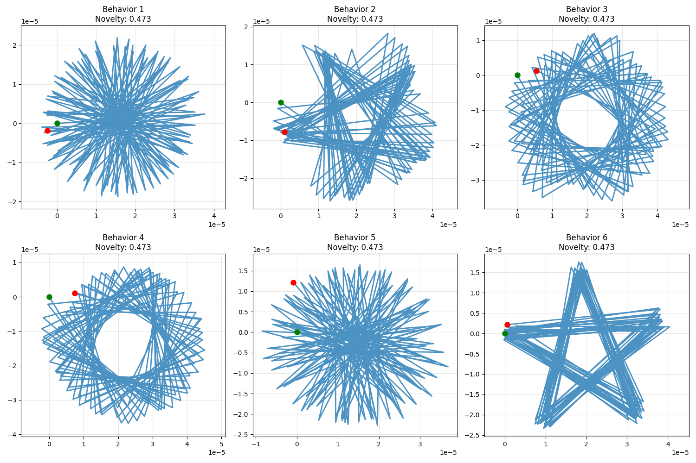

# Fitness Functions

___
Fitness functions are the core of any genetic algorithm - they define how well an individual performs and guide the evolution process. Radiate supports several different types of fitness functions, from your run of the mill functions to advanced techniques like novelty search and composite fitness functions.

The fitness function takes a decoded phenotype (the actual data structure) and returns a `Score` that represents how well that individual performs. The score can be a single value for single-objective optimization or multiple values for multi-objective problems. The result of your fitness function should reflect the quality of the individual in relation to the problem being solved. 

!!! note "**Fitness functions must return valid scores**"
    
    All fitness functions must return a `Score` object or a value that can be converted into a `Score`. Radiate automatically converts common types like `f32`, `f64`, `i32`, `i64`, `Vec<f32>`, etc. into `Score` objects - so those can be returned natively. NaN values are not allowed and will cause a panic. The number of values returned by the fitness function **must** match your objectives. For example, if you have two objectives, your fitness function must return a `Score` with two values.

## Overview

| Fitness Function Type | Purpose | Use Case | Complexity |
|----------------------|---------|----------|------------|
| [Simple Functions](#simple-fitness) | Basic optimization | Problems, benchmarks, custom logic | Low |
| [Batch Fitness](#batch-fitness) | Batch optimization | Problems, benchmarks, custom logic | Low |
| [Raw Fitness](#raw-fitness) | Direct genotype evaluation | When decoding is unnecessary | Low |
| [Composite Functions](#composite-fitness) | Fitness combination | Balancing multiple goals | Medium |
| [Novelty Search](#novelty-search) | Behavioral diversity | Exploration, avoiding local optima | High |

___

## Simple Fitness

Simple fitness functions are the most common type - they take a phenotype and return a single score value. These can be any function that evaluates how well an individual performs. Things like mathematical functions, benchmarks, or even custom evaluation logic can be used as simple fitness functions. Your run of the mill mathematical functions like Rastrigin, Sphere, or Ackley functions are great examples of simple fitness functions. They take a vector of floats and return a single float score.

!!! note ":fontawesome-brands-python: Python `numba`"

    For python, In some cases it is possible to compile your fitness function down to machine code using [numba](https://numba.pydata.org). 
    In most cases with this, this will result in your engine running as fast or almost as fast as rust. Check the examples page for an example using this method.

=== ":fontawesome-brands-python: Python"

    ```python
    --8<-- "python/fitness.py:rastrigin"
    ```

    Python also exposes a `@rd.fitness` decorator which can be used to annotate your fitness functions. As of `1/25/26` using the decorator for a simple fitness function like this doesn't provide any real benefit, the engine will handle wrapping the fitness function into its DSL internally either way. This would be considered the "more explicit" way of defining your fitness function however and may provide benefits in the future as the python API matures.

    ```python
    --8<-- "python/fitness.py:fitness_decorator"
    ```

=== ":fontawesome-brands-rust: Rust"

    ```rust
    --8<-- "rust/fitness.rs:rastrigin"
    ```

---

## Batch Fitness

The batch fitness function groups members of the `Population` which need to be evaluated into buckets to be evaluated together. 
If you need access to parts or the whole of a `Population` in order to compute fitness, this is your best bet. Depending on the 
implementation of your actual fitness logic, this can also be a speed up to your `Engine`. The logic behind the grouping depends on the `Executor` being used. Meaning, if your `Executor` is using 4 workers (threads) the individuals which need to be evaluated will be split into 4 batches. On the flip side, if your `Executor` is using a single thread (Serial), your fitness function will receive a single batch containing all individuals which need evaluation.

Its important to note that other types of fitness functions like `NoveltySearch` & `CompositeFitnessFn` both support batch processing too by simply placing those objects within the call to `.batch_fitness_fn` - just like `.fitness_fn`.

=== ":fontawesome-brands-python: Python"

    ```python
    --8<-- "python/fitness.py:batch_fitness"
    ```

    Just like simple fitness functions, python lets you opt out of wrapping your fitness function in `rd.BatchFitness` by using the `@rd.fitness` decorator.

    ```python
    --8<-- "python/fitness.py:batch_fitness_decorator"
    ```

=== ":fontawesome-brands-rust: Rust"

    ```rust
    --8<-- "rust/fitness.rs:batch"
    ```

---

## Raw Fitness

Raw fitness functions provide direct access to the genotype in the fitness function. If your fitness function can operate directly on the `Genotype` without needing to decode it, you can use a raw fitness function.

This can be a useful performance optimization in cases where decoding is unnecessary or when the genotype structure is simple enough to evaluate directly.

=== ":fontawesome-brands-python: Python"

    Due to the rust-python bridge limitations, raw fitness functions are not currently supported in the python API.
   

=== ":fontawesome-brands-rust: Rust"

    ```rust
    --8<-- "rust/fitness.rs:raw"
    ```

---

## Composite Fitness

Composite fitness functions allow you to combine multiple objectives into a single weighted fitness score. This is useful when you have multiple goals that need to be balanced. There are two main options when using a `CompositeFitnessFn`:

1. Weighted 
    * Combine multiple fitness functions with weights to create a single weighted average objective.
  
2. Equal
    * Combine multiple fitness functions with equal weights (1.0) to produce a single objective.

<!-- 
    ```python
    import radiate as rd

    def accuracy_objective(model: Model) -> float:
        return calculate_accuracy(model, test_data)

    def complexity_objective(model: Model) -> float:
        return model.complexity()  # Lower is better

    def efficiency_objective(model: Model) -> float:
        return model.inference_time()  # Lower is better

    # Create composite fitness function
    composite_fitness = rd.CompositeFitnessFn.new()
        .add_weighted_fn(accuracy_objective, 0.6)      # 60% weight on accuracy
        .add_weighted_fn(complexity_objective, 0.25)   # 25% weight on complexity
        .add_weighted_fn(efficiency_objective, 0.15)   # 15% weight on efficiency

    engine = rd.Engine(
        codec=rd.ModelCodec(),
        fitness_func=composite_fitness,
        objective=rd.MAX  # We want to maximize the composite score
    )
    ```
-->

=== ":fontawesome-brands-python: Python"

    !!! warning ":construction: Under Construction :construction:"
        The composite fitness function is currently under construction and not yet available in the Python API.


=== ":fontawesome-brands-rust: Rust"

    ```rust
    --8<-- "rust/fitness.rs:composite"
    ```

**Key Features:**

- **Weighted combination**: If using weighted, each objective has a weight that determines its importance
- **Normalized scoring**: If using weighted, scores are weighted and averaged
- **Flexible objectives**: Can combine any number of fitness functions
- **Single objective**: Results in a single score for selection

---

## Novelty Search

Novelty search is an advanced technique that rewards individuals for being behaviorally different from previously seen solutions, rather than just being "better" in terms of fitness. This helps avoid local optima and promotes exploration of the solution space. Below we can see a few members of the population generated by the python [script here](https://github.com/pkalivas/radiate/blob/master/examples/python/novelty_search.py). You can see that each of these has an equal fitness score or 'novelty', but they produce vastly different outcomes. Each phenotype was graded on how novel their walk was between points A and B noted by the green and red dots respectively.

<figure markdown="span">
    { width="600" }
</figure>

Novelty search works by:

1. **Behavioral Descriptors**: Each individual is described by a behavioral descriptor (e.g., output patterns, feature values)
2. **Archive**: Novel solutions are stored in an archive
3. **Distance Calculation**: Novelty is measured as the average distance to the *k*-nearest neighbors in the archive — using one of the same [distance measures](diversity/distance.md) that drive speciation (Euclidean by default)
4. **Threshold**: Solutions with novelty above a threshold are added to the archive

=== ":fontawesome-brands-python: Python"

    ```python
    --8<-- "python/fitness.py:novelty_search"
    ```

    Just like the other fitness functions, radiate also exposes a `@rd.novelty` decorator which can be used to annotate your novelty search descriptor (fitness functions). The below code snippet is functionally identical to the one above, just using the decorator instead of passing the function into `rd.NoveltySearch`.

    ```python
    --8<-- "python/fitness.py:novelty_decorator"
    ```

    Note the keyword difference: `NoveltySearch(...)` takes `archive_size=`, while the `@rd.novelty(...)` decorator takes `archive=` — both set the same archive capacity.

=== ":fontawesome-brands-rust: Rust"

    You can implement your own behavioral descriptors by implementing the `Novelty` trait. 

    ```rust
    --8<-- "rust/fitness.rs:novelty"
    ```

---

## Best Practices

### Choosing the Right Fitness Function Type

1. **Simple Functions**: Use for straightforward optimization problems
2. **Composite Functions**: Use when you have multiple objectives that can be weighted
3. **Novelty Search**: Use when you need to explore diverse solutions or avoid local optima and don't care much about the fitness score

### Performance Considerations

1. **Novelty Search**: More computationally expensive due to distance calculations and archive management
2. **Composite Functions**: Slight overhead from multiple function evaluations
3. **Archive Size**: Larger archives in novelty search provide better diversity but use more memory
4. **Distance Calculations**: Choose efficient distance metrics for novelty search

### Parameter Tuning

1. **Novelty Threshold**: Lower values add more solutions to archive, higher values are more selective
2. **K-Nearest Neighbors**: Higher k provides more stable novelty scores but is more expensive
3. **Weights in Composite Functions**: Balance objectives based on their relative importance
4. **Archive Size**: Balance memory usage with diversity preservation

### Common Patterns

1. **Fitness + Novelty**: Combine traditional fitness with novelty for balanced exploration/exploitation
2. **Multi-Objective Composite**: Use composite functions to handle multiple conflicting objectives
3. **Behavioral Descriptors**: Use domain-specific behavioral characteristics for novelty search

