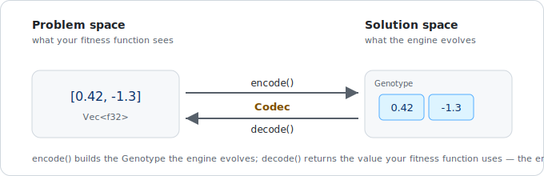

# Codecs

---

## What is a Codec?

Radiate's `GeneticEngine` operates on an abstract representation of your domain problem using the 'Genome'. To bridge the gap between your domain and radiate's, we use a `Codec` - encoder-decoder. A `Codec` is a mechanism that encodes and decodes genetic information between the 'problem space' (your domain) and the 'solution space' (Radiate's internal representation).

<figure markdown="span">
    { width="620" }
</figure>

Essentially, this is a component that defines how genetic information is structured and represented in your evolutionary algorithm. Think of it as a blueprint that tells the algorithm:

- What type of data you're evolving (numbers, characters, etc.)
- How that data is organized (single values, arrays, matrices, etc.)
- Any other chromosome or gene level information needed for the algorithm to work effectively.

---

## Why Do We Need Codecs?

In genetic algorithms, we need to represent potential solutions to our problem in a way that can be:

1. **Evolved**: Modified through operations like mutation and crossover
2. **Evaluated**: Tested to see how good the solution is
3. **Consistent**: Able to be encoded to chromosomes and genes which the engine can understand and operate on, then decoded back into a format that can be used in the real-world problem (e.g., your fitness function).

For example, if you're evolving neural network weights, you need to:

- Represent the weights as numbers
- Organize them in the correct structure (matrices for layers)
- Keep them within reasonable ranges (e.g., between -1 and 1)
  
See [this example](https://github.com/pkalivas/radiate/blob/master/examples/simple-nn/src/main.rs) for a simple neural network evolution using a custom codec.

---

## How Codecs Fit Into the Genetic Algorithm

Here's a simple breakdown of how codecs work in the evolution process:

1. **Initialization**: When you create a population, the codec defines how each individual's genetic information is structured and created within the population. For example, if you're evolving a list of floating-point numbers, the codec will specify how many numbers, their ranges, and how they are represented.
2. **Evaluation**: Your fitness function receives the decoded values in a format you can work with and have possibly defined.

---

## Types of Codecs

Radiate provides several codec types out of the box that should be able to cover most use cases. Each codec type is designed to handle specific data types and structures, making it easier to evolve solutions for various problems. Use the table below to pick one, then expand its section for details.

| Codec | Decodes to | Reach for it when… |
|---|---|---|
| **FloatCodec** | float / list / matrix of floats | continuous params, neural-net weights |
| **IntCodec** | int / list / matrix of ints | discrete params, indices, counts |
| **CharCodec** | chars / strings | text, string-matching |
| **BitCodec** | bools | binary choices, feature selection |
| **SubSetCodec** | a subset of your items | knapsack, feature selection |
| **PermutationCodec** | an ordering of your items | TSP, scheduling, sequencing |
| **FnCodec** | anything (you define encode/decode) | custom structures that don't fit the above |

The core codecs include:

??? note "FloatCodec"

    Use this when you need to evolve floating-point numbers. Perfect for:

    - Neural network weights
    - Mathematical function parameters
    - Continuous optimization problems
    - Real-valued parameters

    In all `FloatCodec` variants, the `bounds` is optional and defaults to the `init_range` if not specified.


    === ":fontawesome-brands-python: Python"

        ```python
        --8<-- "python/genome/codec.py:float_codec"
        ```

    === ":fontawesome-brands-rust: Rust"

        Every `FloatCodec` will `encode()` a `Genotype<FloatChromosome>`.

        ```rust
        --8<-- "rust/genome/codec.rs:float_codec"
        ```

??? note "IntCodec"

    Use this when you need to evolve integer values. Good for:

    - Discrete optimization problems
    - Array indices
    - Configuration parameters that must be whole numbers

    In all `IntCodec` variants, the `bounds` is optional and defaults to the `init_range` if not specified.

    === ":fontawesome-brands-python: Python"

        ```python
        --8<-- "python/genome/codec.py:int_codec"
        ```

    === ":fontawesome-brands-rust: Rust"

        The type of int can be specified as `i8`, `i16`, `i32`, `i64`, `i128` or `u8`, `u16`, `u32`, `u64`, `u128` depending on your needs. Every `IntCodec<I>` will `encode()` a `Genotype<IntChromosome<I>>`.

        ```rust
        --8<-- "rust/genome/codec.rs:int_codec"
        ```

??? note "CharCodec"

    Use this when you need to evolve character strings. Useful for:

    - Text generation
    - String-based problems

    There is an optional `char_set` parameter that allows you to specify the set of characters to use for encoding. If not specified, it defaults to lowercase letters (a-z), uppercase letters (A-Z), digits (0-9), and common punctuation ( !"#$%&'()*+,-./:;<=>?@[\]^_`{|}~).

    === ":fontawesome-brands-python: Python"

        ```python
        --8<-- "python/genome/codec.py:char_codec"
        ```

    === ":fontawesome-brands-rust: Rust"

        Every `CharCodec` will `encode()` a `Genotype<CharChromosome>`.

        ```rust
        --8<-- "rust/genome/codec.rs:char_codec"
        ```

??? note "BitCodec"

    Use this when you need to evolve binary data. Each `Gene` is a `BitGene` where the `Allele`, or value being evolved, is a bool. Ideal for:

    - Binary optimization problems
    - Feature selection
    - Boolean configurations
    - Subset selection problems (e.g., Knapsack problem)

    There is no `scalar` variant of the `BitCodec` because...that doesn't seem useful at all.

    === ":fontawesome-brands-python: Python"

        ```python
        --8<-- "python/genome/codec.py:bit_codec"
        ```

    === ":fontawesome-brands-rust: Rust"

        Every `BitCodec` will `encode()` a `Genotype<BitChromosome>`.

        ```rust
        --8<-- "rust/genome/codec.rs:bit_codec"
        ```

??? note "SubSetCodec"

    For when you need to optimize a subset or smaller collection from a larger set. Underneath the hood, the `SubSetCodec` uses a `BitCodec` to represent the selection of items. This codec allows you to evolve a selection of items from a larger pool, where each gene represents whether an item is included (1) or excluded (0) in the subset.

    - Feature selection in machine learning
    - Knapsack problem
    - Combinatorial optimization

    === ":fontawesome-brands-python: Python"

        !!! warning ":construction: Under Construction :construction:"

            This codec is currently under construction and not yet available in the Python API.

    === ":fontawesome-brands-rust: Rust"

        Each `SubSetCodec` will `encode()` a `Genotype<BitChromosome>` and `decode()` to a `Vec<Arc<T>>` of the selected items, 
        where a selected item is "selected" if the corresponding gene in the `BitChromosome` is `true`.

        ```rust
        --8<-- "rust/genome/codec.rs:subset_codec"
        ```

??? note "PermutationCodec"

    The `PermutationCodec<T>` ensures that each gene in the chromosome is a unique item from the set. Use this when you need to evolve permutations of a set of items. This codec is particularly useful for problems where the order of items matters, such as:

    - Traveling Salesman Problem (TSP)
    - Job scheduling
    - Sequence alignment

    === ":fontawesome-brands-python: Python"

        ```python
        --8<-- "python/genome/codec.py:permutation_codec"
        ```

    === ":fontawesome-brands-rust: Rust"

        Every `PermutationCodec<T>` will `encode()` a `Genotype<PermutationChromosome<T>>` and `decode()` to a `Vec<T>` where each `T` is a unique item from the given set of `allele`s.

        ```rust
        --8<-- "rust/genome/codec.rs:permutation_codec"

        ```

??? note "FnCodec"

    The `FnCodec` is a flexible codec that allows you to define custom encoding and decoding functions for your problem. This is particularly useful when your solution space does not fit neatly into the other codec types or when you need to handle complex data structures. It allows you to specify how to encode and decode your genetic information using user-defined functions. This codec is ideal for:

    - Complex data structures that don't fit into standard codecs
    - Custom encoding/decoding logic
    - Problems where the representation is not easily defined by simple types

    === ":fontawesome-brands-python: Python"

        !!! warning ":construction: Under Construction :construction:"

            This codec is currently under construction and not yet available in the Python API.

    === ":fontawesome-brands-rust: Rust"

        Each `FnCodec<I, O>` will `encode()` a `Genotype<C>` where `C` is the `chromosome` that you choose and `decode()` to an `O`. In the below case, the type `C` is an `IntChromosome<i8>` and `O` is the output type (e.g., `NQueens`).

        ```rust
        --8<-- "rust/genome/codec.rs:fn_codec"
        ```

---

## Best Practices

1. **Start Simple**: Begin with a simple codec structure and expand as needed
2. **Choose Appropriate Ranges (IntCodec & FloatCodec)**:
    - `value_range`/`init_range`: Set this to reasonable initial values
    - `bound_range`/`bounds`: Set this to the valid range for your problem
3. **Match Your Problem**: Choose the codec type that best represents your solution space
4. **Consider Structure**: Use the appropriate configuration (scalar/vector/matrix) for your problem

## Common Pitfalls to Avoid

1. **Too Wide Ranges**: Starting with very wide value ranges can make evolution slower
2. **Too Narrow Bounds**: Restrictive bound ranges might prevent finding optimal solutions
3. **Mismatched Structure**: Using the wrong codec structure can make it impossible to represent valid solutions
