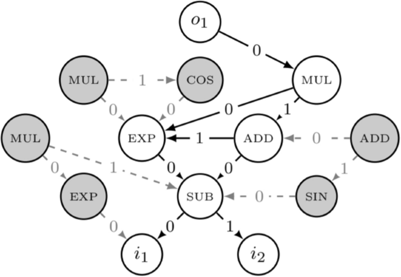
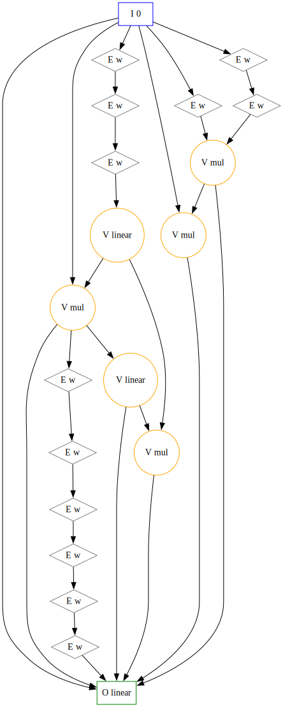

# Genetic Programming

!!! warning ":construction: Under Construction :construction:"

    As of `7/3/2025`: These docs are a work in progress and may not be complete or fully accurate. Please check back later for updates.

___

Genetic Programming (GP) in Radiate enables the evolution of programs represented as **expression trees** and **computational graphs**. This powerful feature allows you to solve complex problems by evolving mathematical expressions, decision trees, neural network topologies, and more.

Radiate's GP implementation provides two core data structures: **Trees** for hierarchical expressions and **Graphs** for complex computational networks. Each offers unique capabilities for different problem domains. Both the `tree` and `graph` modules come with their own specific chromosomes, codecs and alters to evolve these structures effectively.

---

## Installation

To use Radiate's Genetic Programming features, you need to install the library with the appropriate feature flags.

=== ":fontawesome-brands-python: Python"

    ```bash
    pip install radiate
    ```

=== ":fontawesome-brands-rust: Rust"
    ```shell
    cargo add radiate -F gp

    # Or Cargo.toml
    [dependencies]
    radiate = { version = "x", features = ["gp", ...] }
    ```

---

## Overview

| Structure | Best For | Complexity | Use Cases |
|-----------|----------|------------|-----------|
| **[Arity](#arity)** | Number of inputs for nodes and ops | Low | Function arguments, input counts |
| **[Ops](#ops)** | Operations and functions for nodes | Low | Mathematical, logical, activation functions |
| **[Nodes](#nodes)** | Building blocks for trees and graphs | Low | Node types, arity, operations |
| **[Trees](#trees)** | Symbolic regression, mathematical expressions | Low-Medium | Formula discovery, decision trees |
| **[Graphs](#graphs)** | Neural networks, complex computations | Medium-High | Neural evolution, complex programs |
| **[Regression](#regression)** | Regression tasks with trees and graphs | Medium | Function approximation, data fitting |

---

## Arity

[Arity](https://en.wikipedia.org/wiki/Arity) is a term used to describe the number of arguments or inputs a function takes. In the context of genetic programming, arity is crucial for defining how many inputs a `node` or an `op` can accept in both `trees` and `graphs`. For `graphs` `arity` is used to determine how many incoming connections a `GraphNode` can have, while for `trees` it determines how many children a `TreeNode` can have. Radiate uses an enum to express `arity` defined in three variants:

1. **Zero**: The operation takes no inputs (e.g., constants).
2. **Exact(usize)**: The operation takes a specific number of inputs.
3. **Any**: The operation can take any number of inputs (e.g., functions like sum or product).

In most cases, the `tree` or `graph` will try it's best ensure that their node's `arity` is not violated, but it will ultimately be up to the user to ensure that the `arity` is correct.

---

## Ops

The `ops` module provides sets of operations and formats for building and evolve genetic programs including `graphs` and `trees`. In the language of radiate, when using an `op`, it is the `Allele` of the `GraphNode` or `TreeNode`.
An `op` is a function that takes a number of inputs and returns a single output. The `op` can be a constant value, a variable, or a function that operates on the inputs.   

The `op` comes in five flavors:

1. **Function Operations**: Stateless functions that take inputs and return a value.
2. **Variable Operations**: Read from an input index, returning the value at that index.
3. **Constant Operations**: Fixed values that do not change - returning the value when called.
4. **Mutable Constant Operations**: Constants that can change over time, allowing for learnable parameters.
5. **Value Operations**: Stateful operations that maintain internal state and can take inputs to produce a value.

Each `op` has an `arity`, definingt the number of inputs it accepts. For example, the `Add` operation has an `arity` of 2 because it takes two inputs and returns their sum. The `Const` operation has an arity of 0 because it does not take any inputs, it just returns it's value. The `Var` operation has an arity of 0 because it takes an index as a parameter, and returns the value of the input at that index. 

Provided `Ops` include:

??? info "Basic ops"
    | Name | Arity | Description | Initalize | Type |
    |------|-------|-------------|----------|---- |
    | `const` | 0 | x | `Op::constant()` | Const |
    | `named_const` | 0 | x | `Op::named_constant(name)` | Const |
    | `var` | 0 | input[i] - return the value of the input at index `i` | `Op::var(i)` | Var |
    | `identity` |1| return the input value | `Op::identity()` | Fn |


??? info "Basic math operations"
    | Name | Arity | Description | Initalize | Type |
    |------|-------|-------------|----------|---- |
    | `Add` | 2 | x + y | `Op::add()` | Fn |
    | `Sub` | 2 | x - y | `Op::sub()` | Fn |
    | `Mul` | 2 | x * y | `Op::mul()` | Fn |
    | `Div` | 2 | x / y | `Op::div()` | Fn |
    | `Sum` | Any | Sum of n values | `Op::sum()` | Fn |
    | `Product` | Any | Product of n values | `Op::prod()` | Fn |
    | `Difference` | Any | Difference of n values | `Op::diff()` | Fn |
    | `Neg` | 1 | -x | `Op::neg()` | Fn |
    | `Abs` | 1 | abs(x) | `Op::abs()` | Fn |
    | `pow` | 2 | x^y | `Op::pow()` | Fn |
    | `Sqrt` | 1 | sqrt(x) | `Op::sqrt()` | Fn |
    | `Abs` | 1 | abs(x) | `Op::abs()` | Fn |
    | `Exp` | 1 | e^x | `Op::exp()` | Fn |
    | `Log` | 1 | log(x) | `Op::log()` | Fn |
    | `Sin` | 1 | sin(x) | `Op::sin()` | Fn |
    | `Cos` | 1 | cos(x) | `Op::cos()` | Fn |
    | `Tan` | 1 | tan(x) | `Op::tan()` | Fn |
    | `Max` | Any | Max of n values | `Op::max()` | Fn |
    | `Min` | Any | Min of n values | `Op::min()` | Fn |
    | `Ceil` | 1 | ceil(x) | `Op::ceil()` | Fn |
    | `Floor` | 1 | floor(x) | `Op::floor()` | Fn |
    | `Weight` | 1 | Weighted sum of n values | `Op::weight()` | MutableConst |

??? info "Activation Ops"

    These are the most common activation functions used in Neural Networks.

    | Name | Arity | Description | Initalize | Type |
    |------|-------|-------------|----------|---- |
    | `Sigmoid` | Any | 1 / (1 + e^-x) | `Op::sigmoid()` | Fn |
    | `Tanh` | Any | tanh(x) | `Op::tanh()` | Fn |
    | `ReLU` | Any | max(0, x) | `Op::relu()` | Fn |
    | `LeakyReLU` | Any | x if x > 0 else 0.01x | `Op::leaky_relu()` | Fn |
    | `ELU` | Any | x if x > 0 else a(e^x - 1) | `Op::elu()` | Fn |
    | `Linear` | Any | Linear combination of n values | `Op::linear()` | Fn |
    | `Softmax` | Any | Softmax of n values | `Op::softmax()` | Fn |
    | `Softplus` | Any | log(1 + e^x) | `Op::softplus()` | Fn |
    | `SELU` | Any | x if x > 0 else a(e^x - 1) | `Op::selu()` | Fn |
    | `Swish` | Any | x / (1 + e^-x) | `Op::swish()` | Fn |
    | `Mish` | Any | x * tanh(ln(1 + e^x)) | `Op::mish()` | Fn |
    
??? info "bool Ops"
    | Name | Arity | Description | Initalize | Type |
    |------|-------|-------------|----------|---- |
    | `And` | 2 | x && y | `Op::and()` | Fn |
    | `Or` | 2 | `x || y` | `Op::or()` | Fn |
    | `Not` | 1 | !x | `Op::not()` | Fn |
    | `Xor` | 2 | x ^ y | `Op::xor()` | Fn |
    | `Nand` | 2 | !(x && y) | `Op::nand()` | Fn |
    | `Nor` | 2 | `!(x || y)` | `Op::nor()` | Fn |
    | `Xnor` | 2 | !(x ^ y) | `Op::xnor()` | Fn |
    | `Equal` | 2 | x == y | `Op::eq()` | Fn |
    | `NotEqual` | 2 | x != y | `Op::ne()` | Fn |
    | `Greater` | 2 | x > y | `Op::gt()` | Fn |
    | `Less` | 2 | x < y | `Op::lt()` | Fn |
    | `GreaterEqual` | 2 | x >= y | `Op::ge()` | Fn |
    | `LessEqual` | 2 | x <= y | `Op::le()` | Fn |
    | `IfElse` | 3 | if x then y else z | `Op::if_else()` | Fn |

=== ":fontawesome-brands-python: Python"

    Ops in python can't be directly evaluated like in rust. However, they can still be constructed and used in a similar way.

    ```python
    import radiate as rd

    add = rd.Op.add()  
    sub = rd.Op.sub()
    mul = rd.Op.mul()
    div = rd.Op.div()

    constant = rd.Op.constant(42.0)
    variable = rd.Op.var(0)

    sigmoid = rd.Op.sigmoid()
    relu = rd.Op.relu()
    tanh = rd.Op.tanh()
    ```

=== ":fontawesome-brands-rust: Rust"

    ```rust
    use radiate::*;

    // Example usage of an Op
    let fn_op = Op::add();
    let result = fn_op.eval(&[1.0, 2.0]); // result is 3.0

    // Example usage of a constant Op
    let const_op = Op::constant(42.0);
    let result = const_op.eval(&[]); // result is 42.0

    // Example usage of a variable Op
    let var_op = Op::var(0); // Read from input at index 0
    let inputs = var_op.eval(&[5.0, 10.0]); // result is 5.0 when evaluated with inputs
    ```

### Alters

#### OperationMutator

> Inputs
> 
>   * `rate`: f32 - Mutation rate (0.0 to 1.0)
>   * `replace_rate`: f32 - Rate at which to replace an old `op` with a completely new one (0.0 to 1.0)

- **Purpose**: Randomly mutate an operation within a `TreeNode` or `GraphNode`.

This mutator randomly changes or alters the `op` of a node within a `TreeChromosome` or `GraphChromosome`. It can replace the `op` with a new one from the [store](#store) or modify its parameters.

=== ":fontawesome-brands-python: Python"

    ```python
    import radiate as rd

    mutator = rd.OperationMutator(0.07, 0.05),
    ```

=== ":fontawesome-brands-rust: Rust"

    ```rust
    use radiate::*;

    // Create a mutator that has a 10% chance to mutate an op and a 50% chance to replace it with a new one
    let mutator = OperationMutator::new(0.1, 0.5);
    ```

---

## Nodes 

Nodes are not only the `gene` of the `graph` and `tree`, but the fundamental building blocks of them. Each `node` represents a connection, computation, or operation, and has explicit rules depending on its role in the structure. 

### Roles

Nodes in the `gp` system come in different types (roles) depending on whether you're working with trees or graphs:

**Tree Node Types:**

- **Root**: The starting point of a tree (can have any number of children)
- **Vertex**: Internal computation nodes (can have any number of children)
- **Leaf**: Terminal nodes with no children (arity is `Arity::Zero`)

**Graph Node Types:**

- **Input**: Entry points (no incoming connections, one or more outgoing)
- **Output**: Exit points (one or more incoming connections, no outgoing)
- **Vertex**: Internal computation nodes (both incoming and outgoing connections)
- **Edge**: Connection nodes (exactly one incoming and one outgoing connection)

Each node type is defined by the `NodeType` enum:

=== ":fontawesome-brands-python: Python"

    Node types aren't defined in python - we use strings or input variables instead.

=== ":fontawesome-brands-rust: Rust"

    ```rust
    pub enum NodeType {
        Root,    // Tree-specific
        Vertex,  // Both trees and graphs
        Leaf,    // Tree-specific
        Input,   // Graph-specific
        Output,  // Graph-specific
        Edge,    // Graph-specific
    }
    ```

### Store

The `NodeStore<T>` manages available values for different node types, providing a centralized way to define what values can be used in each position of your genetic program. This makes it super easy to create `trees` or `graphs` from a specific template or with a specific structure.

**Usage Examples:**

=== ":fontawesome-brands-python: Python"

    There is no node store for python - it isn't nessesary for the api. Instead, the types of nodes are directly given the their codec or structure.

=== ":fontawesome-brands-rust: Rust"

    ```rust
    use radiate::*;
    
    // Create a store for tree operations
    // Each vertex node created will have a random value chosen from [1, 2, 3]
    // Each leaf node created will have a random value chosen from [4, 5, 6]
    let tree_store: NodeStore<i32> = vec![
        (NodeType::Vertex, vec![1, 2, 3]),
        (NodeType::Leaf, vec![4, 5, 6]),
    ].into();

    // -- or use the macro --

    let tree_store: NodeStore<i32> = node_store! {
        Root => [1, 2, 3],
        Vertex => [1, 2, 3],
        Leaf => [4, 5, 6],
    }

    // -- with ops --
    // for trees, the input nodes are always the leaf nodes, so we can use the `Op::var` to represent them
    let op_store: NodeStore<Op<f32>> = node_store! {
        Root => [Op::sigmoid()],
        Vertex => [Op::add(), Op::mul()],
        Leaf => (0..3).map(Op::var).collect::<Vec<_>>(),
    };

    // Create a new vertex tree node 
    let tree_node: TreeNode<i32> = tree_store.new_instance(NodeType::Vertex);

    // Create a new leaf tree node
    let leaf_node: TreeNode<Op<f32>> = op_store.new_instance(NodeType::Leaf);
    
    // Create a store for graph operations
    // Each input node created will have a random value chosen from [1, 2]
    // Each edge node created will have a random value chosen from [3, 4]
    // Each vertex node created will have a random value chosen from [5, 6, 7]
    // Each output node created will have a random value chosen from [8, 9, 10]
    let graph_store: NodeStore<i32> = vec![
        (NodeType::Input, vec![1, 2]),
        (NodeType::Edge, vec![3, 4]),
        (NodeType::Vertex, vec![5, 6, 7]),
        (NodeType::Output, vec![8, 9, 10]),
    ].into();

    // -- or use the macro --

    let graph_store: NodeStore<i32> = node_store! {
        Input => [1, 2],
        Edge => [3, 4],
        Vertex => [5, 6, 7],
        Output => [8, 9, 10],
    };

    // -- with ops --
    let op_store: NodeStore<Op<f32>> = node_store! {
        Input => [Op::var(0), Op::var(1)],
        Edge => [Op::add(), Op::mul()],
        Vertex => [Op::sub(), Op::div(), Op::max()],
        Output => [Op::sigmoid(), Op::tanh(), Op::relu()],
    };

    // Create a new vertex graph node at index 0
    let graph_node: GraphNode<i32> = graph_store.new_instance((0, NodeType::Vertex));

    // Createa a new edge graph node at index 1
    let edge_node: GraphNode<Op<f32>> = op_store.new_instance((1, NodeType::Edge));
    ```

**Node Type Mapping:**

- **Tree**: `Root`, `Vertex`, `Leaf`
- **Graph**: `Input`, `Output`, `Vertex`, `Edge`

**Store Validation:**
The node store ensures that:

- Each node type has appropriate value
- Values have compatible arity for their node type
- Invalid combinations are prevented during evolution

---

## Trees

A `tree` represents a hierarchical structure where each node has exactly one parent (except the root) and zero or more children. When combined with the [ops](#ops), it allows for the evolution of mathematical expressions, decision trees, and symbolic regression.

<figure markdown="span">
    { width="300" }
</figure>

=== ":fontawesome-brands-python: Python"

    Trees in python aren't quite as expressive as in rust, but they can still be constructed and used in a similar way.

    ```python
    import radiate as rd

    tree = rd.Tree(
        min_height=3,       # Default
        max_size=30,        # Default
        root=rd.Op.add(),   # The root operation - isn't necessary to specify
        vertex=[rd.Op.add(), rd.Op.sub(), rd.Op.mul(), rd.Op.div()],
        leaf=[rd.Op.var(0), rd.Op.var(1)],
    )

    result = tree.eval([1, 2]) 
    ```

=== ":fontawesome-brands-rust: Rust"

    ```rust
    use radiate::*;

    // create a simple tree:
    //              42
    //           /  |   \
    //          1   2    3
    //             / \    
    //            3   4    
    let tree: Tree<i32> = Tree::new(TreeNode::new(42)
        .attach(TreeNode::new(1))
        .attach(TreeNode::new(2)
            .attach(TreeNode::new(3))
            .attach(TreeNode::new(4))
        .attach(TreeNode::new(3))));

    // The tree can be evaluated with a function that takes a vector of inputs
    // This creates a `Tree` that looks like:
    //      +
    //    /   \
    //   *     +
    //  / \   / \
    // 2  3  2   x
    //
    // Where `x` is the first variable in the input.
    // This can also be thought of (and is functionally equivalent) as:
    //
    // f(x) = (2 * 3) + (2 + x)
    //
    let root = TreeNode::new(Op::add())
        .attach(
            TreeNode::new(Op::mul())
                .attach(TreeNode::new(Op::constant(2.0)))
                .attach(TreeNode::new(Op::constant(3.0))),
        )
        .attach(
            TreeNode::new(Op::add())
                .attach(TreeNode::new(Op::constant(2.0)))
                .attach(TreeNode::new(Op::var(0))),
        );

    // And the result of evaluating this tree with an input of `1` would be:
    let result = root.eval(&vec![1_f32]);
    assert_eq!(result, 9.0);
    ```

**Key Properties:**

- **Rooted**: Always has a single root node
- **Acyclic**: No node is its own ancestor
- **Hierarchical**: Parent-child relationships

### Node

Each node in a tree contains a value and optional children & arity. The `TreeNode` also implements the `gene` trait, making the node itself a `gene` and it's value the `allele`. 

**Node Types:**

- **Root**: Starting point of the tree (can have any number of children)
- **Vertex**: Internal computation nodes (can have any number of children)
- **Leaf**: Terminal nodes with no children (arity is `Arity::Zero`)

### Codec

The `TreeCodec` is simply a `codec` that encodes a `TreeChromosome` and decodes it back into a `Tree`. The `TreeCodec` can be configured to create a single `tree` or a multi-root `tree` structure. 

**Codec Types:**

- **Single Root**: Creates one tree per `genotype`
- **Multi-Root**: Creates multiple trees per `genotype`

=== ":fontawesome-brands-python: Python"

    ```python
    import radiate as rd

    # Create a tree codec with a starting (minimum) depth of 3
    codec = rd.TreeCodec(
        shape=(2, 1),
        min_depth=3,
        max_size=30,
        root=rd.Op.add(),
        vertex=[rd.Op.add(), rd.Op.sub(), rd.Op.mul()],
        leaf=[rd.Op.var(0), rd.Op.var(1)],
    )

    genotype = codec.encode()  
    tree = codec.decode(genotype)
    ```

=== ":fontawesome-brands-rust: Rust"

    ```rust
    use radiate::*;

    let store = vec![
        (NodeType::Root, vec![Op::add(), Op::sub()]),
        (NodeType::Vertex, vec![Op::add(), Op::sub(), Op::mul()]),
        (NodeType::Leaf, vec![Op::constant(1.0), Op::constant(2.0)]),
    ];

    // Create a single rooted tree codec with a starting (minimum) depth of 3
    let codec = TreeCodec::single(3, store);
    let genotype: Genotype<TreeChromosome<Op<f32>>> = single_root_codec.encode();
    let tree: Tree<Op<f32>> = codec.decode(&genotype);

    // Create a multi-rooted tree codec with a starting (minimum) depth of 3 and 2 trees
    let codec = TreeCodec::multi_root(3, 2, store);
    let genotype: Genotype<TreeChromosome<Op<f32>>> = codec.encode();
    // multi-rooted codec decodes to a Vec of Trees
    // one for each root in the genotype
    let trees: Vec<Tree<Op<f32>>> = codec.decode(&genotype); 
    ```

### Alters

#### HoistMutator

> Inputs
> 
>   * `rate`: f32 - Mutation rate (0.0 to 1.0)

- **Purpose**:  Randomly hoists subtrees from one part of the tree to another.

The `HoistMutator` is a mutation operator that randomly selects a subtree from the tree and moves it to a different location in the tree. This can create new structures and relationships between nodes, allowing for more complex solutions to emerge.

=== ":fontawesome-brands-python: Python"

    ```python
    import radiate as rd

    mutator = rd.HoistMutator(rate=0.1)
    ```

=== ":fontawesome-brands-rust: Rust"

    ```rust
    use radiate::*;

    let mutator = HoistMutator::new(0.1);
    ```

#### TreeCrossover

> Inputs
> 
>   * `rate`: f32 - Mutation rate (0.0 to 1.0)

- **Purpose**: Swaps two subtrees between two trees.

The `TreeCrossover` is a crossover operator that randomly selects a subtree from one parent tree and swaps it with a subtree from another parent tree.

=== ":fontawesome-brands-python: Python"

    ```python
    import radiate as rd

    mutator = rd.TreeCrossover(rate=0.1)
    ```

=== ":fontawesome-brands-rust: Rust"

    ```rust
    use radiate::*;

    let mutator = TreeCrossover::new(0.1);
    ```

---

## Graphs

Graphs are a powerful way to represent problems. They are used in many fields, such as Neural Networks, and can be used to solve complex problems. Radiate thinks of graphs in a more general way than most implementations. Instead of being a collection of inputs, nodes, edges, and outputs, radiate thinks of a graph as simply a bag of nodes that can be connected in any way. Why? Well, because it allows for more flexibility within the graph and it lends itself well to the evolutionary nature of genetic programming. However, this representation is not without it's drawbacks. It can be difficult to reason about the graph and it can be difficult to ensure that the graph is valid. Radiate tries to mitigate these issues by sticking to a few simple rules that govern the graph.

1. Each input node must have 0 incoming connections and at least 1 outgoing connection.
2. Each output node must have at least 1 incoming connection and 0 outgoing connections.
3. Each edge node must have exactly 1 incoming connection and 1 outgoing connection.
4. Each vertex node must have at least 1 incoming connection and at least 1 outgoing connection.

With these rules in mind, we can begin to build and evolve graphs. The graph typically relies on an underlying `GraphArchitect` to construct a valid graph. This architect is a builder pattern that keeps an aggregate of nodes added and their relationships to other nodes. Because of the architect's decoupled nature, we can easily create complex graphs. When combined with the [op](#ops) functionality, the `graph` module allows for the creation of complex computational graphs that can be evolved to solve or eval regression problems. 

<figure markdown="span">
    { width="300" }
</figure> 

<!--
 <figure markdown="span">
    { width="300" }
</figure> 
-->

Radiate provides a few basic graph architectures, but it is also possible to construct your own graph through either the built in graph functions or by using the architect. In most cases building a graph requires a vec of tuples (or a `NodeStore`) where the first element is the `NodeType` and the second element is a vec of values that the `GraphNode` can take. The `NodeType` is either `Input`, `Output`, `Vertex`, or `Edge`. The value of the `GraphNode` is picked at random from the vec of it's `NodeType`.

**Key Properties:**

- **Flexible Connections**: Nodes can have multiple inputs/outputs
- **Indexed Access**: Each node has a unique index in the vector
- **Connection Sets**: Each node maintains incoming/outgoing connections
- **Direction Support**: Can be directed acyclic (DAG) or cyclic

Manually create a simple graph:

=== ":fontawesome-brands-python: Python"

    Creating a graph in python doesn't offer as much flexibility as in rust at the current time, but it can still be done. 

    ```python
    import radiate as rd

    graph = rd.Graph(
        shape=(2, 1),
        vertex=[rd.Op.add(), rd.Op.sub(), rd.Op.mul(), rd.Op.div()],
        edge=[rd.Op.weight()],
        output=[rd.Op.linear()],
    )

    inputs = [[1.0, 2.0]]
    outputs = graph.eval(inputs)
    ```

=== ":fontawesome-brands-rust: Rust"

    ```rust
    use radiate::*;

    // create a simple graph:
    // 0 -> 1 -> 2
    let mut graph = Graph::<i32>::default();

    let idx_one = graph.insert(NodeType::Input, 0);
    let idx_two = graph.insert(NodeType::Vertex, 1);
    let idx_three = graph.insert(NodeType::Output, 2);

    graph.attach(idx_one, idx_two).attach(idx_two, idx_three);

    // Set cycles in a cyclic graph:
    let mut graph = Graph::<i32>::default();

    let idx_one = graph.insert(NodeType::Input, 0);
    let idx_two = graph.insert(NodeType::Vertex, 1);
    let idx_three = graph.insert(NodeType::Vertex, 2);
    let idx_four = graph.insert(NodeType::Output, 3);

    graph
        .attach(idx_one, idx_two)
        .attach(idx_two, idx_three)
        .attach(idx_three, idx_two)
        .attach(idx_three, idx_four)
        .attach(idx_four, idx_two);

    graph.set_cycles(vec![]);
    ```

Now, the above works just fine, but can become cumbersome quickly. To ease the process of creating a `graph`, we can use the default `graph` types to create graphs in a better way. All we need to do is define a `NodeStore` that contains the possible values for each node given a `NodeType`. 

=== ":fontawesome-brands-python: Python"

    ```python
    import radiate as rd

    graph = rd.Graph(
        shape=(2, 1),
        vertex=[rd.Op.add(), rd.Op.sub(), rd.Op.mul(), rd.Op.div()],
        edge=[rd.Op.weight()],
        output=[rd.Op.linear()],
    )

    inputs = [[1.0, 2.0]]
    outputs = graph.eval(inputs)
    ```

=== ":fontawesome-brands-rust: Rust"

    ```rust
    use radiate::*;

    // Input nodes are picked in order while the rest of the node's values
    // are picked at random.

    // Take note that the NodeType::Input has two variables, [0, 1] 
    // and we create a graph with two input nodes.
    let values = vec![
        (NodeType::Input, vec![Op::var(0), Op::var(1)]),
        (NodeType::Edge, vec![Op::weight()]),
        (NodeType::Vertex, vec![Op::sub(), Op::mul(), Op::linear()]),
        (NodeType::Output, vec![Op::linear()]),
    ];

    // create a directed graph with 2 input nodes and 2 output nodes
    let graph: Graph<Op<f32>> = Graph::directed(2, 2, values);

    // create a recurrent graph with 2 input nodes and 2 output nodes
    let graph: Graph<Op<f32>> = Graph::recurrent(2, 2, values);

    // create a weighted directed graph with 2 input nodes and 2 output nodes
    let graph: Graph<Op<f32>> = Graph::weighted_directed(2, 2, values);

    // create a weighted recurrent graph with 2 input nodes and 2 output nodes
    let graph: Graph<Op<f32>> = Graph::weighted_recurrent(2, 2, values);

    // Op graphs can be evaluated much like trees, but with the added complexity of connections.
    let inputs = vec![vec![1.0, 2.0]];
    let outputs = graph.eval(&inputs);
    ```

### Node

The `GraphNode` struct is a fundamental building block for graph-based genetic programming in Radiate. It represents a node in a directed graph that can have both incoming and outgoing connections to other nodes. Each node has a unique identifier, an index in the graph, a value of type T, and maintains sets of incoming and outgoing connections. The `GraphNode` can be of different types, such as `Input`, `Output`, `Vertex`, or `Edge`, each serving a specific role in the graph structure. To ensure the integrity of the graph, the `GraphNode` enforces rules based on its type, such as the number of incoming and outgoing connections it can have. In order to facilitate genetic programming, the `GraphNode` implements the `Gene` trait, where it's `allele` is the value of the node, and its `gene` is the node itself. 

**Node Types:**

- **Input**: Entry points (no incoming, one or more outgoing)
- **Output**: Exit points (one or more incoming, no outgoing)
- **Vertex**: Internal computation (both incoming and outgoing)
- **Edge**: Connection nodes (exactly one incoming and one outgoing)

=== ":fontawesome-brands-python: Python"

    There is no `GraphNode` in python. It isn't necessary for the api. 

=== ":fontawesome-brands-rust: Rust"

    ```rust
    use radiate::*;

    // Create a new input node with value 42
    let node = GraphNode::new(0, NodeType::Input, 42);

    // Create a node with specific arity
    // This node will be invalid if it has a number of incoming connections other than 2
    let node_with_arity = GraphNode::with_arity(1, NodeType::Vertex, 42, Arity::Exact(2));
    ```

### Codec

The `GraphCodec` is a codec that encodes a `GraphChromosome` and decodes it back into a `Graph`. The `GraphCodec` can be configured to create directed or recurrent graphs.

=== ":fontawesome-brands-python: Python"

    ```python
    # Create a directed graph codec 
    codec = GraphCodec.directed(
        shape=(2, 1),
        vertex=[rd.Op.add(), rd.Op.mul()],
        edge=rd.Op.weight(),
        output=rd.Op.linear()
    )

    genotype = codec.encode()
    graph = codec.decode(genotype)

    # Create a recurrent graph codec
    codec = GraphCodec.recurrent(
        shape=(2, 1),
        vertex=[rd.Op.add(), rd.Op.mul()],
        edge=rd.Op.weight(),
        output=rd.Op.linear()
    )

    genotype = codec.encode()
    recurrent_graph = codec.decode(genotype)
    ```

=== ":fontawesome-brands-rust: Rust"

    ```rust
    use radiate::*;

    // Create a store for graph operations
    let store = vec![
        (NodeType::Input, vec![Op::var(0), Op::var(1)]),
        (NodeType::Edge, vec![Op::add(), Op::mul()]),
        (NodeType::Vertex, vec![Op::sub(), Op::div()]),
        (NodeType::Output, vec![Op::sigmoid(), Op::tanh()]),
    ];

    // Create a directed graph codec with 2 input nodes and 2 output nodes
    let codec = GraphCodec::directed(2, 2, store);
    let genotype: Genotype<GraphChromosome<Op<f32>>> = codec.encode();
    let graph: Graph<Op<f32>> = codec.decode(&genotype);

    // Create a recurrent graph codec with 2 input nodes and 2 output nodes
    let recurrent_codec = GraphCodec::recurrent(2, 2, store);
    let recurrent_genotype: Genotype<GraphChromosome<Op<f32>>> = recurrent_codec.encode();
    let recurrent_graph: Graph<Op<f32>> = recurrent_codec.decode(&recurrent_genotype);
    ```

### Alters

#### GraphMutator

> Inputs
> 
>   * `vertex_rate`: f32 - Probabilty of adding a vertex to the graph (0.0 to 1.0)
>   * `edge_rate`: f32 - Probabilty of adding an edge to the graph (0.0 to 1.0)
>   * `allow_recurrent`: bool - Whether to allow recurrent connections in the graph. The default is `false`, meaning the graph will be a directed acyclic graph (DAG).

- **Purpose**: Randomly adds vertices and edges to the graph.

This mutator is used to add new nodes and connections to the graph. It can be used to evolve the graph structure over time, allowing for more complex solutions to emerge.

=== ":fontawesome-brands-python: Python"

    ```python
    import radiate as rd

    # Create a mutator that adds vertices and edges with a 10% chance for either
    mutator = rd.GraphMutator(vertex_rate=0.1, edge_rate=0.1, allow_recurrent=True)
    ```

=== ":fontawesome-brands-rust: Rust"

    ```rust
    use radiate::*;

    // Create a mutator that adds vertices and edges with a 10% chance for either
    let mutator = GraphMutator::new(0.1, 0.1);

    let mutator = GraphMutator::new(0.1, 0.1).allow_recurrent(true); // Allow recurrent connections
    ```

#### GraphCrossover

> Inputs
> 
>   * `rate`: f32 - Crossover rate (0.0 to 1.0)
>   * `cross_parent_node_rate`: f32 - Probability of the less fit parent taking a node from the more fit parent (0.0 to 1.0)

- **Purpose**: Swaps node value's (`alleles`) between two graphs.

This crossover operator is used to combine two parent graphs by swapping the values of their nodes. It can be used to create new graphs that inherit the structure and values of their parents. Given that a more fit parent's node's `arity` matches the less fit parent's node's `arity`, the less fit parent will take (inherit) the more fit parent's node's value. This means the child is guaranteed to have the same structure as the less fit parent, but with some of the more fit parent's values (`alleles`). This process is extremely similar to how the [NEAT](https://en.wikipedia.org/wiki/NeuroEvolution_of_Augmenting_Topologies) algorithm works.

=== ":fontawesome-brands-python: Python"

    ```python
    import radiate as rd

    crossover = rd.GraphCrossover(0.1, 0.5)
    ```

=== ":fontawesome-brands-rust: Rust"

    ```rust
    use radiate::*;

    // Create a mutator that adds vertices and edges with a 10% chance for either
    let crossover = GraphCrossover::new(0.1, 0.5);
    ```

---

## Regression

In machine learning its common to have a regression task. This is where you have a set of inputs and outputs, and you want to find a function that maps the inputs to the outputs. In Radiate, we can use genetic programming to evolve a `tree` or `graph` that fits the data. The regression `problem` is a special type of `problem` that allows you to define a set of inputs and outputs, and then evolve a `tree` or `graph` that fits the data. The regression problem can be used with both trees and graphs, and it will automatically handle the encoding and decoding of the data.

Lets take a quick look at how we would put together a regression problem using a `tree` and a `graph`.

=== ":fontawesome-brands-python: Python"

    !!! warning ":construction: Under Construction :construction:"
        
        Python's GP is still under development and will be available in a future release.

=== ":fontawesome-brands-rust: Rust"

    !!! warning ":construction: Under Construction :construction:"
        
        These docs are still under construction.


More robust examples can be found in the next section or in the [tree](https://github.com/pkalivas/radiate/tree/master/examples/trees) and [graph](https://github.com/pkalivas/radiate/tree/master/examples/graphs) examples in the git repository.

<!-- 
    ```rust
    use radiate::*;

    // Create a regression problem with a tree
    let tree_problem = RegressionProblem::new(
        "Tree Regression",
        vec![1.0, 2.0, 3.0], // Inputs
        vec![4.0, 5.0, 6.0], // Outputs
        TreeCodec::single(3, node_store! {
            NodeType::Vertex => vec![Op::add(), Op::sub()],
            NodeType::Leaf => vec![Op::var(0), Op::var(1)],
        }),
    );

    // Create a regression problem with a graph
    let graph_problem = RegressionProblem::new(
        "Graph Regression",
        vec![1.0, 2.0, 3.0], // Inputs
        vec![4.0, 5.0, 6.0], // Outputs
        GraphCodec::directed(2, 1, node_store! {
            NodeType::Input => vec![Op::var(0)],
            NodeType::Output => vec![Op::sigmoid()],
            NodeType::Vertex => vec![Op::add(), Op::sub()],
        }),
    );
    ```

-->

---
