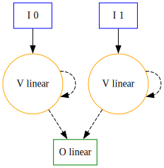
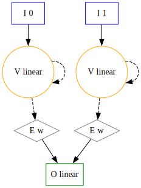
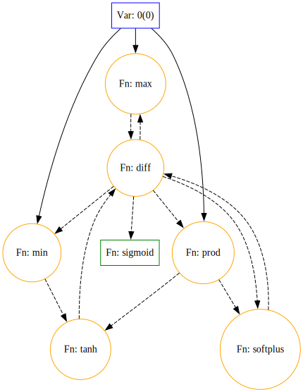

# Graphs

Graphs are a powerful way to represent problems. They are used in many fields, such as Neural Networks, and can be used to solve complex problems. Radiate thinks of graphs in a more general way than most implementations. Instead of being a collection of inputs, nodes, edges, and outputs, radiate thinks of a graph as simply a bag of nodes that can be connected in any way. Why? Well, because it allows for more flexibility within the graph and it lends itself well to the evolutionary nature of genetic programming. However, this representation is not without it's drawbacks. It can be difficult to reason about the graph and it can be difficult to ensure that the graph is valid. Radiate tries to mitigate these issues by sticking to a few simple rules that govern the graph.

1. Each input node must have 0 incoming connections and at least 1 outgoing connection.
2. Each output node must have at least 1 incoming connection and 0 outgoing connections.
3. Each edge node must have exactly 1 incoming connection and 1 outgoing connection.
4. Each vertex node must have at least 1 incoming connection and at least 1 outgoing connection.

With these rules in mind, we can begin to build and evolve graphs. The graph typically relies on an underlying `GraphArchitect` to construct a valid graph. This architect is a builder pattern that keeps an aggregate of nodes added and their relationships to other nodes. Because of the architect's decoupled nature, we can easily create complex graphs. When combined with the [op](op.md) functionality, the `graph` module allows for the creation of complex computational graphs that can be evolved to solve or eval regression problems. 

<figure markdown="span">
    { width="300" }
</figure> 


Radiate provides a few basic graph architectures, but it is also possible to construct your own graph through either the built in graph functions or by using the architect. In most cases building a graph requires a vec of tuples (or a `NodeStore`) where the first element is the `NodeType` and the second element is a vec of values that the `GraphNode` can take. The `NodeType` is either `Input`, `Output`, `Vertex`, or `Edge`. The value of the `GraphNode` is picked at random from the vec of it's `NodeType`.

**Key Properties:**

- **Flexible Connections**: Nodes can have multiple inputs/outputs
- **Indexed Access**: Each node has a unique index in the vector
- **Connection Sets**: Each node maintains incoming/outgoing connections
- **Direction Support**: Can be directed acyclic (DAG) or cyclic

---

## Building a Graph

=== ":fontawesome-brands-python: Python"

    Creating a graph in python doesn't offer as much flexibility as in rust at the current time, but it can still be done through the codec.

    ```python
    import radiate as rd

    codec = rd.GraphCodec.directed(
        shape=(2, 1),
        vertex=[rd.Op.add(), rd.Op.sub(), rd.Op.mul(), rd.Op.div()],
        edge=rd.Op.weight(), # or [rd.Op.weight(), ...]
        output=rd.Op.linear(), # or [rd.Op.linear(), ...]
    )

    graph = codec.decode(codec.encode())

    inputs = [[1.0, 2.0]]
    outputs = graph.eval(inputs)
    ```

=== ":fontawesome-brands-rust: Rust"

    ```rust
    use radiate::*;

    // create a simple graph:
    // 0 -> 1 -> 2
    let mut graph = Graph::<i32>::default();

    let idx_one = graph.insert(NodeType::Input, 0);
    let idx_two = graph.insert(NodeType::Vertex, 1);
    let idx_three = graph.insert(NodeType::Output, 2);

    graph.attach(idx_one, idx_two).attach(idx_two, idx_three);

    // Set cycles in a cyclic graph:
    let mut graph = Graph::<i32>::default();

    let idx_one = graph.insert(NodeType::Input, 0);
    let idx_two = graph.insert(NodeType::Vertex, 1);
    let idx_three = graph.insert(NodeType::Vertex, 2);
    let idx_four = graph.insert(NodeType::Output, 3);

    graph
        .attach(idx_one, idx_two)
        .attach(idx_two, idx_three)
        .attach(idx_three, idx_two)
        .attach(idx_three, idx_four)
        .attach(idx_four, idx_two);

    graph.set_cycles(vec![]);
    ```

Now, the above works just fine, but can become cumbersome quickly. To ease the process of creating a `graph`, we can use the default `graph` types to create graphs in a better way. All we need to do is define a `NodeStore` that contains the possible values for each node given a `NodeType`. 

=== ":fontawesome-brands-python: Python"

    There isn't a direct way to create a Graph in python, instead we can use the codec to create on directly if needed.

    ```python
    import radiate as rd

    codec = rd.GraphCodec.directed(
        shape=(2, 1),
        vertex=[rd.Op.add(), rd.Op.sub(), rd.Op.mul(), rd.Op.div()],
        edge=[rd.Op.weight()],
        output=[rd.Op.linear()],
    )

    # or recurrent graph
    codec = rd.GraphCodec.recurrent(
        # ... same as above
    )

    # or weighted directed graph
    codec = rd.GraphCodec.weighted_directed(
        # ... same as above
    )

    # or weighted recurrent graph
    codec = rd.GraphCodec.weighted_recurrent(
        # ... same as above
    )

    # or lstm graph
    codec = rd.GraphCodec.lstm(
        # ... same as above
    )

    # or gru graph
    codec = rd.GraphCodec.gru(
        # ... same as above
    )

    graph = codec.decode(codec.encode())

    inputs = [[1.0, 2.0]]
    outputs = graph.eval(inputs)
    ```

=== ":fontawesome-brands-rust: Rust"

    ```rust
    use radiate::*;

    // Input nodes are picked in order while the rest of the node's values
    // are picked at random.

    // Take note that the NodeType::Input has two variables, [0, 1] 
    // and we create a graph with two input nodes.
    let values = vec![
        (NodeType::Input, vec![Op::var(0), Op::var(1)]),
        (NodeType::Edge, vec![Op::weight()]),
        (NodeType::Vertex, vec![Op::sub(), Op::mul(), Op::linear()]),
        (NodeType::Output, vec![Op::linear()]),
    ];

    // create a directed graph with 2 input nodes and 2 output nodes
    let graph: Graph<Op<f32>> = Graph::directed(2, 2, values);

    // create a recurrent graph with 2 input nodes and 2 output nodes
    let graph: Graph<Op<f32>> = Graph::recurrent(2, 2, values);

    // create a weighted directed graph with 2 input nodes and 2 output nodes
    let graph: Graph<Op<f32>> = Graph::weighted_directed(2, 2, values);

    // create a weighted recurrent graph with 2 input nodes and 2 output nodes
    let graph: Graph<Op<f32>> = Graph::weighted_recurrent(2, 2, values);

    // create an LSTM graph with 2 input nodes and 2 output nodes
    let graph: Graph<Op<f32>> = Graph::lstm(2, 2, values);

    // create a GRU graph with 2 input nodes and 2 output nodes
    let graph: Graph<Op<f32>> = Graph::gru(2, 2, values);

    // Op graphs can be evaluated much like trees, but with the added complexity of connections.
    let inputs = vec![vec![1.0, 2.0]];
    let outputs = graph.eval(&inputs);
    ```

The `Graph` can be visualized using the `dot` format, which can be rendered using tools like Graphviz. This is especially useful for understanding the structure of complex graphs. Calling `.to_dot()` on a graph will generate the dot representation. The dot format for graphs can be intpreted as follows:

* Blue squares represent input nodes
* Yellow circles represent vertex nodes
* Green squares represent output nodes.
* Grey diamonds represent edge nodes.
* Solid lines represent directed connections
* Dashed lines represent recurrent connections or connections that come from cycles.

??? note "Directed"

    A directed graph is a graph in which the edges have a direction. This means that the connections between nodes are one-way, and data can only flow in the direction of the edges. Here we can see a simple directed graph with 2 input nodes and 1 output node.

    <figure markdown="span">
        { width="300" }
    </figure>

??? note "Recurrent"

    A recurrent graph is a graph in which the edges can form cycles. This means that data can flow in loops, allowing for more complex behaviors. Here we can see a simple recurrent graph with 2 input nodes, two recurrent vertex nodes, and 1 output node.

    <figure markdown="span">
        { width="300" }
    </figure>

??? note "Weighted Directed"

    A weighted directed graph is a directed graph in which the edges have weights. These weights can represent the strength or importance of the connection between nodes. Here we can see a simple weighted directed graph with 2 input nodes, 2 weighted edge nodes, and 1 output node.

    <figure markdown="span">
        { width="300" }
    </figure>

??? note "Weighted Recurrent"

    A weighted recurrent graph is a recurrent graph in which the edges have weights. These weights can represent the strength or importance of the connection between nodes. Here we can see a simple weighted recurrent graph with 2 input nodes, 2 recurrent vertex nodes, 2 weighted edge nodes, and 1 output node.

    <figure markdown="span">
        { width="300" }
    </figure>

??? note "Lstm"

    A Long Short-Term Memory (LSTM) network is a type of recurrent neural network that is designed to handle sequential data. It is capable of learning long-term dependencies and is often used in tasks such as language modeling and time series prediction. Here we can see a simple LSTM with 2 input node and 2 output node. The internal nodes are generated randomly from the provided store. This is an intentionally simplified LSTM structure with the intent of the rest of the nodes being evolved.

    <figure markdown="span">
        { width="300" }
    </figure>

??? note "Gru"

    A Gated Recurrent Unit (GRU) is a type of recurrent neural network that is designed to handle sequential data. It is similar to a Long Short-Term Memory (LSTM) network, but it has a simpler architecture and is easier to train. Here we can see a simple GRU with 1 input node and 1 output node. The internal nodes are generated randomly from the provided store. This is an intentionally simplified GRU structure with the intent of the rest of the nodes being evolved.

    <figure markdown="span">
        { width="300" }
    </figure>

---

## Node

The `GraphNode` struct is a fundamental building block for graph-based genetic programming in Radiate. It represents a node in a directed graph that can have both incoming and outgoing connections to other nodes. Each node has a unique identifier, an index in the graph, a value of type T, and maintains sets of incoming and outgoing connections. The `GraphNode` can be of different types, such as `Input`, `Output`, `Vertex`, or `Edge`, each serving a specific role in the graph structure. To ensure the integrity of the graph, the `GraphNode` enforces rules based on its type, such as the number of incoming and outgoing connections it can have. In order to facilitate genetic programming, the `GraphNode` implements the `Gene` trait, where it's `allele` is the value of the node, and its `gene` is the node itself. 

**Node Types:**

- **Input**: Entry points (no incoming, one or more outgoing)
- **Output**: Exit points (one or more incoming, no outgoing)
- **Vertex**: Internal computation (both incoming and outgoing)
- **Edge**: Connection nodes (exactly one incoming and one outgoing)

=== ":fontawesome-brands-python: Python"

    There is no `GraphNode` in python. It isn't necessary for the api. 

=== ":fontawesome-brands-rust: Rust"

    ```rust
    use radiate::*;

    // Create a new input node with value 42
    let node = GraphNode::new(0, NodeType::Input, 42);

    // Create a node with specific arity
    // This node will be invalid if it has a number of incoming connections other than 2
    let node_with_arity = GraphNode::with_arity(1, NodeType::Vertex, 42, Arity::Exact(2));
    ```

## Codec

The `GraphCodec` is a codec that encodes a `GraphChromosome` and decodes it back into a `Graph`. The `GraphCodec` can be configured to create directed or recurrent graphs.

=== ":fontawesome-brands-python: Python"

    ```python
    import radiate as rd

    # Create a directed graph codec 
    codec = rd.GraphCodec.directed(
        shape=(2, 1),
        vertex=[rd.Op.add(), rd.Op.mul()],
        edge=rd.Op.weight(),
        output=rd.Op.linear()
    )

    genotype = codec.encode()
    graph = codec.decode(genotype)

    # Create a recurrent graph codec
    codec = rd.GraphCodec.recurrent(
        shape=(2, 1),
        vertex=[rd.Op.add(), rd.Op.mul()],
        edge=rd.Op.weight(),
        output=rd.Op.linear()
    )

    genotype = codec.encode()
    recurrent_graph = codec.decode(genotype)
    ```

=== ":fontawesome-brands-rust: Rust"

    ```rust
    use radiate::*;

    // Create a store for graph operations
    let store = vec![
        (NodeType::Input, vec![Op::var(0), Op::var(1)]),
        (NodeType::Edge, vec![Op::add(), Op::mul()]),
        (NodeType::Vertex, vec![Op::sub(), Op::div()]),
        (NodeType::Output, vec![Op::sigmoid(), Op::tanh()]),
    ];

    // Create a directed graph codec with 2 input nodes and 2 output nodes
    let codec = GraphCodec::directed(2, 2, store);
    let genotype: Genotype<GraphChromosome<Op<f32>>> = codec.encode();
    let graph: Graph<Op<f32>> = codec.decode(&genotype);

    // Create a recurrent graph codec with 2 input nodes and 2 output nodes
    let recurrent_codec = GraphCodec::recurrent(2, 2, store);
    let recurrent_genotype: Genotype<GraphChromosome<Op<f32>>> = recurrent_codec.encode();
    let recurrent_graph: Graph<Op<f32>> = recurrent_codec.decode(&recurrent_genotype);
    ```

---

## Alters

### GraphMutator

> Inputs
> 
>   * `vertex_rate`: f32 - Probabilty of adding a vertex to the graph (0.0 to 1.0)
>   * `edge_rate`: f32 - Probabilty of adding an edge to the graph (0.0 to 1.0)
>   * `allow_recurrent`: bool - Whether to allow recurrent connections in the graph. The default is `true`, meaning the graph can have cycles.

- **Purpose**: Randomly adds vertices and edges to the graph.

This mutator is used to add new nodes and connections to the graph. It can be used to evolve the graph structure over time, allowing for more complex solutions to emerge.

=== ":fontawesome-brands-python: Python"

    ```python
    import radiate as rd

    # Create a mutator that adds vertices and edges with a 10% chance for either
    mutator = rd.GraphMutator(vertex_rate=0.1, edge_rate=0.1, allow_recurrent=False)
    ```

=== ":fontawesome-brands-rust: Rust"

    ```rust
    use radiate::*;

    // Create a mutator that adds vertices and edges with a 10% chance for either
    let mutator = GraphMutator::new(0.1, 0.1);

    let mutator = GraphMutator::new(0.1, 0.1).allow_recurrent(false); // Disallow recurrent connections
    ```

### GraphCrossover

> Inputs
> 
>   * `rate`: f32 - Crossover rate (0.0 to 1.0)
>   * `cross_parent_node_rate`: f32 - Probability of the less fit parent taking a node from the more fit parent (0.0 to 1.0)

- **Purpose**: Swaps node value's (`alleles`) between two graphs.

This crossover operator is used to combine two parent graphs by swapping the values of their nodes. It can be used to create new graphs that inherit the structure and values of their parents. Given that a more fit parent's node's `arity` matches the less fit parent's node's `arity`, the less fit parent will take (inherit) the more fit parent's node's value. This means the child is guaranteed to have the same structure as the less fit parent, but with some of the more fit parent's values (`alleles`). This process is extremely similar to how the [NEAT](https://en.wikipedia.org/wiki/NeuroEvolution_of_Augmenting_Topologies) algorithm works.

=== ":fontawesome-brands-python: Python"

    ```python
    import radiate as rd

    crossover = rd.GraphCrossover(0.1, 0.5)
    ```

=== ":fontawesome-brands-rust: Rust"

    ```rust
    use radiate::*;

    // Create a mutator that adds vertices and edges with a 10% chance for either
    let crossover = GraphCrossover::new(0.1, 0.5);
    ```
