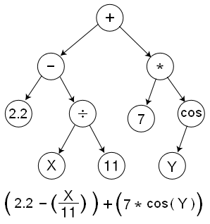

# Trees

A `tree` represents a hierarchical structure where each node has exactly one parent (except the root) and zero or more children. When combined with the [ops](op.md), it allows for the evolution of mathematical expressions, decision trees, and symbolic regression.

<figure markdown="span">
    { width="300" }
</figure>

---

## Building a Tree

=== ":fontawesome-brands-python: Python"

    Trees in python aren't quite as expressive as in rust. A `Tree` is produced from a `TreeCodec` — encode a genotype, then decode it into a `Tree` you can evaluate.

    ```python
    --8<-- "python/gp/trees.py:build_tree"
    ```

=== ":fontawesome-brands-rust: Rust"

    ```rust
    use radiate::*;

    // create a simple tree:
    //              42
    //           /  |   \
    //          1   2    3
    //             / \    
    //            3   4    
    let tree: Tree<i32> = Tree::new(TreeNode::new(42)
        .attach(TreeNode::new(1))
        .attach(TreeNode::new(2)
            .attach(TreeNode::new(3))
            .attach(TreeNode::new(4)))
        .attach(TreeNode::new(3)));

    // The tree can be evaluated with a function that takes a vector of inputs
    // This creates a `Tree` that looks like:
    //      +
    //    /   \
    //   *     +
    //  / \   / \
    // 2  3  2   x
    //
    // Where `x` is the first variable in the input.
    // This can also be thought of (and is functionally equivalent) as:
    //
    // f(x) = (2 * 3) + (2 + x)
    //
    let root = TreeNode::new(Op::add())
        .attach(
            TreeNode::new(Op::mul())
                .attach(TreeNode::new(Op::constant(2.0)))
                .attach(TreeNode::new(Op::constant(3.0))),
        )
        .attach(
            TreeNode::new(Op::add())
                .attach(TreeNode::new(Op::constant(2.0)))
                .attach(TreeNode::new(Op::var(0))),
        );

    // And the result of evaluating this tree with an input of `1` would be:
    let result = root.eval(&vec![1_f32]);
    assert_eq!(result, 9.0);
    ```

**Key Properties:**

- **Rooted**: Always has a single root node
- **Acyclic**: No node is its own ancestor
- **Hierarchical**: Parent-child relationships

---

## Node

Each node in a tree contains a value and optional children & arity. The `TreeNode` also implements the `gene` trait, making the node itself a `gene` and its value the `allele`. 

**Node Types:**

- **Root**: Starting point of the tree (number of children is determined by its op's arity)
- **Vertex**: Internal computation nodes (number of children is determined by the op's arity)
- **Leaf**: Terminal nodes with no children (arity is `Arity::Zero`)

---

## Codec

The `TreeCodec` is simply a `codec` that encodes a `TreeChromosome` and decodes it back into a `Tree`. The `TreeCodec` can be configured to create a single `tree` or a multi-root `tree` structure. Upon creation the codec will produce a 'perfect arity tree' of a specified min depth. This means that the initial tree will contain nodes each with children equal to their value's (op) `arity`. The `max_size` parameter can be used to limit the size of the tree, preventing it from growing too large (bloat) during evolution.

Radiate supports both single-rooted and multi-rooted tree structures to be evolved. The choice between these two structures essentially comes down to how many outputs you want to produce. For example, if you just want to evolve a single mathematical expression like such:

```
f(x) = (2 * 3) + (2 + x)
```

Then a single rooted tree would be sufficient. However, if you wanted to evolve a system of equations like such:

```
f(x) = (2 * 3) + (2 + x)
g(x) = (2 / 3) - (2 - x)
```

Then a multi-rooted tree would be necessary, with one root for `f(x)` and another for `g(x)`.

### Default Ops

Most of the params for the `TreeCodec` have sensible defaults in an attempt to make it as easy as possible to get started. So technically,
you don't need to specify the ops, but in all likelihood you'll want to specify the ops to your specific use case. The defaults are as follows: 

* Root: when left unspecified, the root samples from the **Vertex** options below
* Vertex: `Op.add()`, `Op.sub()`, `Op.mul()`, `Op.div()`, `Op.sin()`, `Op.cos()`, `Op.tanh()`, `Op.relu()`, `Op.linear()`
* Leaf: `Op.var(0)` - (first variable)

=== ":fontawesome-brands-python: Python"

    ```python
    --8<-- "python/gp/trees.py:tree_codec_detailed"
    ```

=== ":fontawesome-brands-rust: Rust"

    ```rust
    use radiate::*;

    let store = vec![
        (NodeType::Root, vec![Op::add(), Op::sub()]),
        (NodeType::Vertex, vec![Op::add(), Op::sub(), Op::mul()]),
        (NodeType::Leaf, vec![Op::constant(1.0), Op::constant(2.0)]),
    ];

    // Create a single rooted tree codec with a starting (minimum) depth of 3
    let codec = TreeCodec::single(3, store);
    let genotype: Genotype<TreeChromosome<Op<f32>>> = codec.encode();
    let tree: Tree<Op<f32>> = codec.decode(&genotype);

    // Create a multi-rooted tree codec with a starting (minimum) depth of 3 and 2 trees
    let codec = TreeCodec::multi_root(3, 2, store);
    let genotype: Genotype<TreeChromosome<Op<f32>>> = codec.encode();
    // multi-rooted codec decodes to a Vec of Trees
    // one for each root in the genotype
    let trees: Vec<Tree<Op<f32>>> = codec.decode(&genotype); 
    ```

---

## Alters

### HoistMutator

> Inputs
> 
>   * `rate`: f32 - Mutation rate (0.0 to 1.0)

- **Purpose**:  Randomly hoists subtrees from one part of the tree to another.

The `HoistMutator` is a mutation operator that randomly selects a subtree from the tree and moves it to a different location in the tree. This can create new structures and relationships between nodes, allowing for more complex solutions to emerge.

=== ":fontawesome-brands-python: Python"

    ```python
    --8<-- "python/gp/trees.py:hoist_mutator"
    ```

=== ":fontawesome-brands-rust: Rust"

    ```rust
    use radiate::*;

    let mutator = HoistMutator::new(0.1);
    ```

### TreeCrossover

> Inputs
> 
>   * `rate`: f32 - Crossover rate (0.0 to 1.0)

- **Purpose**: Swaps two subtrees between two trees.

The `TreeCrossover` is a crossover operator that randomly selects a subtree from one parent tree and swaps it with a subtree from another parent tree.

=== ":fontawesome-brands-python: Python"

    ```python
    --8<-- "python/gp/trees.py:tree_crossover"
    ```

=== ":fontawesome-brands-rust: Rust"

    ```rust
    use radiate::*;

    let mutator = TreeCrossover::new(0.1);
    ```
