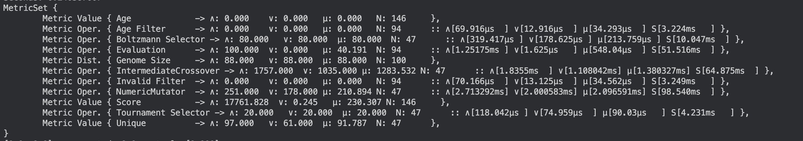

# Metrics

Radiate provides a number of built-in metrics that can be used to evaluate the performance of the `GeneticEngine`. These metrics can be used to 
monitor the progress of the engine, compare different runs, and tune hyperparameters. Radiate defines a metric as:

```rust
#[derive(Clone, PartialEq)]
pub enum Metric {
    Value(&'static str, Statistic),
    Time(&'static str, TimeStatistic),
    Distribution(&'static str, Distribution),
    Operations(&'static str, Statistic, TimeStatistic),
}
```

1. `Value` - Represents a single value metric with a name and a `Statistic`.
2. `Time` - Represents a time metric with a name and a `TimeStatistic`.
3. `Distribution` - Represents a distribution metric with a name and a `Distribution`.
4. `Operations` - Represents a metric that combines a `Statistic` and a `TimeStatistic` where the `Statistic` represents the number of operations performed and the `TimeStatistic` represents the time taken to perform those operations.

## Statistic 

The `Statistic` exposes a number of different statistical measures that can be used to summarize the data, such as, `last_value`, `count`, `min`, `max`, `mean`, `sum`, `variance`, `std_dev`, `skewness`, and `kurtosis`. 

## TimeStatistic

Similarly, the `TimeStatistic` exposes the same measures, however the data is assumed to be time-based. As such, the results are expressed as a `Duration::from_secs_f32(value)`.

## Distribution

The `Distribution` metric is used to represent a distribution of values. The distribution is stored as a `Vec<f32>` and produces the same statistical measures as the `Statistic` and `TimeStatistic` with the exception of `last_value` which is changed to `last_sequence`.

!!! example

    Just as a quick demo, here is the output of the `GeneticEngine`'s `MetricSet` from the [simple_nn](https://github.com/pkalivas/radiate/blob/master/radiate-examples/simple-nn/src/main.rs) example in the [radiate-examples](https://github.com/pkalivas/radiate/tree/master/radiate-examples) in the gh repo.

    <figure markdown="span">
        
    </figure>