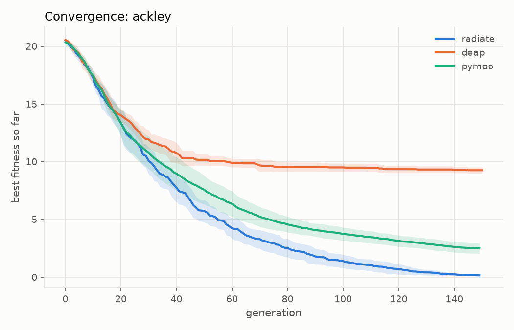
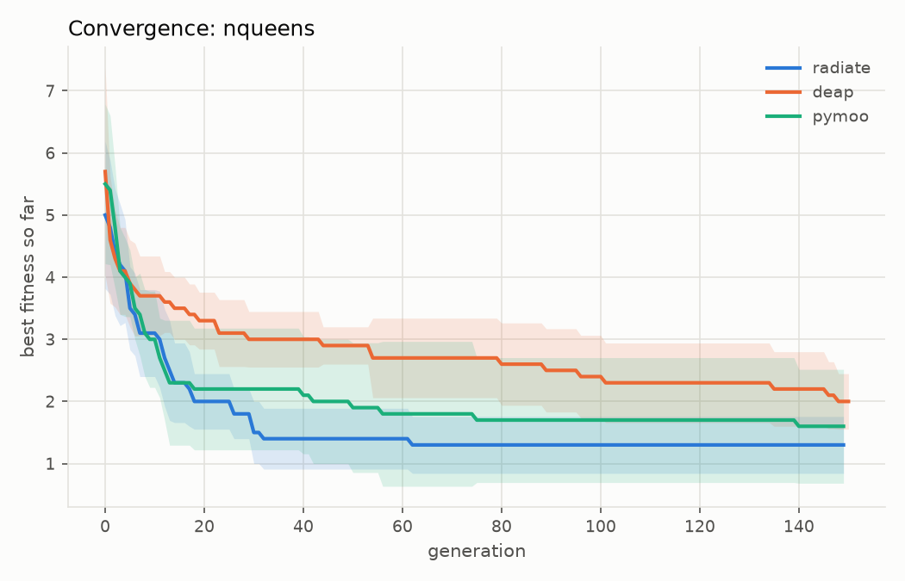

!!! warning ":construction: Under Construction :construction:"

    As of `9/13/26` this is a new section and is still being developed.

I think it's useful to look through comparisons between `radiate` and other libraries that share this space in terms of performance and efficiency. All benchmarks and report generation are run in `python`, the code that created the below charts and comparisons can be found in the [raidate-benchmarks](https://github.com/pkalivas/radiate-benchmarks) repository on github. A majority of these benchmarks compare `radiate` against [PyMoo](https://pymoo.org) and [DEAP](https://deap.readthedocs.io).

## Ackley

Continuous optimization using `f64` precision floating-point numbers & numpy arrays.

$$
f(x) = -20 \exp\left(-0.2 \sqrt{\frac{1}{d} \sum_{i=1}^{d} x_i^2}\right) - \exp\left(\frac{1}{d} \sum_{i=1}^{d} \cos(2 \pi x_i)\right) + 20 + e
$$

<figure markdown="span">
    { width="600" }
</figure>

## N-Queens

Discrete optimization using `usize` precision integers & numpy arrays. `Radiate` here is using the [permutation codec](https://pkalivas.github.io/radiate/source/genome/codec/#types-of-codecs).

!!! tip "Not using optimized `radiate` fitness function"

    There are other examples in this user guide ([here](https://pkalivas.github.io/radiate/source/examples/#nqueens)) that will actually produce faster & more efficient results using `radiate`.

<figure markdown="span">
    { width="600" }
</figure>