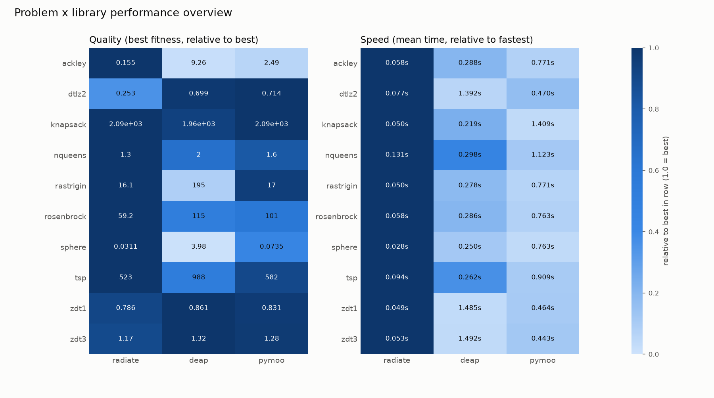
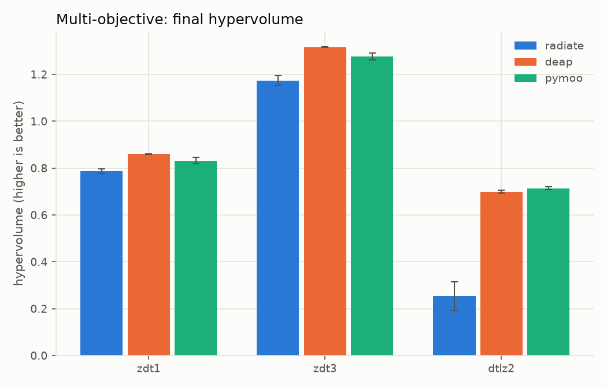
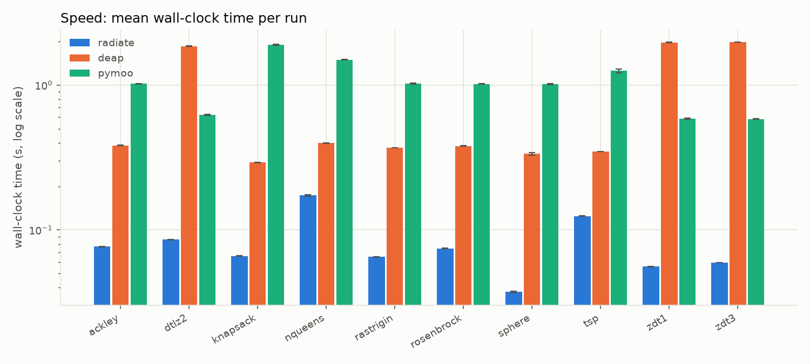
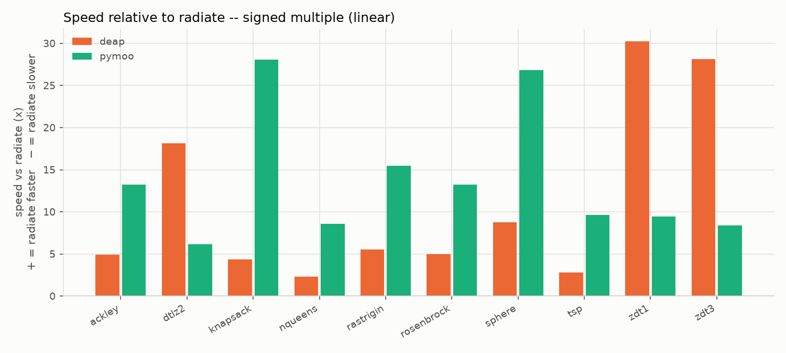

!!! warning ":construction: Under Construction :construction:"

    As of `9/26/26` this is a new section and is still being developed.

I think it's useful to look through comparisons between `radiate` and other libraries that share this space in terms of performance and efficiency. All benchmarks are run in python on a `2020 M1 Pro MacBook Pro`. The code that created the below charts and comparisons can be found in the [raidate-benchmarks](https://github.com/pkalivas/radiate-benchmarks) repository on github. 

In the benchmark's project, we compare the performance and efficiency of `radiate` against other libraries like [PyMoo](https://pymoo.org) and [DEAP](https://deap.readthedocs.io) across various optimization problems. Below are the results of these simple problems, showing both the convergence quality & speed of the different libraries. Each library x problem combination is run 10 times, the best/worst/mean results & wall-clock times are recorded.

<figure markdown="span">
    { width="850" }
</figure>

## Ackley

Continuous optimization using `f64` precision floating-point numbers & numpy arrays.

$$
f(x) = -20 \exp\left(-0.2 \sqrt{\frac{1}{d} \sum_{i=1}^{d} x_i^2}\right) - \exp\left(\frac{1}{d} \sum_{i=1}^{d} \cos(2 \pi x_i)\right) + 20 + e
$$

<figure markdown="span">
    { width="600" }
</figure>

## N-Queens

Discrete optimization using `usize` precision integers & numpy arrays. `Radiate` here is using the [permutation codec](https://pkalivas.github.io/radiate/source/genome/codec/#types-of-codecs).

!!! tip "Not using optimized `radiate` fitness function"

    There are other examples in this user guide ([here](https://pkalivas.github.io/radiate/source/examples/#nqueens)) that will actually produce faster & more efficient results using `radiate`.

<figure markdown="span">
    { width="600" }
</figure>

## Multi-Objective Optimization

Below we can see the convergence of different hypervolume indicators for the `zdt1`, `zdt3`, and `dtlz2` problems. These three are pretty common benchmarks for multi-objective optimization. 

<figure markdown="span">
    { width="600" }
</figure>

## Speed

Below is a log normalized comparison of speed - some problems are just slower to converge so log scale is needed.

<figure markdown="span">
    { width="600" }
</figure>

And now a raw comparison. Anything left of the black line indicates that `radiate` is slower vs the right side where `radiate` is faster & by how much.

<figure markdown="span">
    { width="400" }
</figure>

## Raw Results

| problem    | library   |   best_mean |   best_std |   time_mean_s |   time_std_s |   n_trials |
|:-----------|:----------|------------:|-----------:|--------------:|-------------:|-----------:|
| ackley     | radiate   |      0.0207 |     0.0106 |        0.0767 |       0.0003 |         10 |
| ackley     | deap      |      8.9594 |     0.4361 |        0.3832 |       0.0009 |         10 |
| ackley     | pymoo     |      1.8515 |     0.3751 |        1.0203 |       0.0049 |         10 |
| dtlz2      | radiate   |      0.7012 |     0.0100 |        0.0858 |       0.0004 |         10 |
| dtlz2      | deap      |      0.6974 |     0.0061 |        1.8562 |       0.0066 |         10 |
| dtlz2      | pymoo     |      0.7111 |     0.0056 |        0.6213 |       0.0047 |         10 |
| knapsack   | radiate   |   2090.0000 |     0.0000 |        0.0662 |       0.0005 |         10 |
| knapsack   | deap      |   1982.4000 |    35.0498 |        0.2919 |       0.0009 |         10 |
| knapsack   | pymoo     |   2090.0000 |     0.0000 |        1.8985 |       0.0154 |         10 |
| nqueens    | radiate   |      1.2000 |     0.6325 |        0.1735 |       0.0021 |         10 |
| nqueens    | deap      |      2.0000 |     0.4714 |        0.3972 |       0.0008 |         10 |
| nqueens    | pymoo     |      1.9000 |     0.8756 |        1.4980 |       0.0067 |         10 |
| rastrigin  | radiate   |     10.8435 |     4.8314 |        0.0654 |       0.0003 |         10 |
| rastrigin  | deap      |    182.1082 |    14.1792 |        0.3695 |       0.0007 |         10 |
| rastrigin  | pymoo     |     14.1199 |     3.7540 |        1.0233 |       0.0080 |         10 |
| rosenbrock | radiate   |     33.4129 |    14.9997 |        0.0745 |       0.0003 |         10 |
| rosenbrock | deap      |    106.0411 |     4.8883 |        0.3799 |       0.0009 |         10 |
| rosenbrock | pymoo     |     90.1068 |    23.4850 |        1.0176 |       0.0070 |         10 |
| sphere     | radiate   |      0.0043 |     0.0019 |        0.0374 |       0.0005 |         10 |
| sphere     | deap      |      3.9225 |     0.3664 |        0.3347 |       0.0060 |         10 |
| sphere     | pymoo     |      0.0292 |     0.0061 |        1.0179 |       0.0088 |         10 |
| tsp        | radiate   |    499.1356 |    12.1659 |        0.1248 |       0.0007 |         10 |
| tsp        | deap      |    975.7242 |    21.3226 |        0.3484 |       0.0008 |         10 |
| tsp        | pymoo     |    538.5293 |    54.1085 |        1.2541 |       0.0354 |         10 |
| zdt1       | radiate   |      0.8628 |     0.0010 |        0.0560 |       0.0003 |         10 |
| zdt1       | deap      |      0.8658 |     0.0006 |        1.9708 |       0.0042 |         10 |
| zdt1       | pymoo     |      0.8568 |     0.0056 |        0.5870 |       0.0049 |         10 |
| zdt3       | radiate   |      1.3161 |     0.0019 |        0.0595 |       0.0002 |         10 |
| zdt3       | deap      |      1.3227 |     0.0010 |        1.9806 |       0.0037 |         10 |
| zdt3       | pymoo     |      1.3079 |     0.0044 |        0.5837 |       0.0033 |         10 |