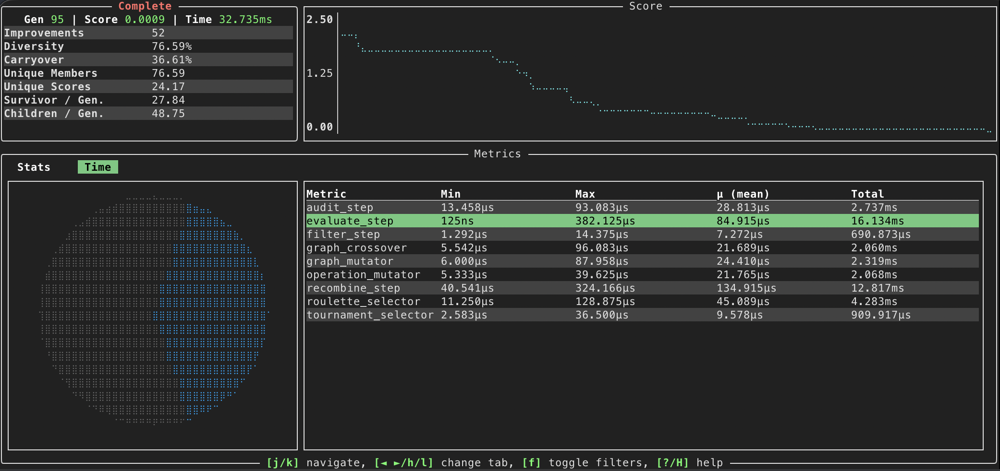
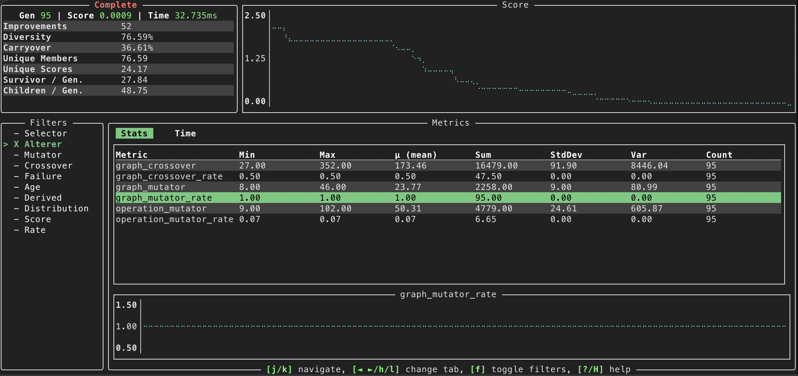
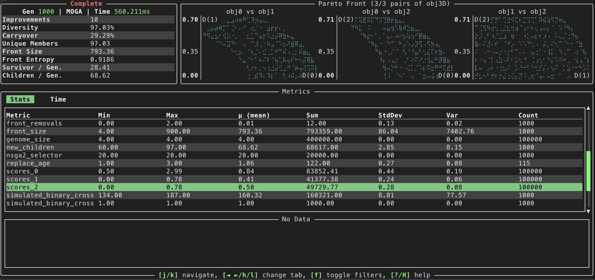

User Interface

---

!!! note "Requires the `ui` feature flag"

    Python includes this feature by default. However, in Rust, you need to enable the `ui` feature flag when adding Radiate as a dependency.

    ```toml
    [dependencies]
    radiate = { version = "x", features = ["ui"] }
    ```


Radiate includes a simple terminal command-line user interface (TUI) built with [ratatui](https://ratatui.rs) for monitoring and controlling evolutionary runs. It provides real-time feedback on the progress of the evolution, including a plethora of statistics and visualizations. 

## Statistics & Timings

Below we can see the base TUI layout during an evolutionary run:

<figure markdown="span">
    { width="600" }
</figure>

The TUI is composed of several sections:

- **Top Left**: Displays base level information about the current engine, including the current generation, best fitness, and elapsed time followed by some useful statistics about the population.
  
- **Top Right**: A line graph showing the best fitness over generations.

- **Bottom**: Statistics collected throughout the engine's run. This will include information about the genetic operators used, such as selection, crossover, and mutation statistics. As you scroll the statistics panel, a line graph will appear on the bottom showing the history of the selected statistic.

Its also possible to view the timings of various components of the genetic algorithm. This can be enabled by pressing the `h/l` (swap left/right between panels) key during an evolutionary run. Again, as you scroll through the timings panel, a pie chart will light up with the corresponding timing information. 

<figure markdown="span">
    { width="600" }
</figure>

---

## Filtering

Because the engine collects so many statistics, its also possible to filter the statistics by their `tag`s. You can do this by pressing the `f` key during an evolutionary run, which will bring up a prompt to enter a tag to filter by. For example, if I just want to see statistics related to `alters`, I can press `f` and enter and toggle the appropriate tags:


<figure markdown="span">
    { width="600" }
</figure>


## Multi-objective

--- 

The TUI also supports multi-objective evolutionary runs. In this case, the top-right panel will show a scatter plot of the Pareto front, with each axis representing one of the objectives being optimized.

<figure markdown="span">
    { width="600" }
</figure>

---

## Using the TUI

The TUI is completely opt-in and can be configured as shown below

=== ":fontawesome-brands-python: Python"

    ```python
    import radiate as rd

    engine = rd.GeneticEngine(
        # ... configure your engine as normal ...
    )

    # Enable the UI by passing ui=True to run() Note that this will disable logging if log=True
    result = engine.run(
        [rd.ScoreLimit(0.001), rd.GenerationsLimit(1000)],
        ui=True,
    )
    print(result)

    ```

=== ":fontawesome-brands-rust: Rust"

    ```rust
    use radiate::*;
    
    const MIN_SCORE: i32 = 100;

    let engine = GeneticEngine::builder()
        // ... configure your engine as normal ...
        .build();

    // Wrap the engine with the UI
    let final_generation = radiate::ui(engine)
        .iter()
        .until_score(MIN_SCORE)
        .last()
        .unwrap();
    ```

## Navigation

The TUI can be navigated using the following keybindings (or see the help menu by pressing `?` or `H`):


| Key        | Action                                      |
|------------|---------------------------------------------|
| `q`        | Quit the UI                                 |
| `?` / `H`  | Toggle this help                            |
| `p`        | Pause / Resume engine                       |
| `n`        | Step one epoch (stays paused)               |
| `j` / Down | Move selection down                         |
| `k` / Up   | Move selection up                           |
| `h` / Left | Previous metrics tab                        |
| `l` / Right| Next metrics tab                            |
| `[` / `]`  | Prev / next objective-pair page             |
| `+` / `-`  | Expand / shrink objective pairs             |
| `c`        | Toggle value mini chart                     |
| `m`        | Toggle mean mini chart                      |
| `f`        | Toggle tag filters panel                    |
| `Enter`    | Toggle tag selection                        |
| `Esc`      | Clear tag filters                           |
| `0-9`      | Select filter by index                      |