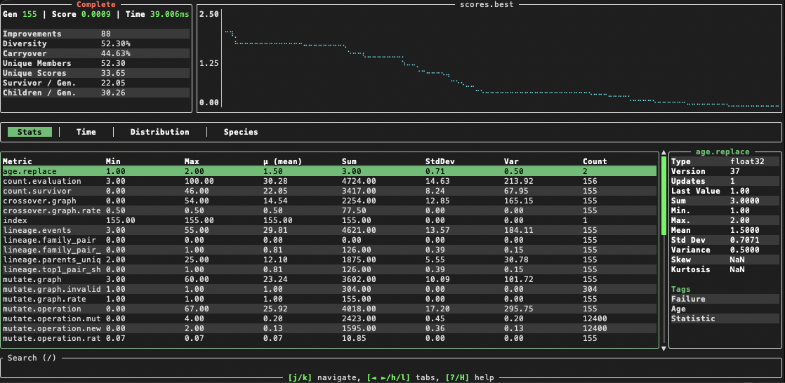
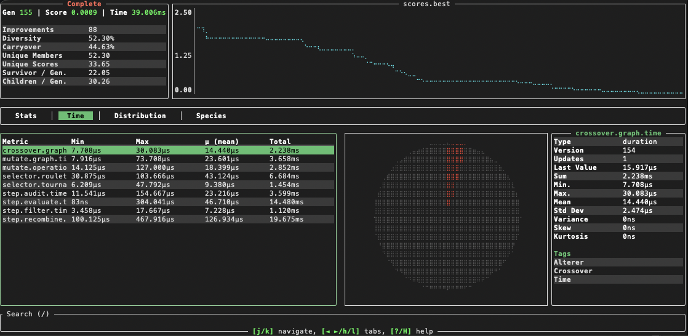
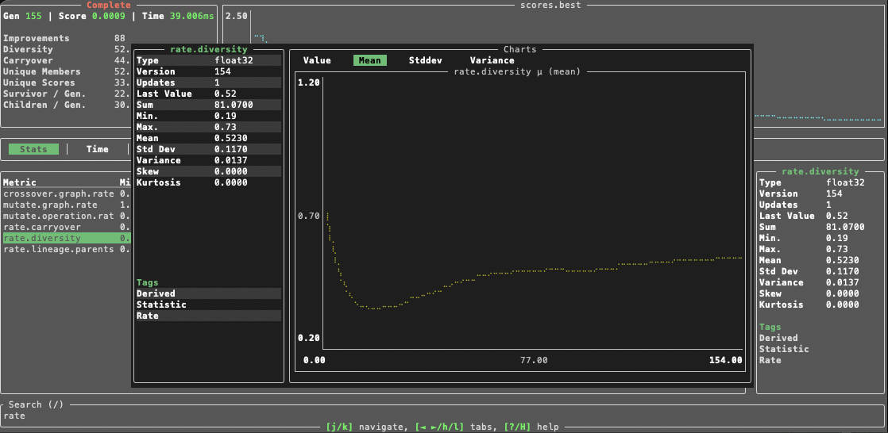
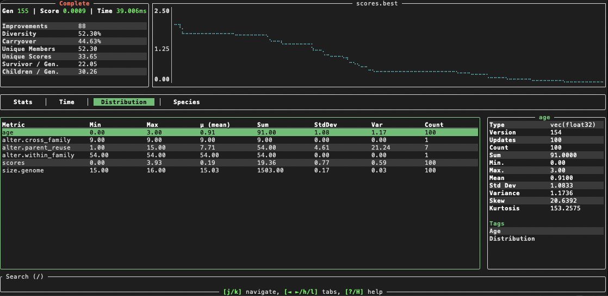
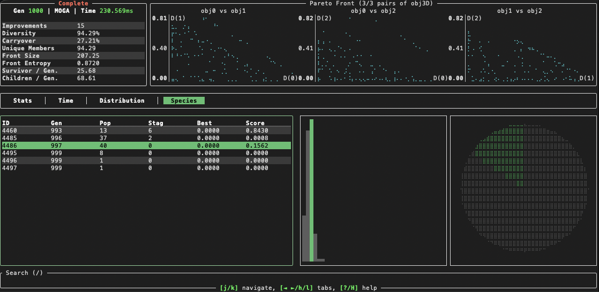
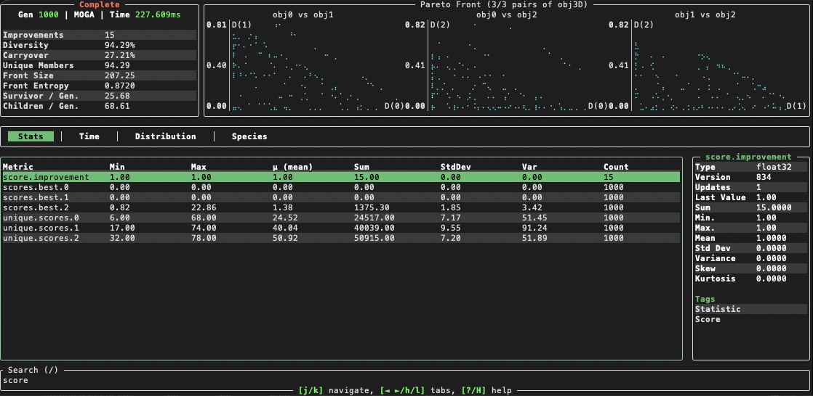

# User Interface

---

!!! note "Requires the `ui` feature flag"

    Python includes this feature by default. However, in Rust, you need to enable the `ui` feature flag when adding Radiate as a dependency.

    ```toml
    [dependencies]
    radiate = { version = "x", features = ["ui"] }
    ```


Radiate includes a simple terminal command-line user interface (TUI) built with [ratatui](https://ratatui.rs) for monitoring and controlling evolutionary runs. It provides real-time feedback on the progress of the evolution, including a plethora of statistics and visualizations. 

## Statistics & Timings

Below we can see the base TUI layout during an evolutionary run:

<figure markdown="span">
    { width="600" }
</figure>

The TUI is composed of several sections:

- **Top Left**: Displays base level information about the current engine, including the current generation, best fitness, and elapsed time followed by some useful statistics about the population.
  
- **Top Right**: A line graph showing the best fitness over generations.

- **Bottom**: Statistics collected throughout the engine's run. This will include information about the genetic operators used, such as selection, crossover, and mutation statistics.

It's also possible to view the timings of various components of the genetic algorithm. This can be enabled by pressing the `h/l` (swap left/right between panels) key during an evolutionary run. Again, as you scroll through the timings panel, a pie chart will light up with the corresponding timing information. 

<figure markdown="span">
    { width="600" }
</figure>

If you press `enter` on a metric, a modal will pop up allowing you to drill down into a specific metric as seen below. Here we can see the mean of the diversity rate throughout the evolutionary run.

<figure markdown="span">
    { width="600" }
</figure>


## Distribution

---

During evolution the metric set collects distribution type metrics, where each generation the metric gets cleared and replaced with the current generation's distribution data. For example, each generation, each member of the population will have a `score`. When we collect the scores for a population of size 100, we have a distribution of 100 scores. To accurately reflect that in the metric set, the `score` metric is cleared and replaced with the new distribution of scores every generation. This can be shown through the metric's data type, which will be `vec(float32)`.

<figure markdown="span">
    { width="600" }
</figure>


## Species

---

When species are enabled, the TUI will also show a tab to help monitor species within the population. From right to left we have panels that show:

1. Species level information, such as the species id, generation it was created, size, # generations stagnant, the best fitness score, and the shared fitness score (this will sum to 1 across all species).
2. A sparkline showing the sizes of the different species within the ecosystem.
3. A piechart showing the shared fitness of the different species within the ecosystem. This is a useful visualization to see which species are dominating the ecosystem and which ones are struggling.

<figure markdown="span">
    { width="600" }
</figure>


## Multi-objective

--- 

The TUI also supports multi-objective evolutionary runs. In this case, the top-right panel will show a scatter plot of the Pareto front, with each axis representing one of the objectives being optimized. Note here we have searched for 'score' in the search bar, so only the metrics dealing with 'score' are being shown in the metric's list.

<figure markdown="span">
    { width="600" }
</figure>

---

## Using the TUI

The TUI is completely opt-in and can be configured as shown below

=== ":fontawesome-brands-python: Python"

    ```python
    --8<-- "python/misc/ui_showcase.py:ui"
    ```

=== ":fontawesome-brands-rust: Rust"

    ```rust
    --8<-- "rust/misc/ui.rs:ui"
    ```

## Navigation

The TUI can be navigated using the following keybindings (or see the help menu by pressing `?` or `H` to see the full breakdown of the keybindings):


| Key        | Action                                      |
|------------|---------------------------------------------|
| `q`        | Quit the UI                                 |
| `?` / `H`  | Toggle this help                            |
| `p`        | Pause / Resume engine                       |
| `n`        | Step one epoch (stays paused)               |
| `j` / Down | Move selection down                         |
| `k` / Up   | Move selection up                           |
| `h` / Left | Previous metrics tab                        |
| `l` / Right| Next metrics tab                            |
| `[` / `]`  | Prev / next objective-pair page             |
| `+` / `-`  | Expand / shrink objective pairs             |
| `Enter`        | Toggle metric chart modal                     |
| `0-9`      | Select a specific objective by index                      |
| `/`        | Move focus to search bar                     |
